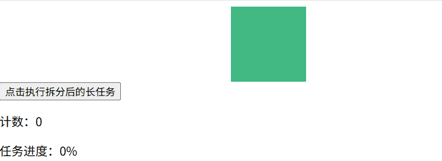

# Scheduler 的协作式调度策略实现：React 如何用 MessageChannel 模拟 requestIdleCallback

## 1. 引言

在前端开发中，页面卡顿是影响用户体验的核心问题之一，而长时间的同步任务阻塞主线程是导致卡顿的主要原因。React 的 Scheduler（调度器）作为核心模块，通过协作式调度解决了这一问题，其关键在于用 MessageChannel 模拟 requestIdleCallback 实现任务的碎片化执行。本文将从实际卡顿案例出发，逐步拆解 requestIdleCallback 的作用、不足，以及 React 如何基于 MessageChannel 实现更可靠的协作式调度。

## 2. 直观感受：主线程阻塞导致的页面卡顿

在浏览器中，JS 执行、DOM 渲染、事件响应等都依赖主线程，若主线程被长时间同步任务占用，页面会失去响应，出现点击无反馈、动画卡顿等问题。我们先通过两个原生示例，直观感受非卡顿与卡顿的差异。

### 2.1 无卡顿的正常场景

这个示例中，我们实现一个简单的按钮点击计数和动画效果，所有任务均为短时间执行，主线程始终处于空闲状态：

```html
<!DOCTYPE html>
<html lang="zh-CN">
  <head>
    <meta charset="UTF-8" />
    <title>无卡顿示例</title>
    <style>
      .box {
        width: 100px;
        height: 100px;
        background: #42b983;
        position: relative;
        animation: move 2s linear infinite alternate;
      }
      @keyframes move {
        from {
          left: 0;
        }
        to {
          left: 500px;
        }
      }
    </style>
  </head>
  <body>
    <div class="box"></div>
    <button id="btn">点击计数</button>
    <p>计数：<span id="count">0</span></p>

    <script>
      const btn = document.getElementById("btn");
      const countSpan = document.getElementById("count");
      let count = 0;

      // 短时间任务：点击计数
      btn.addEventListener("click", () => {
        count++;
        countSpan.textContent = count;
      });
    </script>
  </body>
</html>
```

运行后，动画流畅、按钮点击即时响应，因为主线程没有被长时间任务阻塞。


### 2.2 改造为卡顿场景

我们在点击事件中加入一个千万次循环的同步计算任务，模拟长时间占用主线程的场景：

```html
<!DOCTYPE html>
<html lang="zh-CN">
  <head>
    <meta charset="UTF-8" />
    <title>卡顿示例</title>
    <style>
      .box {
        width: 100px;
        height: 100px;
        background: #42b983;
        position: relative;
        animation: move 2s linear infinite alternate;
      }
      @keyframes move {
        from {
          left: 0;
        }
        to {
          left: 500px;
        }
      }
    </style>
  </head>
  <body>
    <div class="box"></div>
    <button id="btn">点击执行长任务</button>
    <p>计数：<span id="count">0</span></p>

    <script>
      const btn = document.getElementById("btn");
      const countSpan = document.getElementById("count");
      let count = 0;

      // 长时间同步任务：百万次循环计算
      function longTask() {
        let sum = 0;
        // 循环次数可根据设备性能调整，确保卡顿明显
        for (let i = 0; i < 30000000; i++) {
          sum += i;
        }
        return sum;
      }

      btn.addEventListener("click", () => {
        // 执行长任务，阻塞主线程
        longTask();
        count++;
        countSpan.textContent = count;
      });
    </script>
  </body>
</html>
```

点击按钮后，你会发现：动画瞬间停止，按钮点击后无即时反馈，等待数秒后计数才更新、动画恢复。这是因为 longTask 占用了主线程，浏览器无法同时执行动画渲染和事件响应，从而引发卡顿。


## 3. 用 requestIdleCallback 解决卡顿：协作式调度的雏形

要解决主线程阻塞问题，核心思路是将长任务拆分为多个短任务，在主线程空闲时执行，这就是协作式调度。浏览器原生提供的 requestIdleCallback 正是为这一场景设计的 API。

### 3.1 认识 requestIdleCallback

requestIdleCallback 是浏览器提供的空闲期调度 API，用于在浏览器的空闲时间段内执行低优先级任务。其核心特性如下：

- 语法：const handle = requestIdleCallback(callback[, options])
- callback：空闲时执行的回调函数，接收一个 IdleDeadline 对象，包含 timeRemaining() 方法（返回当前空闲期剩余时间）和 didTimeout 属性（是否超时）。
- options：可选配置，仅 timeout（超时时间，若超过该时间任务仍未执行，浏览器会强制执行）。
- 执行时机：浏览器在完成每帧的渲染（布局、绘制）后，若还有剩余时间，会执行 requestIdleCallback 的回调；若没有空闲时间，会推迟到下一帧。
- 协作式：回调内可通过 timeRemaining() 判断剩余时间，若时间不足则暂停任务，等待下一次空闲期继续执行。

### 3.2 基于 requestIdleCallback 改造卡顿示例

我们将百万次循环拆分为多个 30 万次的小任务，利用 requestIdleCallback 在主线程空闲时执行，执行完一个再调度下一个，直到所有任务完成：

```html
<!DOCTYPE html>
<html lang="zh-CN">
  <head>
    <meta charset="UTF-8" />
    <title>requestIdleCallback 解决卡顿</title>
    <style>
      .box {
        width: 100px;
        height: 100px;
        background: #42b983;
        position: relative;
        animation: move 2s linear infinite alternate;
      }
      @keyframes move {
        from {
          left: 0;
        }
        to {
          left: 500px;
        }
      }
    </style>
  </head>
  <body>
    <div class="box"></div>
    <button id="btn">点击执行拆分后的长任务</button>
    <p>计数：<span id="count">0</span></p>
    <p>任务进度：<span id="progress">0%</span></p>

    <script>
      const btn = document.getElementById("btn");
      const countSpan = document.getElementById("count");
      const progressSpan = document.getElementById("progress");
      let count = 0;
      let total = 30000000; // 总任务量
      let current = 0; // 已完成任务量
      const batch = 300000; // 每次执行的小任务量

      // 单个小任务：执行 batch 次循环
      function doBatchTask() {
        let sum = 0;
        for (let i = 0; i < batch; i++) {
          if (current >= total) break;
          sum += current;
          current++;
        }
        // 更新进度
        progressSpan.textContent = `${Math.floor((current / total) * 100)}%`;
        // 任务未完成则继续调度
        if (current < total) {
          requestIdleCallback(doBatchTask);
        } else {
          // 所有任务完成后更新计数
          count++;
          countSpan.textContent = count;
          current = 0; // 重置进度
          progressSpan.textContent = "0%";
        }
      }

      btn.addEventListener("click", () => {
        // 首次调度空闲时执行任务
        requestIdleCallback(doBatchTask);
      });
    </script>
  </body>
</html>
```

运行后点击按钮，动画依然流畅，按钮点击无卡顿，进度条逐步更新，最终计数完成。这是因为 requestIdleCallback 让小任务只在主线程空闲时执行，不会阻塞渲染和事件响应。


### 3.3 requestIdleCallback 的不足

尽管 requestIdleCallback 实现了空闲调度，但它存在多个缺陷，导致无法满足 React 这类大型框架的生产需求：

1. 浏览器兼容性差：IE 完全不支持，移动端部分浏览器（如旧版 Safari）也存在兼容问题。
2. 执行频率低：浏览器的空闲期受刷新率影响，在 60Hz 屏幕下每帧仅 16.6ms，若页面繁忙，requestIdleCallback 可能数秒才执行一次，低优先级任务会被严重延迟。
3. 可靠性问题：部分浏览器对 requestIdleCallback 的执行做了限制，如后台标签页会暂停执行，导致任务长时间挂起。

正因为这些缺陷，React 放弃了直接使用 requestIdleCallback，转而通过 MessageChannel 模拟实现了一套更高效、更可控的空闲调度机制。

## 4. 用 MessageChannel 模拟 requestIdleCallback：React 的替代方案

MessageChannel 是浏览器提供的跨线程通信 API，其核心特性是消息传递是宏任务，且执行时机早于 setTimeout，能在每帧的渲染后立即执行。React 利用这一特性，通过 MessageChannel 模拟出了高频率的 “空闲期” 调度。

### 4.1 为什么选择 MessageChannel？

requestIdleCallback 的回调依赖浏览器的“空闲期”判定（仅当渲染后仍有剩余时间才执行），在页面繁忙时可能数帧才触发一次；而 MessageChannel 作为宏任务会在下一轮事件循环的宏任务阶段执行，不依赖空闲期信号。

要让 MessageChannel 更贴近“帧后执行”，关键是理解事件循环与渲染的时序：浏览器通常会在宏任务与宏任务之间安排渲染。MessageChannel 的回调属于下一轮宏任务，因此往往落在上一帧渲染之后。

#### 4.1.1 先明确：浏览器的帧渲染与事件循环的执行顺序

浏览器的核心工作是按固定帧率（通常 60Hz，每帧 ≈16.6ms）完成渲染，并在渲染间隙执行 JS 任务。一个完整的事件循环迭代（event loop tick）中，渲染流程与宏任务 / 微任务的执行遵循严格的顺序，简化后的核心流程如下：

```text
1. 执行当前宏任务队列中的一个宏任务（如同步JS、setTimeout回调）
2. 执行所有微任务队列中的微任务（Promise.then、MutationObserver等）
3. 执行**渲染流程**（计算样式→布局→绘制，完成一帧的渲染）
4. 检查是否有新的宏任务，若有则回到步骤1，开启下一个事件循环迭代
```

关键结论：渲染流程执行完毕后，下一个事件循环迭代会优先执行新的宏任务。而 MessageChannel 的消息回调正属于这类新的宏任务，因此其执行时机天然落在上一帧渲染完成后。

#### 4.1.2 MessageChannel 的宏任务特性：更贴近“帧后”的触发

MessageChannel 是浏览器提供的跨端口通信 API，其 `port.onmessage` 回调属于宏任务；与 `setTimeout`/`setInterval` 相比，有两点更利于帧后触发：

1. 无最小延迟（即时入队）
   `setTimeout(callback, 0)` 在多数环境存在 ≥4ms 的最小延迟夹紧；`MessageChannel` 的 `postMessage()` 会立即把回调加入宏任务队列，无额外延迟，更容易紧贴渲染后触发。
2. 实践中的触发更靠前（非标准保证）
   在多数现代浏览器实现里，`MessageChannel` 的宏任务触发时机通常早于 `setTimeout`；但标准未规定固定优先级，实际顺序可能随浏览器与场景变化。工程上不应依赖“固定优先级”，而应采用 rAF + MessageChannel 的组合来获得稳定的帧后调度。

### 4.2 基于 MessageChannel 改造卡顿示例

我们模仿 React 的思路，用 MessageChannel 实现一个简易的 “空闲调度器”，替代 requestIdleCallback 解决卡顿问题：

```html
<!DOCTYPE html>
<html lang="zh-CN">
  <head>
    <meta charset="UTF-8" />
    <title>MessageChannel 模拟空闲调度</title>
    <style>
      .box {
        width: 100px;
        height: 100px;
        background: #42b983;
        position: relative;
        animation: move 2s linear infinite alternate;
      }

      @keyframes move {
        from {
          left: 0;
        }

        to {
          left: 500px;
        }
      }
    </style>
  </head>

  <body>
    <div class="box"></div>
    <button id="btn">点击执行拆分后的长任务</button>
    <p>计数：<span id="count">0</span></p>
    <p>任务进度：<span id="progress">0%</span></p>

    <script>
      const btn = document.getElementById("btn");
      const countSpan = document.getElementById("count");
      const progressSpan = document.getElementById("progress");
      let count = 0;
      let total = 30000000;
      let current = 0;
      const batch = 300000;

      // 1. 创建 MessageChannel 实例
      const channel = new MessageChannel();
      const port1 = channel.port1;
      const port2 = channel.port2;

      // 2. 定义调度器：通过 postMessage 触发任务执行
      let scheduledTask = null;
      function scheduleIdleCallback(callback) {
        scheduledTask = callback;
        // 发送消息触发宏任务
        port2.postMessage("execute");
      }

      // 3. 监听消息，执行任务（模拟空闲期）
      port1.onmessage = () => {
        const task = scheduledTask;
        scheduledTask = null;
        if (task) {
          task();
        }
      };

      // 单个小任务逻辑
      function doBatchTask() {
        let sum = 0;
        for (let i = 0; i < batch; i++) {
          if (current >= total) break;
          sum += current;
          current++;
        }
        progressSpan.textContent = `${Math.floor((current / total) * 100)}%`;
        if (current < total) {
          // 用自定义调度器替代 requestIdleCallback
          scheduleIdleCallback(doBatchTask);
        } else {
          count++;
          countSpan.textContent = count;
          current = 0;
          progressSpan.textContent = "0%";
        }
      }

      btn.addEventListener("click", () => {
        scheduleIdleCallback(doBatchTask);
      });
    </script>
  </body>
</html>
```

运行后效果与 requestIdleCallback 版本一致，动画流畅、任务逐步执行。这个简易调度器的核心是：通过 MessageChannel 的消息传递触发宏任务，让小任务在每帧渲染后执行，模拟出 “空闲期” 的效果。


## 5. React 源码中的 MessageChannel 调度实现

React 的 Scheduler 模块是其协作式调度的核心，其中基于 MessageChannel 的调度是关键环节。我们从核心原理和源码关键逻辑两方面拆解其实现。

### 5.1 核心原理

1. 时间分片（Time Slicing）：为每轮任务执行设置固定的时间预算（frameInterval，默认约 5ms），若任务执行时间超过该预算，立即暂停任务并让出主线程，避免阻塞渲染和用户交互。
2. 消息循环驱动：优先使用 MessageChannel 触发宏任务（降级方案为 setImmediate/setTimeout），通过 “发送消息 → 执行任务 → 再次发送消息” 的循环，持续推进任务队列的执行，模拟浏览器的空闲期调度。
3. 双队列管理：维护 timerQueue（延时任务队列）和 taskQueue（立即执行任务队列），延时任务到期后从 timerQueue 转入 taskQueue，确保任务按 “延时优先级 + 过期优先级” 有序执行。
4. 续约回调机制：任务回调执行后可返回一个新的回调函数（“续约回调”），调度器会在下一轮消息循环中继续执行该回调，实现任务的分段执行。
5. 主动让出判断：通过 shouldYieldToHost 函数判断是否需要让出主线程，判断依据包括已执行时间是否超过时间预算、浏览器是否需要重绘，兼顾任务执行效率和页面流畅度。

### 5.2 关键逻辑

React Scheduler 的核心执行流程可拆解为调度器初始化、消息循环启动、任务执行与让出、双队列流转，每个步骤对应源码中的核心函数，以下是详细解析：

#### 5.2.1 调度器初始化：选择异步触发方案

调度器优先使用 MessageChannel 实现高频率的宏任务触发（执行时机早于 setTimeout），若环境不支持则降级为 setImmediate 或 setTimeout，最终封装出 schedulePerformWorkUntilDeadline 函数，作为消息循环的触发入口。

```js
let schedulePerformWorkUntilDeadline;

// 优先级：setImmediate > MessageChannel > setTimeout
if (typeof localSetImmediate === "function") {
  // 非浏览器环境（如Node.js）优先使用setImmediate
  schedulePerformWorkUntilDeadline = () => {
    localSetImmediate(performWorkUntilDeadline);
  };
} else if (typeof MessageChannel !== "undefined") {
  // 浏览器环境核心方案：MessageChannel
  const channel = new MessageChannel();
  const port = channel.port2;
  // 监听消息，触发任务执行
  channel.port1.onmessage = performWorkUntilDeadline;
  schedulePerformWorkUntilDeadline = () => {
    // 发送空消息，触发宏任务
    port.postMessage(null);
  };
} else {
  // 兜底方案：setTimeout（延迟更高，仅用于兼容旧环境）
  schedulePerformWorkUntilDeadline = () => {
    localSetTimeout(performWorkUntilDeadline, 0);
  };
}
```

#### 5.2.2 任务调度：unstable_scheduleCallback 入队逻辑

unstable_scheduleCallback 是调度任务的入口函数，负责根据任务的优先级和延时配置，计算任务的 startTime（开始时间）和 expirationTime（过期时间），并将任务加入 timerQueue（延时任务）或 taskQueue（立即任务）。

```js
/**
 * 调度任务的入口函数
 * @param {number} priorityLevel - 任务优先级
 * @param {Function} callback - 任务回调
 * @param {Object} [options] - 配置项（含delay延时）
 * @returns {Object} 任务实例
 */
function unstable_scheduleCallback(priorityLevel, callback, options) {
  const currentTime = getCurrentTime();
  let startTime;

  // 计算任务的开始时间（支持延时执行）
  if (typeof options === "object" && options !== null) {
    const delay = options.delay;
    startTime =
      typeof delay === "number" && delay > 0
        ? currentTime + delay
        : currentTime;
  } else {
    startTime = currentTime;
  }

  // 根据优先级计算超时时间（过期时间 = 开始时间 + 超时时间）
  let timeout;
  switch (priorityLevel) {
    case ImmediatePriority:
      timeout = -1;
      break; // 立即执行
    case UserBlockingPriority:
      timeout = userBlockingPriorityTimeout;
      break; // 用户阻塞级（如点击）
    case IdlePriority:
      timeout = maxSigned31BitInt;
      break; // 空闲级（最低优先级）
    case LowPriority:
      timeout = lowPriorityTimeout;
      break; // 低优先级
    case NormalPriority:
    default:
      timeout = normalPriorityTimeout;
      break; // 普通优先级
  }
  const expirationTime = startTime + timeout;

  // 创建任务实例
  const newTask = {
    id: taskIdCounter++,
    callback,
    priorityLevel,
    startTime,
    expirationTime,
    sortIndex: -1,
  };

  // 延时任务：加入timerQueue
  if (startTime > currentTime) {
    newTask.sortIndex = startTime;
    push(timerQueue, newTask);
    // 若当前无立即任务且该任务是timerQueue顶部，设置定时器
    if (peek(taskQueue) === null && newTask === peek(timerQueue)) {
      if (isHostTimeoutScheduled) cancelHostTimeout();
      else isHostTimeoutScheduled = true;
      requestHostTimeout(handleTimeout, startTime - currentTime);
    }
  } else {
    // 立即任务：加入taskQueue并启动消息循环
    newTask.sortIndex = expirationTime;
    push(taskQueue, newTask);
    if (!isHostCallbackScheduled && !isPerformingWork) {
      isHostCallbackScheduled = true;
      requestHostCallback();
    }
  }

  return newTask;
}
```

#### 5.2.3 启动消息循环：触发首次任务执行

通过 requestHostCallback 函数标记消息循环为运行态（isMessageLoopRunning = true），并调用 schedulePerformWorkUntilDeadline 触发首次宏任务，启动整个消息循环。

```js
/**
 * 启动消息循环，触发首次任务执行
 */
function requestHostCallback() {
  if (!isMessageLoopRunning) {
    isMessageLoopRunning = true;
    schedulePerformWorkUntilDeadline();
  }
}

// 每帧的时间预算（时间分片的核心阈值）
let frameInterval = frameYieldMs; // 5
// 记录每轮任务执行的开始时间
let startTime = -1;

/**
 * 判断是否需要让出主线程
 * @returns {boolean} 若为true则暂停任务，让出主线程
 */
function shouldYieldToHost() {
  // 若浏览器需要重绘，直接让出
  if (!enableAlwaysYieldScheduler && enableRequestPaint && needsPaint) {
    return true;
  }
  // 计算已执行时间，超过预算则让出
  const timeElapsed = getCurrentTime() - startTime;
  return timeElapsed >= frameInterval;
}

/**
 * 消息循环的核心执行函数：由MessageChannel的onmessage触发
 */
const performWorkUntilDeadline = () => {
  if (enableRequestPaint) {
    needsPaint = false; // 重置重绘标记
  }
  if (isMessageLoopRunning) {
    const currentTime = getCurrentTime();
    startTime = currentTime; // 初始化本轮执行的开始时间
    let hasMoreWork = true;

    try {
      // 执行任务队列并返回是否还有剩余任务,flushWork回去调用workLoop
      hasMoreWork = flushWork(currentTime);
    } finally {
      if (hasMoreWork) {
        // 还有剩余任务，继续发送消息触发下一轮执行
        schedulePerformWorkUntilDeadline();
      } else {
        // 无剩余任务，终止消息循环
        isMessageLoopRunning = false;
      }
    }
  }
};
```

#### 5.2.4 任务执行与让出：workLoop 主循环

workLoop 是任务执行的核心函数，负责从 taskQueue 中取出最高优先级的任务执行，并根据 shouldYieldToHost 判断是否需要让出主线程。若任务回调返回 “续约回调”，则保留任务并在下一轮执行；若执行完成则将任务出队。

```js
/**
 * 任务执行主循环
 * @param {number} initialTime - 本轮执行的开始时间
 * @returns {boolean} 是否还有剩余任务
 */
function workLoop(initialTime) {
  let currentTime = initialTime;
  // 将到期的延时任务从timerQueue转入taskQueue
  advanceTimers(currentTime);
  // 取出taskQueue顶部的最高优先级任务
  currentTask = peek(taskQueue);

  while (currentTask !== null) {
    // 非强制让出模式下，判断是否需要让出主线程
    if (!enableAlwaysYieldScheduler) {
      if (currentTask.expirationTime > currentTime && shouldYieldToHost()) {
        break; // 让出主线程，暂停任务执行
      }
    }

    const callback = currentTask.callback;
    if (typeof callback === "function") {
      currentTask.callback = null; // 清空回调，避免重复执行
      currentPriorityLevel = currentTask.priorityLevel;
      // 判断任务是否超时（过期时间 <= 当前时间）
      const didUserCallbackTimeout = currentTask.expirationTime <= currentTime;
      // 执行任务回调，获取续约回调（若有）
      const continuationCallback = callback(didUserCallbackTimeout);
      currentTime = getCurrentTime();

      if (typeof continuationCallback === "function") {
        // 存在续约回调，保留任务并在下一轮执行
        currentTask.callback = continuationCallback;
        advanceTimers(currentTime);
        return true;
      } else {
        // 任务执行完成，若仍在队列顶部则出队
        if (currentTask === peek(taskQueue)) {
          pop(taskQueue);
        }
        advanceTimers(currentTime);
      }
    } else {
      // 回调非函数，直接出队
      pop(taskQueue);
    }

    // 取出下一个任务
    currentTask = peek(taskQueue);

    // 强制让出模式下，判断是否需要暂停
    if (enableAlwaysYieldScheduler) {
      if (currentTask === null || currentTask.expirationTime > currentTime) {
        break;
      }
    }
  }

  // 若还有未执行的任务，返回true；否则处理延时任务
  if (currentTask !== null) {
    return true;
  } else {
    const firstTimer = peek(timerQueue);
    if (firstTimer !== null) {
      // 存在延时任务，设置定时器触发到期处理
      requestHostTimeout(handleTimeout, firstTimer.startTime - currentTime);
    }
    return false;
  }
}
```

#### 5.2.4 双队列流转：advanceTimers 任务到期处理

advanceTimers 函数负责检查 timerQueue 中的延时任务，将到期的任务（startTime <= 当前时间）从 timerQueue 转入 taskQueue，确保延时任务在指定时间后执行。

```js
/**
 * 将到期的延时任务从timerQueue转入taskQueue
 * @param {number} currentTime - 当前时间
 */
function advanceTimers(currentTime) {
  let timer = peek(timerQueue);
  while (timer !== null) {
    if (timer.callback === null) {
      // 回调为空，任务已取消，直接出队
      pop(timerQueue);
    } else if (timer.startTime <= currentTime) {
      // 任务到期，从timerQueue出队并转入taskQueue
      pop(timerQueue);
      timer.sortIndex = timer.expirationTime; // 按过期时间排序
      push(taskQueue, timer);
    } else {
      // 存在未到期的任务，终止循环
      return;
    }
    timer = peek(timerQueue);
  }
}
```

## 6. 总结

页面卡顿的本质是主线程被长时间同步任务阻塞，而协作式调度是解决这一问题的核心方案。requestIdleCallback 作为原生空闲调度 API，虽能实现基础的碎片化执行，但因兼容性、执行频率等缺陷无法满足 React 的需求。
React 基于 MessageChannel 模拟出了一套更高效的调度机制，其核心是利用 MessageChannel 的宏任务特性，在每帧渲染后触发任务执行，同时结合优先级队列和时间阈值检查，实现了任务的碎片化、优先级化执行。这一机制不仅解决了页面卡顿问题，还为 React 的可中断渲染（Concurrent Mode）提供了底层支撑，是 React 高性能的关键之一。
理解 React Scheduler 的调度策略，不仅能帮助我们更好地排查性能问题，也能在日常开发中借鉴任务拆分和优先级调度的思想，写出更流畅的前端代码。
