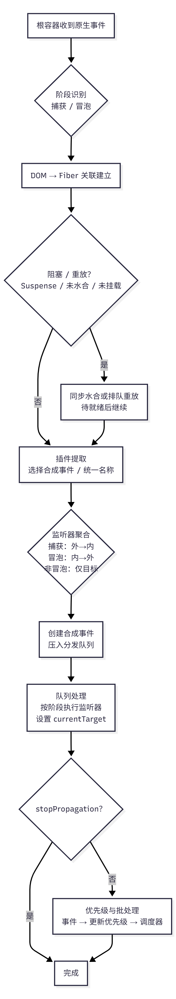

# 一、导论

## 1.1 React 事件机制的目标与优势

React 事件机制的核心目标，是**在抹平浏览器差异的基础上，提供高性能、可扩展、与组件模型深度融合的事件处理能力**，具体可拆解为三大优势：

#### 优势一：跨浏览器兼容性统一

React 事件层通过 “合成事件（SyntheticEvent）” 封装原生事件，将不同浏览器的差异屏蔽在底层。例如：

- 统一事件属性：无论浏览器原生事件中是  `keyCode`（IE）还是  `key`（标准），React 都通过  `e.key`  提供一致的键盘按键信息；
- 统一方法行为：`e.preventDefault()` `e.stopPropagation()`  等方法在所有浏览器中表现完全一致，开发者无需手动判断浏览器类型。

#### 优势二：与 React 组件模型深度融合

React 事件机制并非独立存在，而是与 Fiber 架构、组件状态管理紧密联动，支持多种高级特性：

- 精准关联组件：事件触发时，React 通过  `targetFiber`  快速定位到触发事件的组件，确保监听函数与组件实例正确绑定，避免 “this 指向丢失” 等问题；
- 支持优先级调度：结合 React 的 Lane 优先级模型，事件可按优先级执行（如用户输入的  `click`  优先级高于定时器触发的事件），确保交互响应的流畅性；

#### 优势三：基于事件委托的性能优化

React 事件层采用 “事件委托” 模式，将所有事件监听统一绑定在应用的根 DOM 节点（如  `#root`），而非每个具体组件节点。其优化逻辑如下：

- 减少监听数量：无论页面有多少个按钮，只需在根节点绑定一个  `click`  监听，大幅降低内存占用；
- 自动管理生命周期：组件挂载时，React 只需在内部维护 “组件 - 监听函数” 的映射关系，无需操作 DOM 绑定；组件卸载时，直接移除映射即可，避免内存泄漏；
- 批量处理事件：事件触发时，React 会通过 Fiber 树遍历找到所有相关的监听函数，批量执行，减少浏览器的事件调度开销。

例如一个包含 1000 条数据的列表，每条数据有删除按钮，原生开发需绑定 1000 个  `click`  监听，而 React 只需 1 个根节点监听，性能优势显著。

## 1.2 核心概念速览（委托、合成、优先级）

理解 React 事件机制，需先掌握三个核心概念，它们是整个事件层的基石：

#### 概念一：事件委托

事件委托是 React 事件性能优化的核心手段，基于浏览器 “事件冒泡” 特性实现：

- 原理：将子节点的事件监听 “委托” 给父节点（最终是根节点），当子节点触发事件时，事件会向上冒泡到根节点，由根节点的监听函数统一处理；
- React 实现：根节点的原生监听函数触发后，React 会通过原生事件的  `target`  找到对应的组件 Fiber 节点，再遍历 Fiber 树收集所有相关的监听函数，按顺序执行；

例如点击一个按钮时，原生  `click`  事件会从按钮冒泡到根节点，根节点的 React 监听函数会触发，再通过 Fiber 树找到按钮组件的  `onClick`  函数并执行。

> React 并非对所有事件都采用统一的委托：对于不冒泡的原生事件（如 **`scroll`**），使用非委托绑定直接在目标元素上监听。React 会依据原生事件的冒泡特性与兼容性选择绑定方式，而非一刀切。

#### 概念二：合成事件

合成事件是 React 对原生事件的 “标准化封装”，是开发者直接操作的事件对象：

- 本质：并非替换原生事件，而是在原生事件基础上添加统一的属性和方法，同时保留原生事件引用（`e.nativeEvent`）；
- 核心特性：通过统一事件属性与方法行为实现跨浏览器兼容，以轻量设计避免冗余属性，并借助内置  `_targetInst`  等属性关联事件对应的 Fiber 节点，确保监听函数与组件实例正确绑定。

#### 概念三：事件优先级

事件优先级是 React 确保交互流畅性的关键，与整体的 Lane 优先级模型对齐，将事件分为不同优先级：

- 离散事件：最高优先级，对应用户即时交互（如  `click` `keydown`），需立即执行，避免卡顿；
- 连续事件：中优先级，对应持续触发的事件（如  `scroll` `mousemove` ），可适当延迟，避免阻塞主线程；
- 默认事件：默认优先级，对应非用户直接触发的事件（如  `load`），在正常调度下处理，可能被更高优先级（如点击、滚动）打断。
- 空闲事件：最低优先级，仅在主线程完全空闲时执行（如统计上报）。

优先级的作用的是：当多个事件同时触发时，React 会优先处理高优先级事件产生的“更新”，确保用户交互的响应速度；低优先级的“更新”则可能被延后或被中断。例如用户点击按钮的同时触发滚动，点击回调产生的更新会以更高优先级入队并更快处理；滚动产生的更新可能稍后执行。

# 二、事件系统整体架构

## 2.1 事件入口与容器/Fiber 关联

可以将这部分理解为 “快递从小区门口到你家的配送流程”：

1.  集中收件（事件委托）：应用启动时，React 只在 \*\* 根容器（如 div#root）\*\* 上绑定所有浏览器事件（如 click、input），而非每个组件单独绑定 —— 这就像小区快递柜统一收件，减少 “每个住户装一个收件箱” 的内存和性能开销。

2.  识别包裹（原生事件 → 合成事件）：当用户点击按钮时，浏览器触发原生事件（如 MouseEvent），React 会将其包装成 “合成事件”（如 SyntheticMouseEvent）—— 相当于把不同快递公司的包裹（原生事件差异）统一翻译成 “小区内部配送单”，抹平浏览器兼容性差异。

3.  定位收件人（DOM → Fiber 映射）：根据原生事件的目标节点（如点击的 button），找到对应的组件 Fiber 节点（组件的内部表示）—— 就像根据快递单上的地址，找到你家在小区的具体楼栋和门牌号。

4.  按户集件（监听器聚合）：从目标 Fiber 开始，向上遍历组件树，收集当前阶段（捕获 / 冒泡）的所有监听器（如 onClick、onClickCapture）—— 类似从你家开始，向上问 “楼上邻居要不要一起取件”，最终汇总所有收件人。

5.  上门派送（监听器分发）：按 “捕获 → 冒泡” 的顺序执行收集到的监听器，每次执行时设置 currentTarget（当前处理的组件）—— 如同快递员按顺序上门送件，且每次只敲一家门。

6.  特殊情况处理（异常场景兼容）：若目标组件未挂载、处于 Suspense 加载中或水合阶段，事件会被暂时阻塞或延迟重放—— 就像你不在家时，快递会暂存柜中，等你回来再派送，保证交互语义的正确性。

举例（点击按钮）：根容器收到 click 事件 → 包装成合成事件 → 找到按钮对应的 Fiber → 收集从按钮到根组件的 onClick/onClickCapture 监听器 → 按阶段顺序执行 → 若组件未就绪则延迟执行。

## 2.2 数据流总览（捕获 → 提取 → 分发）

1.  捕获阶段（事件进入）

- 根容器接收原生事件，按注册阶段进入“捕获”或“冒泡”路径。
- 识别目标节点，建立 DOM → Fiber 的语义关联；必要时因水合/挂起阻塞或排队重放。

2.  提取阶段（插件处理）

- 插件系统按事件类型选择合成事件构造（如鼠标、指针、剪贴板、toggle）。
- 统一事件名称与属性语义（如 focusin→focus），过滤不符合规范的历史行为。

3.  聚合阶段（监听器收集）

- 以目标 Fiber 为起点，按当前阶段（捕获/冒泡）向上收集监听器。
- 非冒泡事件或特殊事件遵循目标级聚合，以贴近原生传播语义。

4.  分发阶段（顺序执行）

- 创建合成事件，将“事件 + 监听器列表”压入分发队列。
- 按阶段顺序执行监听器，逐次设置 currentTarget；遇 stopPropagation 立即终止传播。

5.  调度与批处理（协同执行）

- 事件类型映射到更新优先级（离散/连续/默认/空闲），与调度器协同批处理。
- 在副作用与水合场景下可能触发重新评估，确保渲染与交互一致性。

流程图：



# 三、事件系统具体实现

## 3.1 事件注册与阶段识别

### 3.1.1 核心策略总览

- 默认采用 **事件委托**：在应用根容器统一注册原生事件，避免节点级监听的内存开销；
- 阶段贯穿全程：“捕获/冒泡”的区分从事件注册开始，到监听器分发结束，通过标志位控制；
- 特殊场景适配：对“不冒泡”或“语义特殊”的事件，采用 **非委托注册**（直接绑定目标 DOM），确保功能正常。

### 3.1.2 阶段识别：从注册到分发的标志贯穿

“捕获/冒泡”阶段的区分通过 **标志位** 和 **事件名规则** 实现，覆盖“注册-聚合-分发”全链路。

#### （1）注册阶段：用标志位标记阶段

React 定义两个核心标志位，在注册时标记事件的阶段属性：

```javascript
// 标志位定义：标记事件的阶段与注册模式
export const IS_NON_DELEGATED = 1 << 1; // 标记“非委托”事件
export const IS_CAPTURE_PHASE = 1 << 2; // 标记“捕获阶段”事件
```

注册原生事件时，通过 `isCapturePhaseListener` 参数决定是否添加 `IS_CAPTURE_PHASE` 标志，同时区分“捕获/冒泡”两条独立监听链路：

```javascript
// 注册原生事件（绑定捕获/冒泡阶段）
export function listenToNativeEvent(
  domEventName,
  isCapturePhaseListener,
  target
) {
  let eventSystemFlags = 0;
  if (isCapturePhaseListener) {
    eventSystemFlags |= IS_CAPTURE_PHASE; // 捕获阶段：添加阶段标志
  }
  // 绑定到目标容器（根容器或目标DOM）
  addTrappedEventListener(
    targetContainer,
    domEventName,
    eventSystemFlags,
    isCapturePhaseListener
  );
}
```

#### （2）聚合阶段：按阶段选择监听器

监听器聚合时（`accumulateSinglePhaseListeners`），通过“事件名后缀”选择对应阶段的监听器：

- 捕获阶段：选择 `onXxxCapture` 格式的监听器（如 `onClickCapture`）；
- 冒泡阶段：选择 `onXxx` 格式的监听器（如 `onClick`）。

核心源码逻辑：

```javascript
export function accumulateSinglePhaseListeners(
  targetFiber,
  reactName,
  nativeEventType,
  inCapturePhase,
  accumulateTargetOnly,
  nativeEvent
) {
  // 捕获阶段：事件名拼接“Capture”后缀（如 onClick → onClickCapture）
  const captureName = reactName !== null ? reactName + "Capture" : null;
  // 按当前阶段选择要收集的 React 事件名
  const reactEventName = inCapturePhase ? captureName : reactName;

  let listeners = [];
  let instance = targetFiber;
  while (instance !== null) {
    const { stateNode, tag } = instance;
    // 仅处理宿主组件（DOM 对应的 Fiber）
    if (
      (tag === HostComponent ||
        tag === HostHoistable ||
        tag === HostSingleton) &&
      stateNode !== null
    ) {
      // 获取当前阶段的监听器（捕获→onXxxCapture，冒泡→onXxx）
      const listener =
        reactEventName !== null ? getListener(instance, reactEventName) : null;
      if (listener != null) {
        listeners.push(createDispatchListener(instance, listener, stateNode));
      }
    }
    if (accumulateTargetOnly) break; // 仅收集目标组件时终止遍历
    instance = instance.return; // 向上遍历 Fiber 树
  }
  return listeners;
}
```

#### （3）分发阶段：按标志位决定执行顺序

分发时读取注册阶段的 `IS_CAPTURE_PHASE` 标志，确定监听器的执行顺序：

- 捕获阶段：从“祖先 Fiber”到“目标 Fiber”（逆序执行）；
- 冒泡阶段：从“目标 Fiber”到“祖先 Fiber”（顺序执行）；
- 终止规则：遇到 `stopPropagation()` 时，立即终止后续所有监听器执行。

核心源码逻辑：

```javascript
// 分发队列处理：按阶段标志决定执行顺序
export function processDispatchQueue(dispatchQueue, eventSystemFlags) {
  // 读取阶段标志：判断当前是否为捕获阶段
  const inCapturePhase = (eventSystemFlags & IS_CAPTURE_PHASE) !== 0;
  for (let i = 0; i < dispatchQueue.length; i++) {
    const { event, listeners } = dispatchQueue[i];
    // 按阶段执行监听器（捕获逆序，冒泡顺序）
    processDispatchQueueItemsInOrder(event, listeners, inCapturePhase);
  }
}
```

### 3.1.3 事件注册的两种模式：委托 vs 非委托

React 根据事件类型选择“委托注册”或“非委托注册”，平衡性能与功能正确性。

#### （1）模式一：委托注册（默认）

- **适用场景**：支持冒泡的常规事件（如 `click`、`keydown`、`change` 等）；
- **实现逻辑**：应用启动时，通过 `listenToAllSupportedEvents` 在根容器统一注册“捕获+冒泡”两条监听链路；
- **性能优化**：对 `touchstart`、`touchmove`、`wheel` 等可能阻塞主线程的事件，启用 `passive: true` 避免性能警告。

核心源码逻辑：

```javascript
// 根容器统一注册所有支持的委托事件
export function listenToAllSupportedEvents(root) {
  allNativeEvents.forEach((domEventName) => {
    // 特殊处理 selectionchange（需绑定到 document）
    if (domEventName !== "selectionchange") {
      // 非委托事件跳过（后续单独处理）
      if (!nonDelegatedEvents.has(domEventName)) {
        listenToNativeEvent(domEventName, false, root); // 冒泡阶段注册
      }
      listenToNativeEvent(domEventName, true, root); // 捕获阶段注册
    }
  });
}

// 绑定原生事件（含 passive 优化）
function addTrappedEventListener(
  targetContainer,
  domEventName,
  eventSystemFlags,
  isCapturePhaseListener
) {
  let isPassiveListener = undefined;
  if (passiveBrowserEventsSupported) {
    // 触摸/滚轮事件启用 passive，避免阻塞主线程
    if (
      domEventName === "touchstart" ||
      domEventName === "touchmove" ||
      domEventName === "wheel"
    ) {
      isPassiveListener = true;
    }
  }

  // 区分捕获/冒泡绑定
  if (isCapturePhaseListener) {
    return isPassiveListener !== undefined
      ? addEventCaptureListenerWithPassiveFlag(
          targetContainer,
          domEventName,
          listener,
          isPassiveListener
        )
      : addEventCaptureListener(targetContainer, domEventName, listener);
  } else {
    return isPassiveListener !== undefined
      ? addEventBubbleListenerWithPassiveFlag(
          targetContainer,
          domEventName,
          listener,
          isPassiveListener
        )
      : addEventBubbleListener(targetContainer, domEventName, listener);
  }
}
```

#### （2）模式二：非委托注册（特殊场景）

- **适用场景**：不支持冒泡、或语义特殊的事件（如 `scroll`、`load`、`toggle` 等）；
- **实现逻辑**：直接在事件的目标 DOM 节点上注册监听，跳过根容器委托；
- **去重控制**：通过 `EventListenerSet` 记录已注册的事件，避免重复绑定。

核心源码逻辑：

```javascript
// 非委托事件列表：这些事件不适合根容器委托
export const nonDelegatedEvents = new Set([
  "load",
  "scroll",
  "scrollend",
  "invalid",
  "toggle",
  ...mediaEventTypes, // 媒体事件（如 play、pause）
]);

// 非委托事件注册：直接绑定到目标 DOM
export function listenToNonDelegatedEvent(domEventName, targetElement) {
  const isCapturePhaseListener = false; // 非委托事件默认冒泡阶段
  const key = getListenerSetKey(domEventName, isCapturePhaseListener);
  const eventListenerSet = getEventListenerSet(targetElement);

  // 去重：避免重复注册
  if (!eventListenerSet.has(key)) {
    // 添加 IS_NON_DELEGATED 标志，标记为非委托事件
    addTrappedEventListener(
      targetElement,
      domEventName,
      IS_NON_DELEGATED,
      isCapturePhaseListener
    );
    eventListenerSet.add(key);
  }
}
```

### 3.1.4 关键总结

| 维度     | 捕获阶段                             | 冒泡阶段                         | 非委托事件                       |
| -------- | ------------------------------------ | -------------------------------- | -------------------------------- |
| 注册标志 | `IS_CAPTURE_PHASE`                   | 无（默认）                       | `IS_NON_DELEGATED`               |
| 监听器名 | `onXxxCapture`                       | `onXxx`                          | `onXxx`（同冒泡）                |
| 注册目标 | 根容器                               | 根容器                           | 事件目标 DOM 节点                |
| 执行顺序 | 祖先 → 目标                          | 目标 → 祖先                      | 仅目标组件（无传播）             |
| 典型事件 | `onClickCapture`、`onKeyDownCapture` | `onClick`、`onChange`、`onKeyUp` | `onScroll`、`onLoad`、`onToggle` |

## 3.2 DOM→Fiber 映射与根容器边界修正

### 3.2.1 映射建立：提交阶段埋下“关联线索”

DOM 与 Fiber 的映射并非运行时临时创建，而是在组件 **提交阶段** 提前埋下——通过在 DOM 节点上存储 Fiber 指针、根容器标记和最新 props，为后续事件触发时的快速定位打下基础。

#### （1）DOM 节点绑定 Fiber 指针

每个由 React 渲染的“宿主 DOM 节点”（如 `<div>`、`<button>`），都会在提交阶段通过 `precacheFiberNode` 函数绑定对应的 Fiber 实例，存储在 DOM 的内部属性（`internalInstanceKey`）中：

```javascript
// 核心逻辑：将 Fiber 指针缓存到 DOM 节点上
function precacheFiberNode(hostInst: Fiber, node: DOMNode) {
  // internalInstanceKey 是 React 内部定义的唯一键（如 '__reactFiber$xxx'）
  node[internalInstanceKey] = hostInst;
}
```

- 作用：后续事件触发时，通过 DOM 节点的 `internalInstanceKey` 可直接拿到对应的 Fiber，无需遍历整个 Fiber 树。

#### （2）根容器绑定根 Fiber

应用的根容器（如 `div#root`）会额外标记“根 Fiber”，通过 `markContainerAsRoot` 函数存储根 Fiber 实例，明确 DOM 节点所属的“根渲染范围”：

```javascript
// 核心逻辑：给根容器标记对应的根 Fiber
function markContainerAsRoot(hostRoot: FiberRoot, node: DOMNode) {
  // internalContainerInstanceKey 是根容器专属的内部键
  node[internalContainerInstanceKey] = hostRoot;
}
```

- 作用：区分不同根容器的渲染范围（如多根应用中“根 A”和“根 B”的边界），避免事件跨根传播。

#### （3）DOM 节点存储最新 props

组件的最新 props（含事件监听器，如 `onClick`）会通过 `updateFiberProps` 函数写入 DOM 节点的内部属性（`internalPropsKey`）：

```javascript
// 核心逻辑：将组件最新 props 缓存到 DOM 节点
function updateFiberProps(node: DOMNode, props: Props) {
  node[internalPropsKey] = props;
}
```

- 作用：事件触发时，可直接从 DOM 节点读取最新的监听器（而非依赖 Fiber 树的 props），确保拿到“当前生效”的回调函数（避免因 Fiber 树更新导致的监听器滞后）。

### 3.2.2 目标定位：运行时快速找到“事件归属组件”

当原生事件触发时，React 需要从 `event.target`（事件实际触发的 DOM 节点）出发，快速定位到对应的 Fiber 节点（“事件归属的组件”），核心逻辑由 `getClosestInstanceFromNode` 实现。

#### （1）核心定位逻辑：“就近查找+向上回溯”

```javascript
// 核心逻辑：从目标 DOM 节点向上查找最近的 Fiber 实例
function getClosestInstanceFromNode(node: DOMNode): Fiber | null {
  let currentNode = node;
  while (currentNode !== null) {
    // 1. 优先读取当前 DOM 节点的 Fiber 指针
    const fiberInst = currentNode[internalInstanceKey];
    if (fiberInst !== undefined) {
      return fiberInst;
    }
    // 2. 若当前节点无 Fiber（如文本节点、注释节点），向上遍历父 DOM 节点
    currentNode = currentNode.parentNode;
  }
  // 3. 未找到对应 Fiber（如外部非 React 管理的 DOM），返回 null
  return null;
}
```

#### （2）特殊场景适配：水合中的 Suspense 边界

在水合（Hydration）阶段，若目标 DOM 所在的组件处于 Suspense 加载中（未完全水合），定位逻辑会优先返回 Suspense 边界对应的宿主 Fiber，而非原始目标 Fiber：

## 3.3 合成事件规范化与类型族概览

合成事件（`SyntheticEvent`）是 React 事件系统的“统一交互接口”——它基于原生事件封装，核心目标是**屏蔽浏览器差异、提供稳定 API、适配 Fiber 架构的事件分发逻辑**。

### 3.3.1 核心目标：为何需要合成事件？

合成事件的设计并非替换原生事件，而是解决三大核心问题：

1. **跨浏览器兼容**：统一不同浏览器对事件属性/方法的差异；
2. **API 稳定性**：提供固定的 `preventDefault`、`stopPropagation` 等方法，避免开发者处理浏览器特有的事件逻辑；
3. **Fiber 协作**：内置 `_targetInst` 等属性关联 Fiber 节点，确保事件能精准绑定组件实例，适配监听器的聚合与分发。

### 3.3.2 构造逻辑：从原生事件到合成事件的“归一化”

合成事件通过 `createSyntheticEvent` 工厂函数创建，核心是将原生事件的属性按“统一接口”映射，同时注入 Fiber 关联信息。

#### （1）工厂函数：生成专用合成事件构造器

`createSyntheticEvent` 接收一个“接口定义（`Interface`）”，返回对应类型的合成事件构造器（如 `SyntheticMouseEvent`），实现属性归一化：

```javascript
/**
 * 生成合成事件构造器的工厂函数
 * @param Interface 事件属性的归一化规则（如 { clientX: (e) => e.clientX }）
 */
function createSyntheticEvent(Interface) {
  function SyntheticBaseEvent(
    reactName, // React 事件名（如 'onClick'）
    reactEventType, // 事件类型（如 'click'）
    targetInst, // 事件对应的目标 Fiber 节点
    nativeEvent, // 原生事件对象（如 MouseEvent）
    nativeEventTarget // 原生事件的目标 DOM 节点
  ) {
    // 1. 绑定 Fiber 关联信息（用于后续分发）
    this._reactName = reactName;
    this._targetInst = targetInst;
    this.type = reactEventType;
    this.nativeEvent = nativeEvent; // 保留原生事件引用，供特殊场景使用
    this.target = nativeEventTarget;
    this.currentTarget = null; // 动态设置：当前执行监听器的组件

    // 2. 按 Interface 归一化事件属性（屏蔽浏览器差异）
    for (const propName in Interface) {
      const normalizeFn = Interface[propName]; // 属性的归一化函数
      // 若有归一化函数则执行，否则直接取原生事件属性
      this[propName] = normalizeFn
        ? normalizeFn(nativeEvent)
        : nativeEvent[propName];
    }

    // 3. 初始化默认行为状态（兼容 IE 的 returnValue）
    const defaultPrevented =
      nativeEvent.defaultPrevented != null
        ? nativeEvent.defaultPrevented
        : nativeEvent.returnValue === false; // IE 兼容
    // 初始化为“未阻止默认行为”
    this.isDefaultPrevented = defaultPrevented ? () => true : () => false;
    this.isPropagationStopped = () => false; // 初始化为“未停止传播”

    return this;
  }

  // 4. 挂载合成事件的核心方法（原型链共享，节省内存）
  Object.assign(SyntheticBaseEvent.prototype, {
    preventDefault, // 阻止默认行为
    stopPropagation, // 停止事件传播
    persist, // 事件池兼容（现代 React 已停用）
    isPersistent, // 标记事件是否持久化（现代 React 恒为 true）
  });

  return SyntheticBaseEvent;
}
```

#### （2）归一化示例：以鼠标事件为例

例如 `SyntheticMouseEvent` 的 `Interface` 定义如下（简化版）：

```javascript
const MouseEventInterface = {
  clientX: (e) => e.clientX,
  clientY: (e) => e.clientY,
  button: (e) => e.button,
  // ... 其他鼠标事件属性
};
// 生成 SyntheticMouseEvent 构造器
const SyntheticMouseEvent = createSyntheticEvent(MouseEventInterface);
```

- 作用：无论浏览器原生事件的属性是否有差异，通过归一化函数均可统一为标准值，开发者只需使用 `e.clientX` 即可，无需判断浏览器。

### 3.3.3 核心 API 规范：稳定的交互方法

合成事件的 API 是开发者直接接触的部分，React 确保其在所有浏览器中行为一致，核心方法包括 `preventDefault`、`stopPropagation` 等。

#### （1）`preventDefault()`：阻止默认行为

- **作用**：禁止浏览器对事件的默认处理（如 `<a>` 标签的跳转、表单的自动提交）；
- **兼容逻辑**：优先调用原生 `e.preventDefault()`，若不支持（如 IE）则设置 `e.returnValue = false`；
- **状态标记**：调用后将 `isDefaultPrevented` 置为 `() => true`，供后续逻辑判断。

```javascript
function preventDefault() {
  this.defaultPrevented = true;
  const nativeEvent = this.nativeEvent;
  if (!nativeEvent) return;

  // 标准浏览器兼容
  if (nativeEvent.preventDefault) {
    nativeEvent.preventDefault();
  }
  // IE 兼容（returnValue 控制默认行为）
  else if (typeof nativeEvent.returnValue !== "unknown") {
    nativeEvent.returnValue = false;
  }

  // 更新默认行为状态
  this.isDefaultPrevented = () => true;
}
```

#### （2）`stopPropagation()`：停止事件传播

- **作用**：终止事件在“捕获 → 冒泡”阶段的传播，后续监听器不再执行；
- **兼容逻辑**：优先调用原生 `e.stopPropagation()`，若不支持（如 IE）则设置 `e.cancelBubble = true`；
- **状态标记**：调用后将 `isPropagationStopped` 置为 `() => true`，分发时会检查该状态并中断执行。

```javascript
function stopPropagation() {
  const nativeEvent = this.nativeEvent;
  if (!nativeEvent) return;

  // 标准浏览器兼容
  if (nativeEvent.stopPropagation) {
    nativeEvent.stopPropagation();
  }
  // IE 兼容（cancelBubble 控制传播）
  else if (typeof nativeEvent.cancelBubble !== "unknown") {
    nativeEvent.cancelBubble = true;
  }

  // 更新传播状态
  this.isPropagationStopped = () => true;
}
```

#### （3）`persist()` 与 `isPersistent()`：事件池兼容

- **背景**：React 18 前为优化性能，会复用合成事件对象（事件池），`persist()` 用于“取出”事件对象避免被回收；
- **现代行为**：React 18+ 已停用事件池，`persist()` 变为空操作（no-op），`isPersistent()` 恒返回 `true`（表示事件对象不会被复用）。

```javascript
function persist() {
  // 现代 React 无操作，仅为兼容旧代码
}

function isPersistent() {
  return true; // 事件对象持久化，不会被回收
}
```

### 3.3.4 类型族分类：按功能划分的合成事件

React 按事件功能将合成事件分为多个“类型族”，每个类型族对应特定场景，由不同插件负责提取和构造。

#### （1）核心类型族与对应场景

| 类型族                    | 对应事件示例                                | 适用场景                          |
| ------------------------- | ------------------------------------------- | --------------------------------- |
| `SyntheticKeyboardEvent`  | `onKeyDown`、`onKeyUp`、`onKeyPress`        | 键盘输入交互                      |
| `SyntheticMouseEvent`     | `onClick`、`onMouseMove`、`onContextMenu`   | 鼠标操作（点击、移动、右键等）    |
| `SyntheticFocusEvent`     | `onFocus`、`onBlur`、`onFocusIn`            | 元素焦点变化（如输入框聚焦/失焦） |
| `SyntheticTouchEvent`     | `onTouchStart`、`onTouchMove`、`onTouchEnd` | 移动端触摸交互                    |
| `SyntheticPointerEvent`   | `onPointerDown`、`onPointerMove`            | 统一鼠标/触摸/笔输入（跨设备）    |
| `SyntheticDragEvent`      | `onDrag`、`onDrop`、`onDragEnter`           | 元素拖拽交互                      |
| `SyntheticClipboardEvent` | `onCopy`、`onCut`、`onPaste`                | 剪贴板操作（复制、剪切、粘贴）    |
| `SyntheticUIEvent`        | `onScroll`、`onScrollEnd`                   | 页面/元素滚动                     |

#### （2）类型族的构造逻辑：插件按需选择

以 `SimpleEventPlugin`（核心插件）为例，它会根据原生事件名（`domEventName`）选择对应的合成事件构造器，确保事件类型与功能匹配：

```javascript
// 简化版：根据原生事件名选择合成事件构造器
function selectSyntheticEventCtor(domEventName) {
  let SyntheticEventCtor = SyntheticEvent; // 默认构造器
  let reactEventType = domEventName; // React 事件类型（默认与原生一致）

  switch (domEventName) {
    // 键盘事件：选择 SyntheticKeyboardEvent
    case "keydown":
    case "keyup":
    case "keypress":
      SyntheticEventCtor = SyntheticKeyboardEvent;
      break;

    // 焦点事件：统一为 onFocus/onBlur（兼容 focusin/focusout）
    case "focusin":
      reactEventType = "focus";
      SyntheticEventCtor = SyntheticFocusEvent;
      break;
    case "focusout":
      reactEventType = "blur";
      SyntheticEventCtor = SyntheticFocusEvent;
      break;

    // 鼠标事件：选择 SyntheticMouseEvent
    case "click":
    case "mousedown":
    case "mousemove":
      SyntheticEventCtor = SyntheticMouseEvent;
      break;

    // ... 其他类型族的选择逻辑
  }

  return { SyntheticEventCtor, reactEventType };
}

// 按需创建合成事件并入队
const { SyntheticEventCtor, reactEventType } =
  selectSyntheticEventCtor(domEventName);
const event = new SyntheticEventCtor(
  reactName,
  reactEventType,
  targetInst,
  nativeEvent,
  nativeEventTarget
);
dispatchQueue.push({ event, listeners }); // 加入分发队列
```

### 3.3.5 插件协作：合成事件的“提取-注册”流程

合成事件的创建和管理依赖 React 事件系统的“插件化架构”，不同插件负责不同类型族的事件提取，系统初始化时统一注册。

#### （1）插件注册：系统启动时加载所有插件

React 初始化时，会注册所有事件插件，确保各类事件能被正确提取：

```javascript
// 模块初始化时注册核心插件
SimpleEventPlugin.registerEvents(); // 基础类型族（鼠标、键盘、焦点等）
EnterLeaveEventPlugin.registerEvents(); // 进入/离开事件（onMouseEnter/onMouseLeave）
ChangeEventPlugin.registerEvents(); // 表单变化事件（onChange）
SelectEventPlugin.registerEvents(); // 选择事件（onSelect）
BeforeInputEventPlugin.registerEvents(); // 输入前事件（onBeforeInput）
ScrollEndEventPlugin.registerEvents(); // 滚动结束事件（onScrollEnd）
```

#### （2）事件提取：触发时调用插件生成合成事件

当原生事件触发时，`DOMPluginEventSystem` 会依次调用各插件的 `extractEvents` 方法，生成对应的合成事件并加入分发队列：

```javascript
// 事件提取入口（简化版）
function extractEvents(dispatchQueue, targetInst, nativeEvent, ...args) {
  // 1. 基础类型族提取（鼠标、键盘等）
  SimpleEventPlugin.extractEvents(dispatchQueue, targetInst, nativeEvent, args);
  // 2. 进入/离开事件提取（模拟 mouseenter/mouseleave）
  EnterLeaveEventPlugin.extractEvents(
    dispatchQueue,
    targetInst,
    nativeEvent,
    args
  );
  // 3. 表单事件提取（onChange 等）
  ChangeEventPlugin.extractEvents(dispatchQueue, targetInst, nativeEvent, args);
  // ... 其他插件的提取逻辑
}
```

### 3.3.6 事件对象结构：确保分发一致性

React 定义 `ReactSyntheticEvent` 类型，规范合成事件在分发队列中的结构，核心包含“Fiber 关联信息、事件状态、原生事件引用”三部分：

```typescript
// 合成事件的基础结构
type BaseSyntheticEvent = {
  isPersistent: () => boolean; // 是否持久化（恒为 true）
  isPropagationStopped: () => boolean; // 是否停止传播
  _targetInst: Fiber; // 目标 Fiber 节点（核心）
  _dispatchListeners?: Function | Array<Function>; // 待执行的监听器
  nativeEvent: Event; // 原生事件引用
  target: EventTarget | null; // 事件目标 DOM 节点
  currentTarget: EventTarget | null; // 当前执行监听器的 DOM 节点
  type: string; // 事件类型（如 'click'）
};

// 已知 React 事件名的合成事件（如 onClick 触发）
type KnownReactSyntheticEvent = BaseSyntheticEvent & { _reactName: string };
// 未知 React 事件名的合成事件（内部使用）
type UnknownReactSyntheticEvent = BaseSyntheticEvent & { _reactName: null };

// 合成事件的统一类型
export type ReactSyntheticEvent =
  | KnownReactSyntheticEvent
  | UnknownReactSyntheticEvent;
```

## 3.4 插件系统：提取、映射与扩展点

## 3.5 监听器聚合策略与两阶段分发

## 3.6 分发队列、顺序控制与传播终止

## 3.7 事件优先级与调度协同（离散/连续/默认）

# 四、最后
