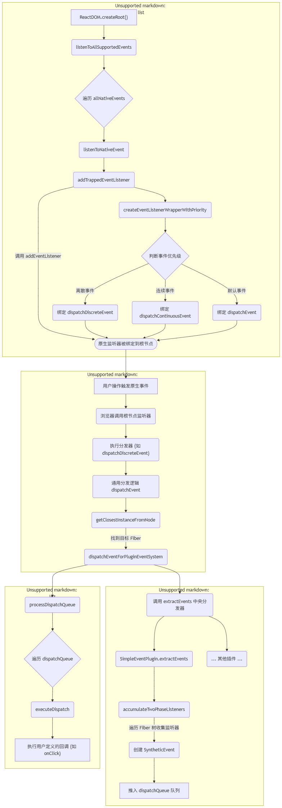

# React 合成事件系统底层实现：事件委托、优先级调度与跨平台抽象

## 一、前言

### 1.1 React 事件机制的目标与优势

React 事件机制的核心目标，是**在抹平浏览器差异的基础上，提供高性能、可扩展、与组件模型深度融合的事件处理能力**，具体可拆解为三大优势：

#### 优势一：跨浏览器兼容性统一

React 事件层通过 “合成事件（SyntheticEvent）” 封装原生事件，将不同浏览器的差异屏蔽在底层。例如：

- 统一事件属性：无论浏览器原生事件中是  `keyCode`（IE）还是  `key`（标准），React 都通过  `e.key`  提供一致的键盘按键信息；
- 统一方法行为：`e.preventDefault()` `e.stopPropagation()`  等方法在所有浏览器中表现完全一致，开发者无需手动判断浏览器类型。

#### 优势二：与 React 组件模型深度融合

React 事件机制并非独立存在，而是与 Fiber 架构、组件状态管理紧密联动，支持多种高级特性：

- 精准关联组件：事件触发时，React 通过  `targetFiber`  快速定位到触发事件的组件，确保监听函数与组件实例正确绑定，避免 “this 指向丢失” 等问题；
- 支持优先级调度：结合 React 的 Lane 优先级模型，事件可按优先级执行（如用户输入的  `click`  优先级高于定时器触发的事件），确保交互响应的流畅性；

#### 优势三：基于事件委托的性能优化

React 事件层采用 “事件委托” 模式，将所有事件监听统一绑定在应用的根 DOM 节点（如  `#root`），而非每个具体组件节点。其优化逻辑如下：

- 减少监听数量：无论页面有多少个按钮，只需在根节点绑定一个  `click`  监听，大幅降低内存占用；
- 自动管理生命周期：组件挂载时，React 只需在内部维护 “组件 - 监听函数” 的映射关系，无需操作 DOM 绑定；组件卸载时，直接移除映射即可，避免内存泄漏；
- 批量处理事件：事件触发时，React 会通过 Fiber 树遍历找到所有相关的监听函数，批量执行，减少浏览器的事件调度开销。

例如一个包含 1000 条数据的列表，每条数据有删除按钮，原生开发需绑定 1000 个  `click`  监听，而 React 只需 1 个根节点监听，性能优势显著。

### 1.2 核心概念速览（委托、合成、优先级）

理解 React 事件机制，需先掌握三个核心概念，它们是整个事件层的基石：

#### 概念一：事件委托

事件委托是 React 事件性能优化的核心手段，基于浏览器 “事件冒泡” 特性实现：

- 原理：将子节点的事件监听 “委托” 给父节点（最终是根节点），当子节点触发事件时，事件会向上冒泡到根节点，由根节点的监听函数统一处理；
- React 实现：根节点的原生监听函数触发后，React 会通过原生事件的  `target`  找到对应的组件 Fiber 节点，再遍历 Fiber 树收集所有相关的监听函数，按顺序执行；

例如点击一个按钮时，原生  `click`  事件会从按钮冒泡到根节点，根节点的 React 监听函数会触发，再通过 Fiber 树找到按钮组件的  `onClick`  函数并执行。

> React 并非对所有事件都采用统一的委托：对于不冒泡的原生事件（如 **`scroll`**），使用非委托绑定直接在目标元素上监听。React 会依据原生事件的冒泡特性与兼容性选择绑定方式，而非一刀切。

#### 概念二：合成事件

合成事件是 React 对原生事件的 “标准化封装”，是开发者直接操作的事件对象：

- 本质：并非替换原生事件，而是在原生事件基础上添加统一的属性和方法，同时保留原生事件引用（`e.nativeEvent`）；
- 核心特性：通过统一事件属性与方法行为实现跨浏览器兼容，以轻量设计避免冗余属性，并借助内置  `_targetInst`  等属性关联事件对应的 Fiber 节点，确保监听函数与组件实例正确绑定。

#### 概念三：事件优先级

事件优先级是 React 确保交互流畅性的关键，与整体的 Lane 优先级模型对齐，将事件分为不同优先级：

- 离散事件：最高优先级，对应用户即时交互（如  `click` `keydown`），需立即执行，避免卡顿；
- 连续事件：中优先级，对应持续触发的事件（如  `scroll` `mousemove` ），可适当延迟，避免阻塞主线程；
- 默认事件：默认优先级，对应非用户直接触发的事件（如  `load`），在正常调度下处理，可能被更高优先级（如点击、滚动）打断。
- 空闲事件：最低优先级，仅在主线程完全空闲时执行（如统计上报）。

优先级的作用的是：当多个事件同时触发时，React 会优先处理高优先级事件产生的“更新”，确保用户交互的响应速度；低优先级的“更新”则可能被延后或被中断。例如用户点击按钮的同时触发滚动，点击回调产生的更新会以更高优先级入队并更快处理；滚动产生的更新可能稍后执行。

## 二、事件委托与注册：从根节点到优先级分发器

React 的事件委托机制远比“在根节点上调用 `addEventListener`”要复杂。它是一套包含动态事件收集、优先级判断、分发器绑定和真实 DOM 监听的完整流程。

### 2.1 `listenToAllSupportedEvents`：事件的动态注册

当我们调用 `ReactDOM.createRoot(root).render()` 时，`listenToAllSupportedEvents` 会被调用，以确保所有 React 支持的事件都已被监听。

```javascript
// allNativeEvents 是通过遍历所有插件的 supportedEvents 聚合而成的 Set
// nonDelegatedEvents 包含 'scroll' 等，这些事件只在目标元素上监听，不参与委托
export function listenToAllSupportedEvents(rootContainerElement: EventTarget) {
  if (!rootContainerElement[listeningMarker]) {
    rootContainerElement[listeningMarker] = true;
    allNativeEvents.forEach((domEventName) => {
      if (domEventName !== "selectionchange") {
        // 对于非委托事件，只在捕获阶段监听
        if (!nonDelegatedEvents.has(domEventName)) {
          // 冒泡阶段的委托监听
          listenToNativeEvent(domEventName, false, rootContainerElement);
        }
        // 所有事件都在捕获阶段进行委托监听
        listenToNativeEvent(domEventName, true, rootContainerElement);
      }
    });
  }
}
```

### 2.2 `listenToNativeEvent` -> `addTrappedEventListener`：创建监听器

`listenToNativeEvent` 并不会直接调用 `addEventListener`，而是经过层层封装，最终由 `addTrappedEventListener` 完成。

```javascript
function listenToNativeEvent(
  domEventName: DOMEventName,
  isCapturePhase: boolean,
  target: EventTarget
) {
  let eventSystemFlags = 0;
  if (isCapturePhase) {
    eventSystemFlags |= IS_CAPTURE_PHASE; // 标记为捕获阶段
  }
  addTrappedEventListener(target, domEventName, eventSystemFlags);
}

function addTrappedEventListener(
  targetContainer: EventTarget,
  domEventName: DOMEventName,
  eventSystemFlags: EventSystemFlags
) {
  // 关键：创建带有优先级的监听器包裹函数
  const listener = createEventListenerWrapperWithPriority(
    targetContainer,
    domEventName,
    eventSystemFlags
  );

  // ... 此处还有 passive listener 的判断和 addEventListener 的调用逻辑 ...
  targetContainer.addEventListener(domEventName, listener, isCapturePhase);
}
```

### 2.3 `createEventListenerWrapperWithPriority`：连接委托与优先级

这是整个事件注册流程中最核心的函数之一。它根据事件的类型，返回一个**特定优先级的分发函数** (`dispatchDiscreteEvent` 或 `dispatchContinuousEvent` 等)，并将事件名、容器等信息通过 `.bind` 的方式预先传入。

```javascript
export function createEventListenerWrapperWithPriority(
  targetContainer: EventTarget,
  domEventName: DOMEventName,
  eventSystemFlags: EventSystemFlags
): Function {
  // 1. 获取事件的优先级
  const eventPriority = getEventPriority(domEventName);
  let listenerWrapper;

  // 2. 根据优先级，选择不同的分发器
  switch (eventPriority) {
    case DiscreteEventPriority: // e.g., click, keydown
      listenerWrapper = dispatchDiscreteEvent;
      break;
    case ContinuousEventPriority: // e.g., mousemove, scroll
      listenerWrapper = dispatchContinuousEvent;
      break;
    case DefaultEventPriority:
    default:
      listenerWrapper = dispatchEvent; // 通用分发器
      break;
  }

  // 3. 绑定参数，返回最终的监听器函数
  return listenerWrapper.bind(
    null,
    domEventName,
    eventSystemFlags,
    targetContainer
  );
}
```

至此，注册阶段完成。当一个原生 `click` 事件在根节点被触发时，实际执行的是被 `bind` 过的 `dispatchDiscreteEvent` 函数。

## 三、事件分发与调度：从分发器到插件系统

### 3.1 `dispatchDiscreteEvent`：高优先级事件分发

以离散事件为例，`dispatchDiscreteEvent` 会确保事件的同步执行，并在需要时处理并发渲染中的阻塞情况。

```javascript
function dispatchDiscreteEvent(
  domEventName,
  eventSystemFlags,
  container,
  nativeEvent
) {
  // ... 省略 ...

  // 最终会调用通用的 dispatchEvent 逻辑
  dispatchEvent(domEventName, eventSystemFlags, container, nativeEvent);
}

// 通用 dispatchEvent 的核心逻辑
function dispatchEvent(
  domEventName,
  eventSystemFlags,
  targetContainer,
  nativeEvent
) {
  // ...
  // 1. 检查在并发渲染中，是否有更高优先级的任务正在进行，导致当前事件被阻塞
  let blockedOn = findInstanceBlockingEvent(nativeEvent);
  if (blockedOn === null) {
    // 2. 如果没有阻塞，直接启动插件系统
    dispatchEventForPluginEventSystem(
      domEventName,
      eventSystemFlags,
      nativeEvent
      // ...
    );
    return;
  }

  // 3. 如果存在阻塞（通常发生在 Hydration 期间），则尝试同步完成阻塞的渲染任务
  // ... 此处包含 attemptSynchronousHydration 等复杂逻辑 ...
}
```

### 3.2 `dispatchEventForPluginEventSystem`：启动插件系统

这是从“事件分发”到“事件处理”的桥梁。它负责找到事件发生的真实目标 Fiber，并调用插件系统的中央分发器。

```javascript
function dispatchEventForPluginEventSystem(
  domEventName: DOMEventName,
  eventSystemFlags: EventSystemFlags,
  nativeEvent: AnyNativeEvent
  // ...
) {
  // 1. 从原生事件目标找到最近的 Fiber 实例
  const nativeEventTarget = getEventTarget(nativeEvent);
  const targetInst = getClosestInstanceFromNode(nativeEventTarget);

  // 2. 调用所有插件进行事件提取
  const dispatchQueue = [];
  extractEvents(
    dispatchQueue,
    domEventName,
    targetInst,
    nativeEvent
    // ...
  );

  // 3. 执行队列中的监听器
  processDispatchQueue(dispatchQueue, eventSystemFlags);
}
```

## 四、插件系统与跨平台抽象

### 4.1 `extractEvents` 中央分发器

`DOMPluginEventSystem.js` 中的 `extractEvents` 函数是插件系统的“派单中心”。它不自己处理逻辑，而是按顺序调用所有插件，让它们各自处理自己关心的事件。

```javascript
function extractEvents(
  dispatchQueue: DispatchQueue,
  domEventName: DOMEventName
  // ...
) {
  // 1. 首先调用最基础的 SimpleEventPlugin
  SimpleEventPlugin.extractEvents(
    dispatchQueue,
    domEventName
    // ...
  );

  // 2. 然后依次调用其他作为 Polyfill 的插件
  EnterLeaveEventPlugin.extractEvents(/* ... */);
  ChangeEventPlugin.extractEvents(/* ... */);
  SelectEventPlugin.extractEvents(/* ... */);
  BeforeInputEventPlugin.extractEvents(/* ... */);
  // ...
}
```

### 4.2 `SimpleEventPlugin`：标准事件处理流水线

作为最核心的插件，`SimpleEventPlugin` 的 `extractEvents` 负责处理大部分一对一的标准事件。

它的工作流程是：

1.  **识别事件**：通过 `topLevelEventsToReactNames` 映射表，将 `click` 转换为 `onClick`。
2.  **选择构造函数**：通过一个 `switch` 语句，为 `click` 事件选择 `SyntheticMouseEvent` 作为合成事件的构造函数。
3.  **收集监听器**：调用 `accumulateSinglePhaseListeners` 或 `accumulateTwoPhaseListeners`，在 Fiber 树上从事件目标开始向上遍历，收集所有 `props.onClick` 和 `props.onClickCapture` 的监听器。
4.  **创建任务**：如果收集到监听器，则创建一个 `SyntheticMouseEvent` 实例，并和监听器数组一起打包成 `{event, listeners}` 对象，推入 `dispatchQueue`。

### 4.3 `ChangeEventPlugin`：复杂事件的模拟

`ChangeEventPlugin` 则展示了插件系统如何作为 Polyfill 抹平浏览器差异。它会监听 `input`, `keydown`, `click` 等多个原生事件，通过内部状态追踪，最终模拟出在所有表单元素上行为都统一的 `onChange` 事件，并将其任务推入 `dispatchQueue`。

## 五、队列执行与回调触发

### 5.1 `processDispatchQueue` 与 `executeDispatch`

在所有插件完成工作后，`processDispatchQueue` 会遍历 `dispatchQueue` 队列，并根据当前是捕获还是冒泡阶段，以正确的顺序执行所有收集到的监听器。

```javascript
export function processDispatchQueue(
  dispatchQueue: DispatchQueue,
  eventSystemFlags: EventSystemFlags
): void {
  const isCapturePhase = (eventSystemFlags & CAPTURE_PHASE) !== 0;
  for (let i = 0; i < dispatchQueue.length; i++) {
    const { event, listeners } = dispatchQueue[i];
    if (isCapturePhase) {
      // 捕获阶段：正序执行
      for (let j = 0; j < listeners.length; j++) {
        executeDispatch(event, listeners[j]);
        if (event.isPropagationStopped()) break;
      }
    } else {
      // 冒泡阶段：逆序执行
      for (let j = listeners.length; j-- > 0; ) {
        executeDispatch(event, listeners[j]);
        if (event.isPropagationStopped()) break;
      }
    }
  }
}

function executeDispatch(event: ReactSyntheticEvent, listener: Function): void {
  // 在执行前检查事件是否已被停止传播
  if (event.isPropagationStopped()) {
    return;
  }
  // 真正执行用户定义的回调函数
  listener(event);
}
```

这个过程清晰地展示了 React 事件系统是如何解耦“收集”和“执行”这两个步骤的，为批处理和并发渲染中的复杂调度提供了可能。

## 六、整体流程图



## 七、总结

回顾 React 事件系统，三个技术贯穿始终：一是委托 + 合成事件，既减少监听数量又抹平浏览器差异，解决原生事件的性能与兼容痛点；二是插件化架构，将不同类型事件（如鼠标、表单、进入离开）的处理逻辑解耦，方便扩展与维护；三是优先级协同，通过离散 / 连续事件的优先级划分，让用户关键交互（点击、输入）优先响应，平衡流畅度与主线程效率。
