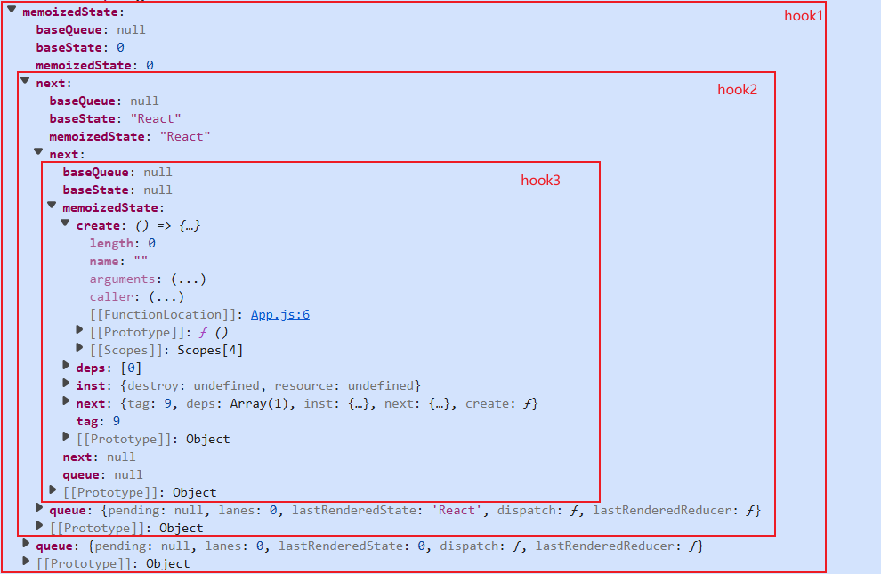

# 函数组件内存模型与 Hooks 链表结构：深入 useState、useEffect 的底层实现

# 一、前言

React Hooks 的出现极大地简化了函数组件的状态管理和副作用处理，但其内部的精妙设计往往隐藏在日常使用的 API 背后。本系列文档旨在揭开这些“幕后”的秘密，带领读者从源码层面理解 `useState`、`useEffect` 等核心 Hook 的工作原理。

我们将从最基础的 Fiber 节点和 Hook 链表等内存布局开始，逐步深入到 `useState` 的初始化与更新流程、`useEffect` 的依赖比较与副作用调度，以及 React 内部的更新队列和优先级调度机制。

# 二、函数组件的内存布局基础

要理解 Hooks 如何工作，核心是先搞懂函数组件的内存承载结构—— 所有状态、副作用都依赖「Fiber 节点」和「Hook 链表」这两个核心载体存储。

## 2.1 核心数据结构总览：它们如何协同工作？

在深入细节之前，我们先来建立一个整体的认知框架。想象一下，React 在管理你的函数组件时，就像在搭建一个精密的“信息管理系统”。这个系统主要由以下几个核心“部件”组成：

1.  **Fiber 节点（组件的“档案袋”）**：

    - 每个 React 组件（无论是函数组件还是类组件）在 React 内部都有一个对应的 `Fiber 节点`。你可以把它理解为这个组件的“专属档案袋”，里面记录了组件的所有重要信息，比如它的类型、属性（props）、在组件树中的位置，以及最重要的——它的**状态**和**副作用**。
    - 对于函数组件而言，`Fiber 节点` 的一个关键字段 `memoizedState`，就像是这个档案袋的“入口标签”，它指向了该组件所有 `Hook` 的起始位置。

2.  **Hook 链表（状态和副作用的“清单”）**：

    - 当你在函数组件中调用 `useState`、`useEffect` 等 Hook 时，React 并不会把它们独立存储。相反，它会将这些 Hook 组织成一个**单向链表**，挂载在对应的 `Fiber 节点` 上。
    - 这个 `Hook 链表` 就像是组件“档案袋”里的一份详细“清单”，每一项（每一个 `Hook` 节点）都记录着一个 `useState` 的当前值，或者一个 `useEffect` 的副作用函数和依赖项等信息。
    - 链表的顺序非常重要，它严格按照你在组件中调用 Hook 的顺序排列。

3.  **更新队列（状态变化的“待办事项列表”）**：
    - 每个 `useState` Hook 内部，都维护着一个独立的 `更新队列`。当你调用 `setState` 来更新状态时，React 并不会立即改变 `Hook` 节点上的状态值，而是会创建一个 `Update` 对象（一个“待办事项”），并把它添加到这个 `更新队列` 中。
    - 这个 `更新队列` 就像是每个 `useState` 的“专属待办事项列表”，里面记录了所有等待被处理的状态更新请求。React 会在合适的时机，按照一定的优先级规则，逐一处理这些“待办事项”，最终计算出最新的状态。

**它们如何协同工作？**

- **Fiber 节点**是**容器**，它持有组件的所有信息，并通过 `memoizedState` 字段**指向**第一个 `Hook` 节点。
- **Hook 链表**是**内容**，它存储了组件中所有 `useState` 和 `useEffect` 等 Hook 的具体数据，并通过 `next` 指针**串联**起来。
- **更新队列**是**机制**，它附着在每个 `useState` 的 `Hook` 节点上，负责**管理**和**调度**状态的变更。

理解这三者之间的关系，是理解 React Hooks 内部机制的关键。接下来，我们将逐一深入这些数据结构的细节。

## 2.2 Fiber 节点与 memoizedState

函数组件本身是无实例的纯函数，无法像类组件那样用 this 存储状态 —— 所有状态、Hooks 信息，都寄生在组件对应的 Fiber 节点 中。可以把 Fiber 节点理解为 “函数组件的内存容器”，其关键字段直接决定了状态的存储与读取逻辑。

### Fiber 节点的核心结构

Fiber 节点与函数组件状态相关的核心字段如下（剔除调度、树结构等非核心字段）：

```javascript
function FiberNode(tag, pendingProps, key, mode) {
  // 1. 状态存储核心：函数组件的 Hooks 链表入口
  this.memoizedState = null; // 关键！指向第一个 Hook 节点（如 useState、useEffect 节点）
  // 2. 组件接收的 props：上次渲染时使用的 props（用于依赖对比）
  this.memoizedProps = null;
  // 3. 更新队列：管理函数组件的副作用、事件等（如 useEffect 队列）
  this.updateQueue = null;
  this.alternate = null; // 4. 双缓冲关联：指向另一棵树的 Fiber 节点。React 内部维护“两棵树”：一棵是当前屏幕上显示的（current），另一棵是在后台构建的（workInProgress）。`alternate` 字段就是这两棵树之间相互连接的桥梁，用于在更新过程中切换和复用 Fiber 节点。
}
```

### memoizedState：Hook 链表的入口

对于函数组件，`memoizedState` 字段具有特殊意义——它是整个 Hook 链表的入口点。与类组件不同，函数组件的 `memoizedState` 不直接存储状态对象，而是指向第一个 Hook 节点。

```javascript
// 函数组件的 memoizedState 指向 Hook 链表头部
fiber.memoizedState = firstHook; // Hook 链表的第一个节点

// 类组件的 memoizedState 直接存储状态对象
classComponentFiber.memoizedState = { count: 0, name: "React" };
```

### 渲染过程中的状态管理

函数组件每次渲染（首次 / 重渲染），都会通过 renderWithHooks 函数初始化内存结构，核心是 “重置链表入口 + 选择调度器”：

```javascript
export function renderWithHooks(
  current, // 当前 Fiber 节点（已渲染到屏幕的）
  workInProgress, // 工作 Fiber 节点（本次要渲染的）
  Component, // 函数组件本身
  props, // 组件接收的 props
  nextRenderLanes // 渲染优先级
) {
  // 1. 绑定全局变量：让 Hooks 能找到当前正在渲染的 Fiber 节点
  currentlyRenderingFiber = workInProgress;
  // 2. 重置 Hooks 链表入口：避免上次渲染的链表残留
  workInProgress.memoizedState = null;
  // 3. 选择 Hooks 调度器：首次渲染用 Mount 调度器，重渲染用 Update 调度器
  ReactSharedInternals.H =
    current === null
      ? HooksDispatcherOnMount // 首次渲染：创建新 Hook 节点
      : HooksDispatcherOnUpdate; // 重渲染：复用已有 Hook 节点
  // 4. 执行函数组件：触发 useState、useEffect 调用，构建/复用 Hooks 链表
  const children = Component(props);
  // 5. 清理全局变量，完成渲染
  finishRenderingHooks(current, workInProgress, Component);
  return children;
}
```

简单说：renderWithHooks 是 “内存初始化的开关”，决定了 Hooks 链表是 “新建” 还是 “复用”，是连接函数组件与 Fiber 节点的核心桥梁。

## 2.3 Hook 链表与更新队列的存储机制

### Hook 节点的内存结构

无论是什么类型的 Hook（useState/useEffect），都共享同一个基础结构，核心字段如下：

```javascript
type Hook = {
  memoizedState: any, // 1. 当前 Hook 的“状态值”。对于 `useState`，它存储的是最新的状态值；对于 `useEffect`，它存储的是副作用函数和依赖数组等信息。
  baseState: any, // 2. “基础状态”。在处理状态更新时，`baseState` 记录了上一次成功提交（commit）时的状态。它与 `baseQueue` 配合，用于在跳过低优先级更新时，确保状态计算的正确性。
  baseQueue: Update<any> | null, // 3. “基础更新队列”。存储了上一次渲染周期中，因为优先级不足而被跳过，但仍需在未来处理的更新。它是一个环形链表，与 `baseState` 一起保证了状态更新的连贯性。
  queue: any, // 4. “当前更新队列”。存储了所有待处理的更新（`Update` 对象）。对于 `useState`，它包含了 `setState` 调用产生的更新。这个队列也是一个环形链表。
  next: Hook | null, // 5. “链表指针”。指向下一个 Hook 节点，将所有 Hook 串联成一个单向链表。
};
```

不同 Hook 的差异，仅体现在 memoizedState 和 queue 的具体内容（如 useEffect 的 memoizedState 存副作用函数和依赖，useState 存具体数值）。

### 链表的构建与遍历

以一个包含多个 Hook 的函数组件为例：

```javascript
function MyComponent() {
  const [count, setCount] = useState(0); // Hook1
  const [name, setName] = useState("React"); // Hook2
  useEffect(() => {
    // Hook3
    document.title = `Count: ${count}`;
  }, [count]);

  return (
    <div>
      {count} - {name}
    </div>
  );
}
```

其内存布局如下：


```
// Fiber 节点：memoizedState 指向第一个 Hook 节点
MyComponentFiber {
  memoizedState: Hook1 (useState(count)), // 链表入口
  memoizedProps: { ... }, // 组件接收的 props
  updateQueue: { ... }, // 副作用队列
  alternate: null
}

// Hook1：useState(count) 节点
Hook1 {
  memoizedState: 0, // 当前状态值：count = 0
  baseState: 0,
  queue: { ... }, // setCount 的更新队列
  next: Hook2 (useState(name)) // 指向第二个 Hook
}

// Hook2：useState(name) 节点
Hook2 {
  memoizedState: "React", // 当前状态值：name = "React"
  baseState: "React",
  queue: { ... }, // setName 的更新队列
  next: Hook3 (useEffect) // 指向第三个 Hook
}

// Hook3：useEffect 节点
Hook3 {
  memoizedState: { // 存副作用相关信息
    create: () => { document.title = `Count: ${count}`; }, // 副作用函数
    destroy: null, // 清理函数（本例无）
    deps: [0] // 依赖数组：[count]
  },
  baseState: null,
  queue: null,
  next: null // 最后一个 Hook，next 为 null
}
```

链表顺序严格遵循 Hooks 的调用顺序（Hook1→Hook2→Hook3），这也是 “不能在条件语句中写 Hooks” 的根本原因（会打乱链表顺序）；
每个 Hook 节点的 next 指针是 “链式存储” 的关键，遍历链表时通过 next 依次访问所有 Hook；
Fiber 节点仅需持有链表的 “头指针”（memoizedState），就能找到所有 Hook 节点，实现高效的状态管理。

### FunctionComponentUpdateQueue 结构

除了 Hooks 链表，函数组件的 Fiber 节点还通过 updateQueue 字段存储辅助信息，其类型为 FunctionComponentUpdateQueue，核心用于管理副作用和事件：

```javascript
// FunctionComponentUpdateQueue 定义
export type FunctionComponentUpdateQueue = {
  lastEffect: Effect | null, // 指向最后一个 Effect 节点（如 useEffect 队列）
  events: Array<EventFunctionPayload> | null, // 事件处理队列（如 useEffectEvent）
  stores: Array<StoreConsistencyCheck> | null, // 状态一致性检查
  memoCache: MemoCache | null, // 记忆化缓存（如 useMemo/useCallback 的缓存）
};
```

它相当于 Hooks 链表的 “辅助仓库”，专门存储链表之外的副作用调度信息，与 Hooks 链表配合实现完整的状态与副作用管理。

# 三、useState 的底层实现机制

`useState` 是 React Hooks 中最基础也最常用的 Hook 之一，它允许你在函数组件中“存储”和“更新”状态。但它背后是如何工作的呢？在 React 内部，`useState` 的行为会根据组件是首次渲染（挂载）还是后续渲染（更新）而有所不同。

简单来说，当你的函数组件第一次被渲染时，`useState` 会走一套“初始化”流程；而当组件因为状态变化需要重新渲染时，`useState` 则会走一套“更新”流程。在整个过程中，React 还会利用一个“更新队列”和“优先级调度”机制，来确保状态更新的有序性和高效性。

## 3.1 mountState：初始化状态管理

当一个函数组件首次被渲染到屏幕上时，React 会进入一个“挂载”阶段。在这个阶段，`useState` 会被一个特殊的“Hooks 分发器”（`HooksDispatcherOnMount`）拦截，并将其内部逻辑指向 `mountState` 函数。

### 3.1.1 发生时机

- **首次渲染函数组件时**：这是 `mountState` 登场的唯一时机。想象一下，你的组件就像一个新开张的商店，`mountState` 负责为它准备好所有必要的“货架”（Hook 节点）和“库存管理系统”（更新队列）。

### 3.1.2 初始值如何处理

当你调用 `useState` 时，可以传入一个初始值，这个初始值可以是具体的数据（如 `useState(0)`），也可以是一个函数（如 `useState(() => computeInitialValue())`）。

- **懒初始化（Lazy Initialization）**：

  - 如果你传入的是一个函数（例如 `useState(() => heavyInit())`），React 不会立即执行这个函数，而是在真正需要初始值的时候才去调用它。这种方式被称为“懒初始化”，当你的初始值计算成本很高时，可以避免不必要的性能开销。

  ```javascript
  function mountStateImpl(initialState) {
    const hook = mountWorkInProgressHook(); // 创建 Hook 节点
    if (typeof initialState === "function") {
      const initialStateInitializer = initialState;
      initialState = initialStateInitializer(); // 第一次调用，获取初始值
      if (shouldDoubleInvokeUserFnsInHooksDEV) {
        // 仅在 DEV 严格模式下
        setIsStrictModeForDevtools(true);
        try {
          initialStateInitializer(); // 第二次调用，检查副作用
        } finally {
          setIsStrictModeForDevtools(false);
        }
      }
    }
    // ... 后续会用这个 initialState 来设置 hook.memoizedState 和 hook.baseState
    return hook;
  }
  ```

### 3.1.3 Hook 节点与更新队列的建立

在 `mountStateImpl` 函数中，React 会为当前的 `useState` 调用创建一个内部的 **Hook 节点**（`hook` 对象），并为它配备一个 **更新队列**（`queue` 对象）。

- **Hook 节点（`hook`）**：
  - `memoizedState`：这是 Hook 节点中最重要的字段，它存储着当前组件渲染时可以读取到的状态值。你可以把它理解为组件的“当前状态快照”。
  - `baseState`：这个字段用于在处理更新队列时，作为计算新状态的“基线”。当有多个更新排队时，`baseState` 确保 React 能够从一个已知且稳定的状态开始计算，避免因为跳过某些更新而导致状态不一致。
  ```javascript
  // ... 在 mountStateImpl 中
  hook.memoizedState = hook.baseState = initialState; // 初始时两者都等于初始值
  ```
- **更新队列（`queue`）**：

  - 每个 `useState` Hook 都会有一个独立的更新队列。这个队列是一个**环形链表**结构，专门用来存储所有待处理的状态更新。
  - **`pending: null`**：指向队列中最新待处理的更新。由于是环形链表，它通常指向链表的尾部。在初始化时，还没有任何更新，所以是 `null`。
  - **`lanes: NoLanes`**：这是一个位掩码（bitmask），用于表示队列中所有更新的优先级集合。`NoLanes` 表示当前队列中没有任何更新，因此也没有优先级。
  - **`dispatch: null`**：这个字段非常关键，它将会在稍后被绑定为我们熟悉的 `setState` 函数。在初始化阶段，它暂时是 `null`。
  - **`lastRenderedReducer: basicStateReducer`**：这是一个默认的 reducer 函数，用于处理 `useState` 的状态更新逻辑。它能识别你传入 `setState` 的是值还是函数。
  - **`lastRenderedState: initialState`**：记录上一次渲染时的状态。这个字段与 `lastRenderedReducer` 一起，用于实现“急切更新”（eager update）优化，在某些情况下可以减少一次不必要的渲染。

  ```javascript
  // ... 在 mountStateImpl 中
  const queue = {
    pending: null, // 指向最新待处理更新（环形链表尾）
    lanes: NoLanes, // 队列中所有更新的优先级集合
    dispatch: null, // 后续绑定的更新触发函数（setXxx）
    lastRenderedReducer: basicStateReducer, // 状态计算函数（默认处理值/函数类型 action）
    lastRenderedState: (initialState: any), // 上一次渲染的状态（用于优化）
  };
  hook.queue = queue;
  ```

### 3.1.4 绑定 dispatch：为什么 `setState` 引用稳定

你可能注意到，无论组件重新渲染多少次，你从 `useState` 解构出来的 `setState` 函数的引用总是稳定的，它不会变。这是 React 内部一个非常巧妙的设计。

- **闭包与绑定**：
  - 在 `mountState` 函数中，React 会创建一个 `dispatch` 函数，并通过 `Function.prototype.bind` 方法，将当前的 Fiber 节点（`currentlyRenderingFiber`）和 Hook 的更新队列（`queue`）“绑定”到 `dispatchSetState` 函数上。
  - 这个绑定操作确保了 `dispatch` 函数在组件的整个生命周期中，始终能够正确地找到它所属的 Fiber 节点和更新队列，从而触发正确的状态更新。

```javascript
function mountState(initialState) {
  const hook = mountStateImpl(initialState);
  const queue = hook.queue;
  // 绑定 dispatch：与当前 Fiber、队列闭包关联，确保稳定性
  const dispatch = dispatchSetState.bind(
    null,
    currentlyRenderingFiber, // 当前正在渲染的 Fiber 节点
    queue // 当前 Hook 的更新队列
  );
  queue.dispatch = dispatch; // 将绑定后的 dispatch 存储到队列中
  return [hook.memoizedState, dispatch]; // 返回 [状态, 更新函数]
}
```

### 3.1.5 `action` 长什么样：值或函数都可以

当你调用 `setState(action)` 时，`action` 可以是两种形式：

1.  **直接的值**：例如 `setCount(10)`，此时 `action` 就是 `10`。
2.  **一个函数**：例如 `setCount(prevCount => prevCount + 1)`，此时 `action` 是一个接收上一个状态作为参数并返回新状态的函数。

这两种形式的 `action` 都是由 `basicStateReducer` 这个内部函数来处理的：

```javascript
function basicStateReducer<S>(state: S, action: BasicStateAction<S>): S {
  return typeof action === "function" ? action(state) : action;
}
```

## 3.2 updateState：状态更新流程

当组件已经挂载完成，并且因为 `setState` 调用导致状态发生变化时，React 会进入“更新”阶段。此时，`useState` 的内部逻辑会路由到 `updateState` 函数。

### 3.2.1 发生时机

- **组件后续渲染时**：只要组件不是第一次渲染，并且因为某种原因（例如父组件重新渲染、自身状态更新等）需要重新执行函数体时，`useState` 就会调用 `updateState`。

### 3.2.2 `useState` 是 `useReducer` 的特殊形式

`useState` 在底层其实是 `useReducer` 的一个简化版本。`updateState` 函数的实现清晰地展示了这一点：

```javascript
function updateState<S>(
  initialState: (() => S) | S
): [S, Dispatch<BasicStateAction<S>>] {
  // 实际上是调用了 updateReducer，并传入了 basicStateReducer 作为默认的 reducer
  return updateReducer(basicStateReducer, initialState);
}
```

这意味着 `useState` 的所有状态更新逻辑，包括如何处理更新队列、如何计算新状态、如何处理优先级等，都复用了 `useReducer` 的核心机制。`useState` 只是提供了一个更简洁的 API 封装。

### 3.2.3 `updateReducer` 的核心工作

`updateReducer` 是处理 Hook 状态更新的核心函数。它会遍历 Hook 的更新队列，并根据队列中的更新来计算出最新的状态。

- **获取 Hook 节点和队列**：

  - `updateReducer` 首先会获取当前正在处理的 Hook 节点（`hook`）以及它关联的更新队列（`queue`）。

```javascript
function updateReducerImpl<S, A>(
  hook: Hook,
  current: Hook, // 上一次渲染的 Hook 节点
  reducer: (S, A) => S
): [S, Dispatch<A>] {
  const queue = hook.queue;
  // ...
}
```

- **遍历更新队列，计算新状态**：

  - `updateReducer` 会从 `hook.baseState`（基线状态）开始，沿着更新队列（`queue.pending` 指向的环形链表）逐个处理每一个更新。
  - 对于每个更新，它会调用传入的 `reducer` 函数（对于 `useState` 来说就是 `basicStateReducer`），将当前状态和更新的 `action` 传给 `reducer`，得到新的状态。

- **避免不必要的渲染**：

  - 当 setState 接收到一个 值 ，并且这个值与当前的 memoizedState （即上一次渲染后的状态） 严格相等 时，React 会判断状态没有实际变化，从而 提前退出 ，不调度一次新的渲染。这是为了避免不必要的计算和 DOM 更新，提高性能。这正是我之前修正的重点。

- **处理优先级（Lanes）**：

  - 在遍历更新队列时，`updateReducer` 还会考虑每个更新的优先级（`lane`）。它会确保只有那些优先级足够高的更新才会被处理。低优先级的更新可能会被跳过，留待后续的渲染周期处理。

### 3.2.4 返回值

`updateState` 最终会返回一个数组 `[state, dispatch]`，其中 `state` 是经过所有有效更新计算后的最新状态，而 `dispatch` 仍然是那个稳定的 `setState` 函数。

## 3.3 UpdateQueue 与优先级调度

在 React 中，状态更新并非总是立即执行的。为了保证应用的响应性和性能，React 引入了一套精密的更新队列（`UpdateQueue`）和优先级调度（`Lanes`）机制。这套机制确保了即使在短时间内有大量状态更新请求，React 也能以高效且有序的方式处理它们。

### 3.3.1 UpdateQueue 的数据结构

每个 `useState` Hook 内部都维护着一个 `queue` 对象，这个对象就是该 Hook 的更新队列。它是一个**环形链表**，专门用于存储所有待处理的状态更新（`Update` 对象）。

```javascript
// Hook 内部的 queue 结构
const queue = {
  pending: null, // 指向队列中最新待处理更新（环形链表尾部）
  lanes: NoLanes, // 队列中所有更新的优先级集合（位掩码）
  dispatch: null, // 绑定后的 setState 函数
  lastRenderedReducer: basicStateReducer, // 状态计算函数
  lastRenderedState: (initialState: any), // 上一次渲染的状态
};
```

- **`pending`**: 这是一个指向环形链表尾部的指针。由于是环形链表，通过 `pending.next` 就可以访问到链表的第一个更新。当没有待处理的更新时，`pending` 为 `null`。
- **`lanes`**: 这是一个位掩码（bitmask），它聚合了当前 `UpdateQueue` 中所有 `Update` 的优先级。React 通过这个 `lanes` 值来判断当前 Hook 是否有待处理的更新，以及这些更新的最高优先级是什么。
- **`dispatch`**: 这就是我们平时使用的 `setState` 函数。它在 `mountState` 阶段被绑定到当前的 Fiber 节点和 `queue` 上，确保了其引用稳定性。
- **`lastRenderedReducer`**: 对于 `useState` 而言，它始终是 `basicStateReducer`，负责处理 `action` 是值还是函数的情况。
- **`lastRenderedState`**: 记录上一次成功渲染后该 Hook 的状态值。这个值在“急切更新”优化中扮演重要角色。

### 3.3.2 Update 对象的结构

当调用 `setState(action)` 时，React 会创建一个 `Update` 对象，并将其添加到对应的 `UpdateQueue` 中。一个 `Update` 对象通常包含以下关键信息：

```javascript
type Update<S, A> = {
  lane: Lane, // 本次更新的优先级
  action: A, // 更新的动作，可以是新状态值或一个函数
  hasEagerState: boolean, // 是否有急切状态（用于优化）
  eagerState: S | null, // 急切状态值（用于优化）
  next: Update<S, A> | null, // 指向下一个更新
  // ... 其他内部属性
};
```

- **`lane`**: 表示本次更新的优先级。React 内部使用 `Lane`（车道）模型来管理优先级，不同的 `Lane` 代表不同的优先级，例如同步更新、并发更新、离屏更新等。
- **`action`**: 用户传入 `setState` 的值或函数。
- **`hasEagerState` 和 `eagerState`**: 用于“急切更新”优化。如果 `action` 是一个非函数值，并且与当前状态不同，React 会尝试计算出 `eagerState` 并标记 `hasEagerState` 为 `true`。
- **`next`**: 指向 `UpdateQueue` 中的下一个 `Update` 对象，构成环形链表。

### 3.3.3 优先级调度与 `Lanes` 机制

React 的调度器（Scheduler）会根据 `Lanes` 来决定何时以及以何种顺序处理更新。

- **Lanes (车道)**: React 使用位掩码来表示优先级，每个位代表一个“车道”。数字越小，优先级越高。例如：
  - `SyncLane` (同步车道): 最高优先级，通常用于用户交互（如点击）。
  - `InputContinuousLane` (连续输入车道): 较高优先级，用于连续输入事件（如拖拽）。
  - `DefaultLane` (默认车道): 中等优先级，用于大多数状态更新。
  - `IdleLane` (空闲车道): 最低优先级，用于不重要的后台任务。
- **更新的合并与跳过**:
  - 在 `updateReducerImpl` 中，React 会遍历 `UpdateQueue`。对于每个 `Update`，它会检查其 `lane` 是否在当前渲染的 `renderLanes` 范围内。
  - 如果 `Update` 的 `lane` 不在 `renderLanes` 范围内（即优先级不够高），这个更新会被**跳过**，并保留在 `UpdateQueue` 中，等待下一个更高优先级的渲染周期处理。
  - 如果 `Update` 的 `lane` 在 `renderLanes` 范围内，则会被处理，其 `action` 会被 `reducer` 函数执行，计算出新的状态。
- **`baseState` 和 `baseQueue`**:
  - `hook.baseState` 存储的是上一次成功提交（commit）的状态。
  - `hook.baseQueue` 存储的是上一次成功提交后，仍然保留在队列中但未被处理的低优先级更新。
  - 在每次更新时，`updateReducerImpl` 会从 `baseState` 开始，并首先处理 `baseQueue` 中的更新，然后处理 `pending` 队列中的更新。这样可以确保即使有低优先级更新被跳过，它们也能在后续的渲染中被正确处理，保证状态的最终一致性。

### 3.3.4 批量更新 (Batching Updates)

React 会在特定情况下对多个 `setState` 调用进行批量处理，将它们合并成一个更新，从而减少不必要的渲染次数，提高性能。

- **自动批量更新**: 在 React 18 及更高版本中，`setState` 调用在事件处理函数、`useEffect`、`setTimeout` 等异步操作中都会自动进行批量更新。这意味着即使你在同一个事件处理函数中多次调用 `setState`，React 也只会触发一次重新渲染。
- **手动批量更新**: 对于一些特殊场景，例如在 Promise 回调中，如果需要手动批量更新，可以使用 `ReactDOM.unstable_batchedUpdates` (在 React 18 中已不再需要，因为默认行为就是批量更新)。

```javascript
// 假设这是 React 内部维护的全局变量
let isBatchingUpdates = false;
let pendingUpdates = []; // 存储所有待处理的更新

// 模拟 setState 的核心逻辑
function dispatchSetState(fiber, queue, action) {
  const update = { action, lane: /* 计算优先级 */ };
  // 将更新添加到 Hook 的队列中
  enqueueUpdate(queue, update);

  if (!isBatchingUpdates) {
    // 如果当前不在批处理中，则立即调度一次渲染
    scheduleUpdateOnFiber(fiber.root, fiber, update.lane);
  } else {
    // 如果在批处理中，则将更新添加到全局待处理队列，等待批处理结束
    pendingUpdates.push({ fiber, queue, update });
  }
}

// 模拟事件处理函数或异步回调的包装
function batchedUpdatesWrapper(callback) {
  isBatchingUpdates = true;
  try {
    callback(); // 执行用户代码，其中可能包含多个 setState
  } finally {
    isBatchingUpdates = false;
    // 批处理结束，统一调度所有收集到的更新
    flushPendingUpdates();
  }
}

function flushPendingUpdates() {
  // 遍历所有收集到的更新。虽然这里对每个更新都调用了 scheduleUpdateOnFiber，
  // 但在 React 内部，scheduleUpdateOnFiber 会智能地将同一批次内对同一根节点的多次调度请求合并，
  // 最终只会触发一次针对该根节点的实际渲染工作循环。
  // 这样就实现了批量更新的效果。
  for (const { fiber, queue, update } of pendingUpdates) {
    scheduleUpdateOnFiber(fiber.root, fiber, update.lane);
  }
  pendingUpdates = []; // 清空待处理队列
}

// 模拟 scheduleUpdateOnFiber 的简化版本
// 它的职责是标记 Fiber 树需要更新，并最终触发一次工作循环
function scheduleUpdateOnFiber(root, fiber, lane) {
  // 标记 root 和 fiber 需要更新
  markRootUpdated(root, lane);
  // 确保根节点被调度，最终会触发一次渲染
  ensureRootIsScheduled(root);
}

// 模拟 updateReducerImpl 的简化版本
// 在渲染阶段，它会遍历 Hook 的更新队列，计算最终状态
function updateReducerImpl(hook, current, reducer) {
  const queue = hook.queue;
  let newState = hook.baseState;
  let update = queue.pending; // 假设 pending 包含了所有更新

  do {
    if (update === null) break;
    // 应用更新
    newState = reducer(newState, update.action);
    update = update.next;
  } while (update !== queue.pending); // 遍历整个循环链表

  hook.memoizedState = newState;
  return [newState, hook.dispatch];
}

// 示例使用
function Counter() {
  const [count, setCount] = useState(0);

  const handleClick = () => {
    // 在事件处理函数中，这些 setState 会被自动批量处理
    setCount(c => c + 1);
    setCount(c => c + 1);
    setCount(c => c + 1);
    // 最终只会触发一次渲染，count 会变为 3
  };

  return <button onClick={handleClick}>{count}</button>;
}
```

**核心原理总结**：

- **`isBatchingUpdates` 标志**：React 内部维护一个标志，指示当前是否处于批处理模式。
- **条件调度**：当 `setState` 被调用时，如果 `isBatchingUpdates` 为 `false`，则会立即调度一次渲染。如果为 `true`，则会将更新暂时存储起来。
- **统一调度**：当批处理模式结束时（例如事件处理函数执行完毕），React 会统一处理所有收集到的更新，并只调度一次渲染。
- **`updateReducerImpl` 的作用**：在渲染阶段，`updateReducerImpl` 会负责遍历 Hook 的更新队列，将所有批处理中的更新按顺序应用，计算出最终的状态，从而确保组件只渲染一次，但状态是所有更新的累积结果。

通过这种机制，React 能够在保证状态一致性的前提下，最大限度地减少不必要的渲染，提升应用性能。

### 3.3.5 setState 的同步与异步行为

react 有一道面试题是 setState 是同步还是异步，其实 setState （包括 useState 的更新函数）的同步/异步特性并非由其本身决定，而是取决于 React 的 批量更新机制 。这一机制由 isBatchingUpdates 标志控制。

#### 1.核心源码分析

```javascript
// ReactFiberWorkLoop.js
let isBatchingUpdates = false;

function batchedUpdates(fn) {
  const previousIsBatchingUpdates = isBatchingUpdates;
  isBatchingUpdates = true;
  try {
    return fn(); // 在批量更新模式下执行回调
  } finally {
    isBatchingUpdates = previousIsBatchingUpdates;
    if (!isBatchingUpdates) {
      flushSyncUpdates(); // 退出批量模式时刷新更新
    }
  }
}
```

- **异步更新（默认行为）**：当 `setState` 在 React 事件处理函数（如 `onClick`）或生命周期方法中调用时，会被 `batchedUpdates` 包裹，`isBatchingUpdates` 为 `true`。此时更新会被暂存到 `updateQueue` 中，等待事件处理完成后统一执行，避免重复渲染。

  ```javascript
  // 示例：React 事件处理中的异步更新
  function handleClick() {
    setCount((c) => c + 1); // 进入批量更新队列
    setCount((c) => c + 1); // 同一队列，合并处理
  }
  ```

- **同步更新（特殊情况）**：当 `setState` 在非 React 事件上下文（如 `setTimeout`、原生 DOM 事件）中调用时，`isBatchingUpdates` 为 `false`。此时更新会立即执行，同步触发重新渲染。

  ```javascript
  // 示例：非 React 事件中的同步更新
  setTimeout(() => {
    setCount((c) => c + 1); // 直接触发更新
  }, 0);
  ```

#### 2.`updateReducer` 中的批量处理逻辑

在 `updateReducer` 函数中，React 会根据 `isBatchingUpdates` 决定是否立即处理更新：

```javascript
// ReactFiberHooks.js
function updateReducer<S, A>(
  reducer: (S, A) => S,
  initialState: (() => S) | S
): [S, Dispatch<A>] {
  const hook = updateWorkInProgressHook();
  const queue = hook.queue;

  // 处理更新队列
  const pendingQueue = queue.pending;
  if (pendingQueue !== null) {
    queue.pending = null;
    const firstUpdate = pendingQueue.next;
    let update = firstUpdate;
    do {
      const action = update.action;
      hook.memoizedState = reducer(hook.memoizedState, action); // 计算新状态
      update = update.next;
    } while (update !== firstUpdate);
  }

  // 根据批量模式决定是否立即渲染
  if (!isBatchingUpdates) {
    scheduleSyncCallback(flushSyncUpdates); // 同步刷新
  }

  return [hook.memoizedState, dispatch];
}
```

- 当 `isBatchingUpdates` 为 `true` 时，更新会被暂存，直到事件循环结束后统一处理。
- 当 `isBatchingUpdates` 为 `false` 时，会立即调用 `scheduleSyncCallback` 触发渲染。

#### 3.结论

`setState` 的行为是**条件异步**的：

- 在 React 管控的上下文（事件处理、生命周期）中，为异步批量更新。
- 在非 React 管控的上下文（定时器、原生事件）中，为同步立即更新。

### 3.3.6 状态预计算 (Eager State Computation)

在 `dispatchSetStateInternal` 函数中，React 会尝试进行“急切状态计算”优化。

- **优化原理**: 如果 `action` 是一个非函数值，并且当前 Hook 的 `queue.lastRenderedReducer` 是 `basicStateReducer`，React 会尝试立即计算出新的状态 `eagerState`。
- **提前退出**: 如果计算出的 `eagerState` 与 `queue.lastRenderedState` 相同，并且没有其他高优先级的更新，React 就可以**提前退出**，避免调度一次不必要的渲染。这大大减少了不必要的计算和渲染开销。
- **条件**: 这种优化只在满足特定条件时发生，例如 `action` 必须是值而不是函数，并且没有其他待处理的更新会影响最终状态。

```javascript
const currentState: S = (queue.lastRenderedState: any);
const eagerState = lastRenderedReducer(currentState, action);
//　这里的 `is(eagerState, currentState)` 用于比较新旧状态是否相等
// 如果相等，则通过 `return false` 阻止后续的调度。
if (is(eagerState, currentState)) {
  enqueueConcurrentHookUpdateAndEagerlyBailout(fiber, queue, update);
  return false; // 提前退出，不调度新的渲染
}
```

# 四、useEffect 的底层实现机制

`useEffect` 是 React Hooks 中一个非常重要的 Hook，它允许你在函数组件中执行副作用（side effects），例如数据获取、订阅或手动更改 DOM。理解 `useEffect` 的底层机制对于深入掌握 React 的渲染流程和性能优化至关重要。

## 4.1 Effect 链表结构

与 `useState` 类似，`useEffect` 也是通过链表的形式存储在 Fiber 节点上的。每个 `useEffect` Hook 都会在对应的 Fiber 节点上创建一个 `Effect` 对象，这些 `Effect` 对象通过 `next` 指针连接起来，形成一个 Effect 链表。这个链表最终会挂载到 Fiber 节点的 `updateQueue` 属性上。

每个 `Effect` 对象通常包含以下关键属性：

- **`tag`**: 一个位掩码，用于标识 Effect 的类型和特性，例如 `HookHasEffect`（表示有副作用需要执行）、`HookLayout`（对应 `useLayoutEffect`）、`HookPassive`（对应 `useEffect`）。
- **`create`**: `useEffect` 回调函数本身，即你传入 `useEffect` 的第一个参数。它会在副作用执行时被调用。
- **`destroy`**: `create` 函数的返回值，通常是一个清理函数。它会在组件卸载或 Effect 重新执行前被调用，用于清理副作用（例如取消订阅、清除定时器）。
- **`deps`**: 依赖项数组，即你传入 `useEffect` 的第二个参数。React 会根据这个数组来判断 Effect 是否需要重新执行。
- **`next`**: 指向 Effect 链表中的下一个 `Effect` 对象。

**简易结构示意**：

```javascript
// 假设 FiberNode 上有一个 updateQueue 属性，其中包含 lastEffect 指针
// FiberNode.updateQueue.lastEffect -> Effect1 -> Effect2 -> Effect3 -> Effect1 (循环链表)

interface Effect {
  tag: number; // HookFlags，例如 HookPassive
  create: () => (() => void) | void; // 副作用函数
  destroy: (() => void) | void; // 清理函数
  deps: Array<any> | null; // 依赖项数组
  next: Effect; // 指向下一个 Effect
}

interface FunctionComponentUpdateQueue {
  lastEffect: Effect | null;
  // ... 其他属性，如 events, stores, memoCache
}

interface FiberNode {
  // ... 其他 Fiber 属性
  updateQueue: FunctionComponentUpdateQueue | null;
  // ...
}
```

## 4.2 EffectInstance 与生命周期管理

`useEffect` 的生命周期管理主要围绕着 `create` 和 `destroy` 函数的执行时机。React 会在不同的阶段调用这些函数，以确保副作用的正确执行和清理。

### 4.2.1 挂载阶段 (Mount Phase)

当组件首次渲染并挂载到 DOM 后，React 会执行 `useEffect` 的 `create` 函数。这个过程主要由 `commitHookEffectListMount` 函数负责。

**`commitHookEffectListMount` 核心逻辑**：

```javascript
// 简化后的 commitHookEffectListMount 示例
function commitHookEffectListMount(flags, finishedWork) {
  const updateQueue = finishedWork.updateQueue;
  const lastEffect = updateQueue !== null ? updateQueue.lastEffect : null;

  if (lastEffect !== null) {
    const firstEffect = lastEffect.next;
    let effect = firstEffect;
    do {
      // 检查 Effect 的 tag 是否包含指定的 flags (例如 HookPassive)
      if ((effect.tag & flags) === flags) {
        const create = effect.create;
        // 执行 create 函数，并将其返回值（清理函数）存储到 effect.destroy 上
        effect.destroy = create();
      }
      effect = effect.next;
    } while (effect !== firstEffect);
  }
}
```

- `commitHookEffectListMount` 会遍历 Fiber 节点上的 Effect 链表。
- 对于符合条件的 Effect（例如 `useEffect` 对应的 `HookPassive` 类型的 Effect），它会调用 `effect.create()` 函数。
- `create` 函数的返回值（如果存在）会被保存到 `effect.destroy` 属性上，作为后续清理的依据。

### 4.2.2 卸载阶段 (Unmount Phase)

当组件从 DOM 中卸载时，React 会执行 `useEffect` 的 `destroy` 函数，以清理之前创建的副作用。这个过程主要由 `commitHookEffectListUnmount` 函数负责。

**`commitHookEffectListUnmount` 核心逻辑**：

```javascript
// 简化后的 commitHookEffectListUnmount 示例
function commitHookEffectListUnmount(flags, finishedWork) {
  const updateQueue = finishedWork.updateQueue;
  const lastEffect = updateQueue !== null ? updateQueue.lastEffect : null;

  if (lastEffect !== null) {
    const firstEffect = lastEffect.next;
    let effect = firstEffect;
    do {
      // 检查 Effect 的 tag 是否包含指定的 flags
      if ((effect.tag & flags) === flags) {
        const destroy = effect.destroy;
        // 如果存在清理函数，则执行它
        if (destroy !== undefined && destroy !== null) {
          destroy();
        }
      }
      effect = effect.next;
    } while (effect !== firstEffect);
  }
}
```

- `commitHookEffectListUnmount` 同样会遍历 Effect 链表。
- 对于符合条件的 Effect，它会检查 `effect.destroy` 是否存在，如果存在，则执行该清理函数。

### 4.2.3 更新阶段 (Update Phase) 与延迟执行

在组件更新时，如果 `useEffect` 的依赖项发生了变化，React 会先执行上一次 Effect 的 `destroy` 函数，然后再执行新的 `create` 函数。值得注意的是，`useEffect`（即 `HookPassive` 类型的 Effect）的 `create` 和 `destroy` 函数的执行是**延迟的**，它们不会在同步的 commit 阶段立即执行，而是会在浏览器完成绘制之后，在一个单独的异步任务中执行。这个延迟执行的机制主要由 `flushPassiveEffects` 函数及其相关的调度器（Scheduler）负责。

**`flushPassiveEffects` 的作用**：

- `flushPassiveEffects` 是一个在 commit 阶段之后被调用的函数，它负责收集所有待执行的 `HookPassive` 类型的 Effect。
- 它会将这些 Effect 调度到一个低优先级的任务中，等待浏览器空闲时执行。
- 这种延迟执行的策略可以避免阻塞主线程，提高用户体验，确保动画和用户交互的流畅性。

## 4.3 依赖比较与副作用调度

`useEffect` 的核心在于它能够根据依赖项的变化来决定是否重新执行副作用。这就像给 React 装上了一双“火眼金睛”，能够精准地识别出哪些“任务”需要重新执行，哪些可以“偷懒”跳过。而副作用的调度，则像一位“幕后英雄”，默默地在合适的时机执行这些任务，确保应用的性能和用户体验。

#### 4.3.1 依赖项比较

在每次组件渲染时，`useEffect` 都会拿到新的依赖项数组 `nextDeps`，并与上一次渲染的依赖项数组 `prevDeps` 进行比较。这个比较工作主要由 `areHookInputsEqual` 函数完成。

```javascript
function areHookInputsEqual(
  nextDeps: Array<mixed>,
  prevDeps: Array<mixed> | null
): boolean {
  if (prevDeps === null) {
    // 首次渲染或依赖项从无到有，总是返回 false，意味着副作用总是会执行。
    return false;
  }

  // 核心比较逻辑：遍历依赖数组，使用 Object.is 进行浅比较
  for (let i = 0; i < prevDeps.length && i < nextDeps.length; i++) {
    if (is(nextDeps[i], prevDeps[i])) {
      continue; // 如果当前依赖项相同，则继续比较下一个
    }
    return false; // 发现不同，立即返回 false
  }
  return true; // 所有依赖项都相同，返回 true
}
```

#### 4.3.2 副作用的调度

当组件首次挂载时，`mountEffectImpl` 函数会被调用。它的主要职责是：

```javascript
function mountEffectImpl(
  fiberFlags: Flags,
  hookFlags: HookFlags,
  create: () => (() => void) | void, // 副作用函数
  createDeps: Array<mixed> | void | null // 依赖项
  // ... 其他参数
): void {
  const hook = mountWorkInProgressHook(); // 创建新的 Hook 节点
  const nextDeps = createDeps === undefined ? null : createDeps;
  currentlyRenderingFiber.flags |= fiberFlags; // 标记 Fiber 节点需要执行副作用
  hook.memoizedState = pushSimpleEffect(
    // 将副作用信息存储到 Hook 节点的 memoizedState 中
    HookHasEffect | hookFlags,
    createEffectInstance(),
    create,
    nextDeps
  );
}
```

- **创建 Hook 节点**：`mountWorkInProgressHook()` 会创建一个新的 Hook 节点，用于存储 `useEffect` 的相关信息。
- **标记 Fiber 节点**：`currentlyRenderingFiber.flags |= fiberFlags;` 会给当前的 Fiber 节点打上一个 `fiberFlags` 标记（例如 `PassiveEffect`），这个标记告诉 React 在提交阶段需要处理这个副作用。
- **存储副作用信息**：`pushSimpleEffect` 会将副作用函数 `create`、依赖项 `nextDeps` 以及其他相关信息封装成一个 Effect 对象，存储再 fiber 的 updateQueue 中，并返回这个对象，后再存储在 Hook 节点的 `memoizedState` 中。

##### 4.3.2.2 更新阶段

当组件更新时，`updateEffectImpl` 函数会被调用。这是 `useEffect` 依赖项比较和副作用调度最关键的地方：

```javascript
function updateEffectImpl(
  fiberFlags: Flags,
  hookFlags: HookFlags,
  create: () => (() => void) | void, // 副作用函数
  deps: Array<mixed> | void | null // 依赖项
): void {
  const hook = updateWorkInProgressHook(); // 获取当前 Hook 节点
  const nextDeps = deps === undefined ? null : deps;
  const effect: Effect = hook.memoizedState; // 获取上一次渲染的副作用信息
  const inst = effect.inst;

  if (currentHook !== null) {
    if (nextDeps !== null) {
      const prevEffect: Effect = currentHook.memoizedState;
      const prevDeps = prevEffect.deps;
      // 核心：调用 areHookInputsEqual 比较依赖项
      if (areHookInputsEqual(nextDeps, prevDeps)) {
        // 如果依赖项没有变化，则跳过副作用的重新执行
        hook.memoizedState = pushSimpleEffect(
          hookFlags,
          inst,
          create,
          nextDeps
        );
        return; // 直接返回，不设置 Fiber 节点的 flags
      }
    }
  }

  // 如果依赖项发生变化，或者 prevDeps 为 null (不应该发生在这里，因为是更新阶段)
  // 则标记 Fiber 节点需要执行副作用
  currentlyRenderingFiber.flags |= fiberFlags;

  hook.memoizedState = pushSimpleEffect(
    HookHasEffect | hookFlags,
    inst,
    create,
    nextDeps
  );
}
```

#### 4.3.3 副作用的调度时机

`useEffect` 的副作用（默认情况下）是在浏览器完成绘制之后异步执行的。这通过 `PassiveEffect` 标志位来实现。

- 当 `useEffect` 的依赖项发生变化时，`updateEffectImpl` 会给当前的 Fiber 节点打上 `PassiveEffect` 标记。
- 在 React 的提交阶段，它会遍历所有带有 `PassiveEffect` 标记的 Fiber 节点，并执行它们对应的副作用函数。
- 由于这些副作用是在浏览器绘制之后执行的，它们不会阻塞用户界面的渲染，从而保证了应用的响应性。

通过对 `useState` 和 `useEffect` 底层源码的深入剖析，我们可以提炼出一些指导我们日常开发的最佳实践。这些实践并非空穴来风，而是基于 React 内部机制的优化考量。

# 五 一些实践优化建议

### 4.4.1 `useState`

1.  **懒初始化（Lazy Initialization）**：

    - **源码**：在 `mountStateImpl` 中，如果 `useState` 的初始值是一个函数，React 只会在首次渲染时执行它一次。
    - **实践建议**：当初始状态的计算成本较高（例如需要进行大量计算或数据转换）时，应传入一个函数作为 `useState` 的初始值，而不是直接传入计算结果。这可以避免在每次组件渲染时都执行不必要的计算。

    ```javascript
    // 避免：每次渲染都执行 expensiveCalculation
    const [data, setData] = useState(expensiveCalculation());

    // 推荐：只在首次渲染时执行 expensiveCalculation
    const [data, setData] = useState(() => expensiveCalculation());
    ```

2.  **状态的不可变性（Immutability）**：

    - **源码**：`updateReducer` 在处理更新时，会比较新旧状态是否严格相等（`Object.is`）。如果相等，React 会跳过后续的渲染。
    - **实践建议**：永远不要直接修改状态对象或数组。当你需要更新对象或数组状态时，应该创建新的对象或数组，并用新值替换旧值。这能确保 React 正确检测到状态变化，并触发必要的重新渲染。

    ```javascript
    // 避免：直接修改对象
    const [user, setUser] = useState({ name: "Alice", age: 30 });
    user.age = 31; // ❌ React 可能不会重新渲染

    // 推荐：创建新对象
    setUser((prevUser) => ({ ...prevUser, age: 31 })); // ✅
    ```

3.  **批量更新（Batching Updates）**：
    - **源码**：React 内部会批量处理在同一事件循环中触发的多个 `setState` 调用，以减少不必要的重新渲染次数。
    - **实践建议**：在事件处理函数或异步操作中，即使多次调用 `setState`，通常也只会触发一次重新渲染。了解这一点可以帮助你避免过度优化，并相信 React 的性能机制。

### 4.4.2 `useEffect`

1.  **精确的依赖项（Precise Dependencies）**：

    - **源码**：`areHookInputsEqual` 函数通过浅比较（`Object.is`）来判断依赖项是否发生变化。
    - **实践建议**：
      - **不要遗漏依赖项**：确保 `useEffect` 的依赖数组包含了所有在副作用函数内部使用的、且在组件渲染过程中可能发生变化的值（props、state、函数等）。遗漏依赖项会导致副作用在应该重新执行时却不执行，从而引入 bug。
      - **避免不必要的依赖项**：如果某个值在副作用函数内部使用，但它在组件的整个生命周期中都不会改变（例如常量、外部函数），则可以将其从依赖数组中移除，或者使用 `useCallback`/`useMemo` 进行记忆化，以避免不必要的副作用重新执行。
      - **对象和数组的引用问题**：由于 `areHookInputsEqual` 进行的是浅比较，如果依赖项中包含对象或数组，即使其内部属性发生变化，只要引用不变，`useEffect` 就不会重新执行。此时，你需要确保每次更新都生成新的对象/数组引用，或者使用 `useMemo` 来记忆化这些对象/数组。

2.  **恰当的清理函数（Proper Cleanup）**：

    - **源码**：`useEffect` 的副作用函数可以返回一个清理函数，这个函数会在组件卸载或副作用重新执行前被调用。
    - **实践建议**：对于任何需要订阅、定时器、网络请求等可能导致内存泄漏或资源占用的副作用，务必提供一个清理函数。这能确保在组件生命周期结束或副作用重新执行时，及时释放资源，避免不必要的性能开销和 bug。

    ```javascript
    useEffect(() => {
      const timer = setInterval(() => {
        console.log("Tick");
      }, 1000);

      return () => {
        clearInterval(timer); // 清理定时器
      };
    }, []);
    ```

3.  **理解执行时机（Understanding Execution Timing）**：
    - **源码**：`PassiveEffect` 标志位决定了 `useEffect` 的副作用是在浏览器绘制之后异步执行的。
    - **实践建议**：`useEffect` 适用于那些不影响 DOM 布局或渲染的副作用，例如数据获取、订阅、日志记录等。如果你的副作用需要同步修改 DOM 并并在浏览器绘制前完成，你应该考虑使用 `useLayoutEffect`。

# 六. 最后

React Hooks 的设计精妙之处在于其对 Fiber 架构的充分利用，通过 Hook 链表和更新队列，实现了函数组件状态和副作用的有效管理。理解这些底层机制，不仅能帮助我们更深入地掌握 React 的工作原理，也能在日常开发中更好地优化组件性能，避免潜在的问题。
