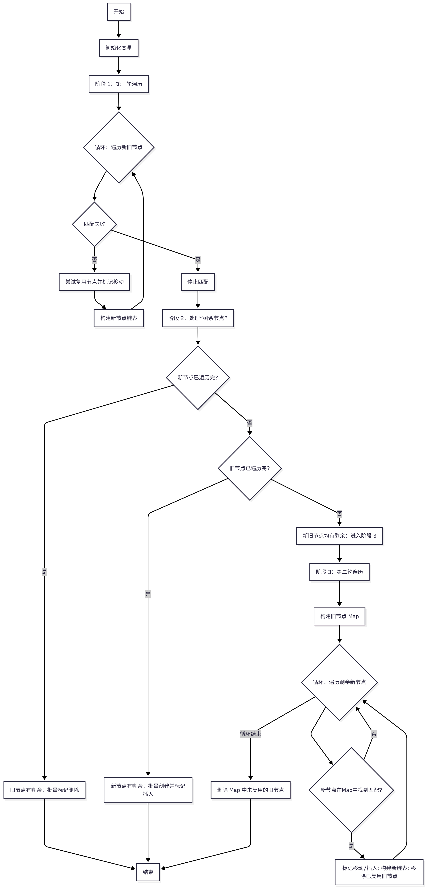

# Fiber 双缓存架构与 Diff 算法优化

# 1. 引言

## 1.1 传统栈协调的局限

在 React 16 之前的版本中，React 的协调器（Reconciler）采用了一种基于递归遍历组件树的机制，通常称之为“栈协调”（Stack Reconciler）。这种机制在处理组件更新时，会从根组件开始，自上而下地递归调用每个组件的 `render` 方法，并对比新旧虚拟 DOM 树的差异。

以下是一个简化的 React 15 协调过程示例：

```js
// React 15 的简化协调过程
function reconcileChildren(currentFiber, newChildren) {
  // 递归处理所有子节点
  for (let i = 0; i < newChildren.length; i++) {
    const child = newChildren[i];
    const newFiber = createFiber(child);

    // 递归调用，无法中断
    reconcileChildren(newFiber, child.children);

    // 立即应用DOM变更
    commitWork(newFiber);
  }
}
```

这种递归架构存在以下根本性问题：

1.  **调用栈的不可控性**：递归调用会在 JavaScript 调用栈中生成大量栈帧，每个栈帧包含函数的局部变量和执行上下文。在处理大型组件树时，这不仅可能导致栈溢出，更关键的是，一旦递归过程启动，便无法中途暂停或中断，必须一次性完成。

2.  **主线程阻塞的严重性**：由于 JavaScript 的单线程特性，当 React 执行大量协调工作时，主线程会被完全占用。这意味着浏览器无法及时响应用户交互、执行动画或处理其他高优先级任务，从而导致用户界面出现卡顿和响应延迟，严重损害用户体验。

3.  **优先级处理的缺失**：在传统的递归架构中，所有更新都被视为同等重要。系统无法区分紧急的用户输入事件（如点击、输入）与非紧急的数据获取或后台更新。这可能导致一个耗时较长的低优先级更新任务阻塞了高优先级、需要即时响应的用户操作。

## 1.2 Fiber 架构介绍

eact 16 引入了全新的协调器（Reconciler），即 **Fiber Reconciler**，它基于 **Fiber 节点**实现。Fiber 节点是 React Fiber 架构的核心，它在概念上扮演着双重角色：

1. **作为静态数据结构**：每个 Fiber 节点对应一个 React element，它存储了组件的关键信息，例如组件的类型（函数组件、类组件、原生 DOM 组件等）、对应的 DOM 节点引用，以及与父节点、子节点和兄弟节点的关系。
2. **作为动态工作单元**：在组件更新过程中，每个 Fiber 节点会记录本次更新中组件状态的变化、需要执行的具体工作（例如组件需要被删除、插入到 DOM 中，或者仅仅是更新属性等）。

React Fiber 架构的主要目标是显著提升 React 在动画、布局和手势等场景下的表现力与用户体验。其核心的特性是：

1.  **时间切片**：这意味着 React 能够将复杂的渲染工作拆解成更小的、可管理的工作单元，并在多个浏览器帧之间分批执行，从而避免长时间阻塞主线程。
2.  **可中断与可恢复**：当有新的、更高优先级的更新请求时，React 能够暂停当前正在进行的工作，转而处理紧急任务，并在主线程空闲时恢复之前的工作。
3.  **优先级调度**：能够为不同类型的更新任务分配不同的优先级，确保用户交互等高优先级任务能够得到及时响应，而低优先级任务则可以在后台或空闲时段执行。

## 1.3 双缓存与 Diff 优化的关系

React Fiber 架构中，双缓存机制与 Diff 算法优化是实现高效、可中断渲染的核心支柱。

### 1.3.1 双缓存机制

Fiber 架构通过 “Current 树”（对应当前屏幕 UI、与 DOM 同步）和 “WorkInProgress 树”（后台构建的待更新 UI）实现双缓存：更新时在 WorkInProgress 树处理，构建完成后与 Current 树交换并提交 DOM，确保 UI 一致性，同时支持渲染中断与恢复，避免中间状态闪烁。

### 1.3.2 Diff 算法优化

Fiber 中的 Diff 算法聚焦 “高效找差异”：按层级比较节点，类型不同则直接替换；类型相同则对比属性，结合 key 识别列表节点的增 / 删 / 移，只更新变化部分，最小化 DOM 操作。

### 1.3.3 双缓存与 Diff 的协同作用

双缓存机制为 Diff 算法提供了一个沙盒环境。所有的 Diff 计算都在 WorkInProgress Fiber Tree 上进行，不会影响到当前屏幕上显示的 Current Fiber Tree。这使得 Diff 过程可以被中断，并且可以在后台进行，从而避免阻塞主线程。

当 Diff 算法在 WorkInProgress Fiber Tree 上完成所有计算后，它会生成一个副作用列表（Effect List），其中包含了所有需要对真实 DOM 进行的操作（如插入、更新、删除等）。在提交阶段，React 会遍历这个副作用列表，一次性地将所有变更应用到真实 DOM 上。

# 2. Fiber 节点的数据结构设计

## 2.1 Fiber 节点的核心属性

在 React Fiber 架构中，`Fiber` 节点是核心概念，它代表了组件的一个工作单元。每个 `Fiber` 节点都包含了组件的类型、状态、属性以及与父节点、子节点和兄弟节点的关系等信息。这些信息共同构成了 Fiber 树，是 React 协调过程的基础。

```javascript
export type Fiber = {
  // 节点类型信息
  this.tag = tag;                    // 节点类型（函数组件、类组件、DOM元素等）
  this.key = key;                    // React key
  this.elementType = null;           // 元素类型
  this.type = null;                  // 组件类型或DOM标签名
  this.stateNode = null;             // 对应的DOM节点或组件实例

  // 树结构关系
  this.return = null;                // 父Fiber节点
  this.child = null;                 // 第一个子Fiber节点
  this.sibling = null;               // 下一个兄弟Fiber节点
  this.index = 0;                    // 在兄弟节点中的索引

  // 属性和状态
  this.ref = null;                   // ref引用
  this.pendingProps = pendingProps;  // 新的props
  this.memoizedProps = null;         // 上次渲染使用的props
  this.updateQueue = null;           // 更新队列
  this.memoizedState = null;         // 类组件上次渲染的state，函数组件指向第一个hook

  // 副作用相关
  this.flags = NoFlags;              // 副作用标记
  this.subtreeFlags = NoFlags;       // 子树副作用标记
  this.deletions = null;             // 需要删除的子节点

  // 调度相关
  this.lanes = NoLanes;              // 当前节点的优先级
  this.childLanes = NoLanes;         // 子树的优先级

  // 双缓存
  this.alternate = null;             // 对应的另一棵树的节点
};
```

1. **`tag`**: 这个属性是 Fiber 节点最重要的标识之一，它决定了 Fiber 节点的类型，例如：

- `FunctionComponent`: 函数组件
- `ClassComponent`: 类组件
- `HostRoot`: 根 Fiber 节点
- `HostComponent`: 原生 DOM 元素（如 `<div>`、`<span>`）
- `HostText`: 文本节点
- `SuspenseComponent`: Suspense 组件
- `ContextProvider`: Context 提供者
- `ContextConsumer`: Context 消费者
  通过 `tag` 属性，React 能够根据不同类型的组件执行不同的协调逻辑。

2. **`elementType` 和 `type`**:

- `elementType` 是 `React.createElement` 的第一个参数，它可能是函数、类或字符串。
- `type` 是 `elementType` 经过解析后的实际组件类型。对于函数组件，`elementType` 和 `type` 都是函数本身；对于类组件，它们都是类本身；对于原生 DOM 元素，`elementType` 和 `type` 都是字符串（如 `'div'`）。

3. **`stateNode`**: 这个属性存储了与 Fiber 节点关联的实例。对于类组件，`stateNode` 指向组件的实例；对于原生 DOM 元素，`stateNode` 指向真实的 DOM 节点；对于函数组件，`stateNode` 通常为 `null`。

4. **`flags` 和 `subtreeFlags`**: 这些是位掩码，用于标记 Fiber 节点需要执行的副作用。

- `flags` 标记当前 Fiber 节点自身的副作用。
- `subtreeFlags` 标记当前 Fiber 节点及其子树中所有 Fiber 节点需要执行的副作用。
  这些副作用包括 DOM 插入、更新、删除、生命周期方法的调用等。React 在提交阶段会根据这些 `flags` 来执行相应的操作。

5. **`alternate`**: 这是双缓存机制的核心属性。每个 Fiber 节点都有一个 `alternate` 属性，指向它的替身 Fiber 节点。在更新过程中，React 会在 `workInProgress` 树上构建新的 Fiber 节点，并通过 `alternate` 属性与 `current` 树上的旧 Fiber 节点关联。当 `workInProgress` 树构建完成后，`current` 树和 `workInProgress` 树会进行切换，从而实现 UI 的原子更新。

6. **`return`、`child`、`sibling`**: 这三个属性构成了 Fiber 树的结构：

- `return` 指向父 Fiber 节点。
- `child` 指向第一个子 Fiber 节点。
- `sibling` 指向下一个兄弟 Fiber 节点。
  通过这三个指针，React 可以在 Fiber 树中进行遍历，实现深度优先遍历（DFS）的工作方式。

## 2.2 树形结构的链表实现

Fiber 架构采用了一种巧妙的数据结构设计：使用链表来表示树形结构。这种设计使得树的遍历变得更加灵活和高效。

每个 Fiber 节点都包含了以下三个核心指针，它们共同构建了 Fiber 树的链表结构：

1.  **`child` 指针**：指向当前 Fiber 节点的**第一个子节点**。如果一个节点有多个子节点，`child` 指针会指向它的最左侧子节点。
2.  **`sibling` 指针**：指向当前 Fiber 节点的**下一个兄弟节点**。通过 `child` 和 `sibling` 指针，可以遍历一个父节点下的所有子节点。
3.  **`return` 指针**：指向当前 Fiber 节点的**父节点**。这个指针在工作循环中至关重要，它允许 React 在处理完一个子树后，能够“返回”到其父节点继续处理或向上冒泡。

**这种链表实现的优势：**

1. **高效的遍历**：通过 `child` 和 `sibling` 指针，React 可以进行深度优先遍历（DFS），这与传统的递归遍历类似，但避免了 JavaScript 调用栈的限制。
2. **灵活的修改**：当组件树发生变化时（例如，添加、删除或移动节点），React 只需要修改少数几个指针，而无需重新构建整个树。这大大提高了更新的效率。
3. **支持可中断渲染**：`return` 指针使得 React 可以在处理完一个 Fiber 节点后，随时暂停工作，并在需要时从中断的地方恢复。当一个工作单元完成时，React 可以通过 `return` 指针向上回溯，找到下一个需要处理的节点，而无需依赖调用栈。

# 3. Fiber 双缓存架构

## 3.1 双缓存的核心概念

双缓存（Double Buffering）是计算机图形学中的一个经典概念，React 将这个概念引入到虚拟 DOM 的管理中，创造了一种优雅的状态管理方案。

在计算机图形学中，双缓存通常用于解决画面撕裂（tearing）和闪烁（flickering）问题。它通过维护两个缓冲区来实现：一个用于显示（front buffer），另一个用于在后台绘制（back buffer）。当后台缓冲区绘制完成后，两个缓冲区会进行快速交换，从而在屏幕上呈现一个完整且平滑的画面。

React Fiber 架构借鉴了这一思想，将“双缓存”应用于其内部的 Fiber 树管理。它维护了两棵 Fiber 树：

1.  **Current Fiber Tree (当前 Fiber 树)**：这棵树代表了当前屏幕上已经渲染的 UI 状态。它与真实的 DOM 保持同步，用户所见即是这棵树的反映。
2.  **WorkInProgress Fiber Tree (工作中的 Fiber 树)**：这棵树是在后台构建的，用于表示即将更新的 UI 结构。所有的更新操作（如状态变更、属性更新、组件挂载/卸载等）都会在这棵树上进行。

当有更新发生时，React 不会直接修改 Current Fiber Tree，而是在 WorkInProgress Fiber Tree 上进行所有的协调和渲染工作。这个过程是可中断的，意味着 React 可以在浏览器空闲时暂停工作，并在需要时恢复。一旦 WorkInProgress Fiber Tree 构建完成，并且所有的更新都已计算完毕，它就会在提交阶段（Commit Phase）与 Current Fiber Tree 进行交换，新的 WorkInProgress Fiber Tree 成为 Current Fiber Tree，并最终反映到真实的 DOM 上。

## 3.2 双缓存的存储结构

### 3.2.1 FiberRootNode 与 HostRootFiber

整个 React 应用的根节点是一个 `FiberRootNode` 对象。这个对象是整个应用的入口，它包含了指向当前渲染的 Fiber 树的引用。在 `FiberRootNode` 内部，有一个关键的属性 `current`，它始终指向当前屏幕上显示的 **Current Fiber Tree** 的根 Fiber 节点，这个根 Fiber 节点通常被称为 `HostRootFiber`。
`HostRootFiber` 是整个 Fiber 树的起点，它代表了 React 应用挂载的真实 DOM 容器（例如 `<div id="root"></div>`）。

```javascript
function FiberRootNode(containerInfo, tag, hydrate) {
  this.tag = tag;
  this.containerInfo = containerInfo;
  this.pendingChildren = null;
  this.current = null; // 指向当前渲染的 Fiber 树的根节点
  this.pingCache = null;
  this.finishedWork = null;
  this.timeoutHandle = -1;
  this.context = null;
  this.pendingContext = null;
  this.hydrate = hydrate;
  this.callbackNode = null;
  this.callbackPriority = NoLane;
  this.eventTimes = createLaneMap(NoLanes);
  this.expirationTimes = createLaneMap(NoTimestamp);

  this.pendingLanes = NoLanes;
  this.suspendedLanes = NoLanes;
  this.pingedLanes = NoLanes;
  this.expiredLanes = NoLanes;
  this.mutableReadLanes = NoLanes;
  this.finishedLanes = NoLanes;

  this.entangledLanes = NoLanes;
  this.entanglements = createLaneMap(NoLanes);
}
```

### 3.2.2 Current Fiber Tree 与 WorkInProgress Fiber Tree 的关联

每个 Fiber 节点都有一个 `alternate` 属性。这个 `alternate` 属性是连接 Current Fiber Tree 和 WorkInProgress Fiber Tree 的关键。

- 在 **Current Fiber Tree** 中的每个 Fiber 节点，其 `alternate` 属性会指向 **WorkInProgress Fiber Tree** 中对应的 Fiber 节点。
- 反之，在 **WorkInProgress Fiber Tree** 中的每个 Fiber 节点，其 `alternate` 属性会指向 **Current Fiber Tree** 中对应的 Fiber 节点。

这种双向引用使得 React 可以在更新过程中，轻松地在两棵树之间切换和查找对应的节点。当 React 开始构建 WorkInProgress Fiber Tree 时，它会从 Current Fiber Tree 的根节点开始，为每个 Fiber 节点创建或复用一个 `alternate` 节点，并将其作为 WorkInProgress Fiber Tree 的一部分。

### 3.2.3 树的切换

当 WorkInProgress Fiber Tree 构建完成，并且所有的更新都已准备好提交时，React 会执行一个非常简单的操作：它会将 `FiberRootNode` 的 `current` 属性从指向旧的 Current Fiber Tree 的根节点，切换为指向新的 WorkInProgress Fiber Tree 的根节点。

这个切换操作是原子性的，意味着它会在一个瞬间完成。一旦切换完成，新的 WorkInProgress Fiber Tree 就成为了新的 Current Fiber Tree，并立即反映到屏幕上。旧的 Current Fiber Tree 则会被废弃，等待垃圾回收机制进行清理。

### 3.2.4 存储结构的优势

这种存储结构带来了以下几个显著优势：

1. **高效的切换：** 通过简单地修改 `FiberRootNode.current` 的指向，React 可以在 O(1) 的时间复杂度内完成新旧树的切换，保证了 UI 更新的平滑性。
2. **内存复用：** 在构建 WorkInProgress Fiber Tree 时，React 会尽可能地复用 Current Fiber Tree 中的 Fiber 节点。如果一个组件在更新前后没有发生变化，React 就会直接克隆旧的 Fiber 节点，而不是重新创建，从而节省了内存开销。
3. **可中断性：** 由于 WorkInProgress Fiber Tree 是在后台构建的，即使构建过程被中断，也不会影响到当前屏幕上显示的 UI。当 React 恢复工作时，它可以继续在 WorkInProgress Fiber Tree 上进行操作。

通过 `FiberRootNode`、`HostRootFiber` 和 `alternate` 属性的设计，React Fiber 架构实现了高效、平滑且可中断的双缓存机制。

## 3.3 双缓存的工作流程

### 3.3.1 渲染/协调阶段

这个阶段的主要任务是构建 **WorkInProgress Fiber Tree**，并找出需要对真实 DOM 进行的所有变更。这个阶段是可中断的，意味着 React 可以在任何时候暂停工作，并在稍后恢复。

```javascript
function workLoopConcurrent() {
  while (workInProgress !== null && !shouldYield()) {
    workInProgress = performUnitOfWork(workInProgress);
  }
}

function performUnitOfWork(unitOfWork: Fiber): Fiber | null {
  const current = unitOfWork.alternate;
  let next;

  // 执行当前工作单元的协调逻辑
  next = beginWork(current, unitOfWork, renderLanes);

  // 处理副作用标记
  if (next === null) {
    next = completeUnitOfWork(unitOfWork);
  }

  // 优先级检查：如果存在更高优先级任务则中断
  if (shouldYieldToHost()) {
    return unitOfWork;
  }

  return next;
}
```

1.  **从根节点开始遍历**：React 从 `HostRootFiber`（即 `FiberRootNode.current` 指向的根 Fiber 节点）开始，深度优先遍历 Current Fiber Tree。
2.  **创建或复用 WorkInProgress Fiber**：对于 Current Fiber Tree 中的每个 Fiber 节点，React 会检查它是否需要更新。
    - 如果需要更新，React 会创建一个新的 WorkInProgress Fiber 节点，并将其 `alternate` 属性指向对应的 Current Fiber 节点。
    - 如果不需要更新，React 会直接克隆 Current Fiber 节点，并将其作为 WorkInProgress Fiber 节点。
    - 这个过程中，`alternate` 属性起到了关键的连接作用，使得两棵树的节点能够相互引用。
3.  **执行更新工作**：在 WorkInProgress Fiber 节点上，React 会执行组件的 `render` 方法（对于函数组件，就是执行函数体），计算新的 props 和 state，并与旧的 props 和 state 进行比较（Diff 算法）。
4.  **标记副作用**：如果发现有任何需要对真实 DOM 进行的操作（例如，属性变更、文本内容更新、节点插入、移动或删除），React 会在 WorkInProgress Fiber 节点上标记一个“副作用”（Effect Tag），并将其添加到副作用列表中。
5.  **可中断性**：这个阶段是可中断的。React 会根据当前帧的剩余时间（time slice）和任务的优先级来决定是否继续工作。如果时间不足或有更高优先级的任务到来，React 会暂停当前工作，将控制权交还给浏览器，并在下次空闲时恢复。

### 3.3.2 提交阶段

一旦渲染/协调阶段完成，并且 WorkInProgress Fiber Tree 构建完毕，所有的副作用都被标记并收集起来，React 就会进入提交阶段。这个阶段是不可中断的，必须一次性完成，以确保 UI 的一致性。

```javascript
function commitRoot(root: FiberRoot) {
  const finishedWork = root.finishedWork;

  // 提交前检查：确保没有未处理的高优先级任务
  if (shouldFlushSync) {
    flushSyncCallbacks();
  }

  // 执行 DOM 更新和副作用
  commitRootImpl(root, finishedWork);

  // 切换 Fiber 树（原子操作）
  root.current = finishedWork;

  // 清理工作
  root.finishedWork = null;
}
```

1.  **切换 Fiber 树**：React 会将 `FiberRootNode` 的 `current` 属性从指向旧的 Current Fiber Tree 切换为指向新的 WorkInProgress Fiber Tree。此时，新的 WorkInProgress Fiber Tree 就成为了新的 Current Fiber Tree。
2.  **执行副作用**：React 遍历副作用列表，并根据每个副作用的类型，一次性地将所有变更应用到真实的 DOM 上。这包括：
    - **DOM 更新**：修改元素的属性、文本内容等。
    - **DOM 插入/删除/移动**：将新的 DOM 节点插入到文档中，或从文档中删除/移动旧的 DOM 节点。
    - **生命周期方法/Hooks**：执行组件的 `componentDidMount`、`componentDidUpdate`、`componentWillUnmount` 等生命周期方法，以及 `useEffect` 等 Hooks 的回调函数。
3.  **完成更新**：提交阶段完成后，用户在屏幕上看到的就是最新的 UI 界面。旧的 Current Fiber Tree（现在是 WorkInProgress Fiber Tree 的 `alternate`）会被标记为“旧树”，等待垃圾回收。

通过这两个阶段的协同工作，双缓存机制使得 React 能够在后台“悄悄地”准备好新的 UI，然后在一个瞬间将其呈现在用户面前，从而实现了平滑、高效且响应迅速的用户体验。

# 4. Fiber Diff 算法

## 4.1 Fiber Diff 与传统 Diff 的差异

### 4.3.1 传统 Diff 算法的局限性

在 React 15 及之前的版本中，协调、过程是同步进行的。这意味着一旦更新开始，它就会一口气遍历整个组件树，计算出所有需要进行的 DOM 操作，然后一次性提交到浏览器。这种“一气呵成”的模式在组件树较小或更新频率较低时表现良好，但当组件树变得庞大或更新频繁时，就可能导致以下问题：

1.  **阻塞主线程**：同步的协调过程会长时间占用 JavaScript 主线程，导致浏览器无法响应用户输入（如点击、滚动），从而出现页面卡顿、无响应的“掉帧”现象。
2.  **无法中断与恢复**：由于是同步执行，一旦开始就无法暂停或中断，这使得优先级更高的任务（如用户输入）无法及时得到处理。
3.  **难以实现优先级调度**：所有更新都被视为同等重要，无法根据任务的紧急程度进行区分和调度。

### 4.3.2 源码中的体现

`reconcileChildFibers` 是 Fiber Diff 算法的核心，负责对比新旧子节点，生成 Fiber 节点及 DOM 操作副作用（插入、更新、删除等）。
以特殊函数 `forceUnmountCurrentAndReconcile`为例：

```javascript
function forceUnmountCurrentAndReconcile(
  current: Fiber,
  workInProgress: Fiber,
  nextChildren: any,
  renderLanes: Lanes
) {
  // 第一次调用：传入 null 触发所有旧子节点的删除
  workInProgress.child = reconcileChildFibers(
    workInProgress,
    current.child,
    null,
    renderLanes
  );
  // 第二次调用：传入 null 跳过旧节点匹配，直接创建新子节点
  workInProgress.child = reconcileChildFibers(
    workInProgress,
    null,
    nextChildren,
    renderLanes
  );
}
```

该函数虽为 “强制卸载并重建子树” 的特殊场景，却体现了 Fiber 架构的核心优势（相比传统 Diff）

1. 可中断的协调过程： Fiber 将工作拆分为 Fiber 节点级别的单元，即使是两次 reconcileChildFibers 调用，也可在处理过程中暂停并交还浏览器控制权，避免长时间阻塞；而传统 Diff 需同步完成整个操作，期间浏览器无响应。
2. 优先级调度支持： reconcileChildFibers 兼容优先级机制，即使执行重置操作，仍可被高优任务（如用户输入）中断；传统 Diff 无法区分优先级，只能按顺序执行。
3. 细粒度副作用管理：即使是 “强制重建”，也通过生成精确的 “删除旧节点 + 插入新节点” 副作用实现，而非粗暴清空 DOM；传统 Diff 易产生多余 DOM 操作，缺乏这种精细化控制。

## 4.2 单节点 Diff 逻辑

### 4.2.1 单节点 Diff 的核心逻辑

1. 如果新旧节点的 key 不同，React 会直接销毁旧节点及其子树，并创建新节点及其子树。key 的作用是帮助 React 识别列表中的唯一元素，当 key 改变时，意味着元素本身发生了变化。

2. key 相同，但 类型 不同：如果新旧节点的 key 相同，但 type 不同，React 也会销毁旧节点，并创建新节点。例如，一个 <p> 标签变为 <div> 标签。

3. 类型和 key 都相同：这是最理想的情况。React 会复用旧的 Fiber 节点，并继续比较它们的属性（props）。如果属性有变化，React 会标记该节点需要更新，并继续递归比较其子节点。

```javascript
function reconcileSingleElement(
  returnFiber: Fiber, // 父 Fiber 节点
  currentFirstChild: Fiber | null, // 当前旧的第一个子 Fiber 节点
  element: ReactElement, // 新的 React 元素，表示即将渲染的子组件
  lanes: Lanes // 优先级相关
) {
  const key = element.key; // 取新节点的key
  let child = currentFirstChild;
  while (child !== null) {
    if (child.key === key) {
      // 第一步：匹配key
      const elementType = element.type;
      // 处理 Fragment 类型
      if (elementType === REACT_FRAGMENT_TYPE) {
        // 如果旧节点也是 Fragment，则复用并更新其子节点
        if (child.tag === Fragment) {
          deleteRemainingChildren(returnFiber, child.sibling); // 删除 Fragment 后的所有兄弟节点
          const existing = useFiber(child, element.props.children); // 复用旧的
          existing.return = returnFiber;
          return existing;
        }
      } else {
        // 如果新旧节点的 type 相同，或者新节点是懒加载组件且解析后的类型相同，则可以复用
        if (
          child.elementType === elementType ||
          (typeof elementType === "object" &&
            elementType !== null &&
            elementType.$typeof === REACT_LAZY_TYPE &&
            resolveLazy(elementType) === child.type)
        ) {
          deleteRemainingChildren(returnFiber, child.sibling); // 删除其他旧节点
          const existing = useFiber(child, element.props); // 复用旧节点并更新属性
          existing.return = returnFiber;
          return existing;
        }
      }
      // 如果 key 匹配但 type 不匹配，或者 Fragment 类型不匹配，则不能复用，删除旧节点并跳出循环
      deleteRemainingChildren(returnFiber, child); // type不匹配则删除旧节点
      break;
    } else {
      // key不匹配则删除旧节点
      deleteChild(returnFiber, child);
    }
    // 继续检查下一个兄弟节点
    child = child.sibling;
  }

  // 如果没有匹配到，则根据类型创建新节点
  if (element.type === REACT_FRAGMENT_TYPE) {
    const created = createFiberFromFragment(
      element.props.children,
      returnFiber.mode,
      lanes,
      element.key
    );
    created.return = returnFiber;
    return created;
  } else {
    const created = createFiberFromElement(element, returnFiber.mode, lanes); // 新建节点
    created.return = returnFiber;
    return created;
  }
}
```

## 4.3 多节点 Diff 逻辑

多节点 Diff 是 React Diff 算法的核心场景，需处理节点的插入、删除、移动三种核心操作。

### 4.3.1 核心原理：两轮遍历与 key 的作用

`key` 是节点的唯一标识，相当于 Diff 过程的“锚点”，用于精准匹配新旧节点；结合两轮遍历，可高效覆盖不同更新场景：

1. **第一轮遍历**：按索引正向匹配，快速复用“连续相同”的节点（如列表前半部分无变化），避免复杂计算；
2. **第二轮遍历**：用哈希 Map 匹配剩余节点，处理“移动、插入、删除”等离散变更，通过 `key` 快速定位可复用节点。

### 4.3.2 完整流程拆解（基于 `reconcileChildrenArray`）

#### 阶段 1：第一轮遍历（按索引正向匹配）

从新旧节点列表的“头部”开始，按索引逐个对比，优先复用连续相同的节点：

- **匹配条件**：节点的 `key` 相同且类型相同 → 复用旧节点，仅更新属性；
- **终止条件**：遇到不匹配节点（`key`/类型不同）或空槽位（如 `null`）→ 退出第一轮，进入后续处理。

核心代码（简化）：

```javascript
let oldFiber = currentFirstChild; // 旧节点链表起点
let newIdx = 0; // 新节点数组索引
for (; oldFiber && newIdx < newChildren.length; newIdx++) {
  // 缓存下一个旧节点，避免遍历丢失
  const nextOldFiber = oldFiber.sibling;
  // 对比 key 和类型，尝试复用节点
  const newFiber = updateSlot(
    returnFiber,
    oldFiber,
    newChildren[newIdx],
    lanes
  );

  if (newFiber === null) break; // 匹配失败，退出第一轮

  // 标记节点是否需要移动（通过 lastPlacedIndex 判断）
  lastPlacedIndex = placeChild(newFiber, lastPlacedIndex, newIdx);
  // 构建新节点链表（通过 sibling 指针连接）
  if (!previousNewFiber) resultingFirstChild = newFiber;
  else previousNewFiber.sibling = newFiber;

  previousNewFiber = newFiber;
  oldFiber = nextOldFiber; // 继续下一个旧节点
}
```

#### 阶段 2：处理“剩余节点”（分 3 种场景）

根据第一轮结束后 “新旧节点是否有剩余”，分情况处理：

1. 新节点已遍历完，旧节点有剩余
   剩余旧节点均为 “需删除” 节点 → 批量标记删除：

```javascript
if (newIdx === newChildren.length) {
  deleteRemainingChildren(returnFiber, oldFiber); // 删除所有剩余旧节点
  return resultingFirstChild;
}
```

2. 旧节点已遍历完，新节点有剩余
   剩余新节点均为 “需插入” 节点 → 批量创建并标记插入：

```javascript
if (oldFiber === null) {
  for (; newIdx < newChildren.length; newIdx++) {
    const newFiber = createChild(returnFiber, newChildren[newIdx], lanes);
    placeChild(newFiber, lastPlacedIndex, newIdx); // 标记插入
    // 连接新节点到链表
    previousNewFiber
      ? (previousNewFiber.sibling = newFiber)
      : (resultingFirstChild = newFiber);
    previousNewFiber = newFiber;
  }
  return resultingFirstChild;
}
```

3. 新旧节点均有剩余（进入第二轮遍历）

#### 阶段 3：第二轮遍历（Map 映射匹配）

针对“新旧节点均有剩余”的场景（如列表中间插入/删除节点），用哈希 Map 快速定位可复用节点：

1. **构建旧节点 Map**：将剩余旧节点存入 Map，`key` 为节点的 `key`（优先）或索引（无 `key` 时）；
2. **遍历剩余新节点**：从 Map 中查找匹配的旧节点：
   - 找到 → 复用节点，调整位置（标记 `Placement`），并从 Map 中移除该旧节点；
   - 未找到 → 新建节点，标记插入；
3. **清理未复用旧节点**：Map 中剩余的旧节点均为“未被复用”，批量标记删除。

核心代码（简化）：

```javascript
// 剩余旧节点转 Map，key 为节点 key 或索引
const existingChildren = mapRemainingChildren(oldFiber);
// 遍历剩余新节点，从 Map 匹配
for (; newIdx < newChildren.length; newIdx++) {
  const newFiber = updateFromMap(
    existingChildren,
    returnFiber,
    newIdx,
    newChildren[newIdx],
    lanes
  );

  if (newFiber) {
    // 标记移动/插入，构建新链表
    lastPlacedIndex = placeChild(newFiber, lastPlacedIndex, newIdx);
    if (!previousNewFiber) resultingFirstChild = newFiber;
    else previousNewFiber.sibling = newFiber;
    previousNewFiber = newFiber;
    // 移除已复用的旧节点
    existingChildren.delete(newFiber.key || newIdx);
  }
}
// 删除 Map 中未复用的旧节点
existingChildren.forEach((child) => deleteChild(returnFiber, child));
```

#### 关键辅助函数：`placeChild`（判断节点是否移动）

通过 `lastPlacedIndex`（上一个“无需移动”的旧节点索引）判断当前节点是否需要移动：

- 若旧节点索引 < `lastPlacedIndex` → 节点位置后移，标记 `Placement`（需移动）；
- 若旧节点索引 ≥ `lastPlacedIndex` → 节点位置未变，更新 `lastPlacedIndex` 为当前旧节点索引。

代码逻辑：

```javascript
function placeChild(newFiber, lastPlacedIndex, newIndex) {
  newFiber.index = newIndex;
  const current = newFiber.alternate; // 对应的旧节点
  if (current) {
    const oldIndex = current.index;
    if (oldIndex < lastPlacedIndex) {
      newFiber.flags |= Placement; // 标记需要移动
      return lastPlacedIndex;
    } else {
      return oldIndex; // 更新 lastPlacedIndex
    }
  } else {
    newFiber.flags |= Placement; // 新节点，标记插入
    return lastPlacedIndex;
  }
}
```

#### 流程图



### 4.3.3 具体示例

#### 示例 1：节点移动（列表元素交换位置）

```jsx
// 旧列表
<div>
  <div key="a">A</div>
  <div key="b">B</div>
  <div key="c">C</div>
</div>;

//新列表
<div>
  <div key="b">B</div>
  <div key="a">A</div>
  <div key="c">C</div>
</div>;
```

**Diff 过程**：

1. 第一轮遍历：
   - 索引 0：旧 `a` vs 新 `b` → `key` 不匹配，退出第一轮；
2. 第二轮遍历：
   - 构建旧节点 Map：`{a: 旧a, b: 旧b, c: 旧c}`；
   - 新节点索引 0（`b`）：从 Map 找到旧 `b`，旧索引 1 ≥ `lastPlacedIndex`（0）→ 无需移动，更新 `lastPlacedIndex` 为 1；
   - 新节点索引 1（`a`）：从 Map 找到旧 `a`，旧索引 0 < `lastPlacedIndex`（1）→ 标记移动；
   - 新节点索引 2（`c`）：从 Map 找到旧 `c`，旧索引 2 ≥ `lastPlacedIndex`（1）→ 无需移动；
3. 最终操作：仅移动 `a` 到 `b` 之后，无节点创建/删除。

#### 示例 2：节点插入+删除（列表中间增删元素）

```jsx
// 旧列表
<div>
  <div key="a">A</div>
  <div key="b">B</div>
  <div key="c">C</div>
</div>
// 新列表
<div>
  <div key="a">A</div>
  <div key="d">D</div>
  <div key="c">C</div>
</div>
```

**Diff 过程**：

1. 第一轮遍历：
   - 索引 0：旧 `a` vs 新 `a` → 匹配成功，复用节点；
   - 索引 1：旧 `b` vs 新 `d` → `key` 不匹配，退出第一轮；
2. 第二轮遍历：
   - 构建旧节点 Map：`{b: 旧b, c: 旧c}`；
   - 新节点索引 1（`d`）：Map 中无匹配 → 新建节点，标记插入；
   - 新节点索引 2（`c`）：从 Map 找到旧 `c`，旧索引 2 ≥ `lastPlacedIndex`（0）→ 无需移动；
3. 最终操作：删除旧 `b`，插入新 `d`，无其他移动。

#### 示例 3：节点移动 + 插入 + 删除（混合变更）

```jsx
// 旧列表
<div>
  <div key="a">A</div>
  <div key="b">B</div>
  <div key="c">C</div>
  <div key="d">D</div>
  <div key="e">E</div>
</div>;

// 新列表
<div>
  <div key="b">B</div>
  <div key="f">F</div>
  <div key="a">A</div>
  <div key="c">C</div>
  <div key="g">G</div>
</div>;
```

**Diff 过程**：

1.  **第一轮遍历（从左到右，比较相同索引的节点）**：
    - 索引 0：旧 `a` vs 新 `b` → `key` 不匹配，退出第一轮遍历。
2.  **第二轮遍历（从右到左，比较相同索引的节点）**：
    - 索引 4：旧 `e` vs 新 `g` → `key` 不匹配，退出第二轮遍历。
3.  **第三轮遍历（处理剩余未匹配节点）**：
    - **构建旧节点 Map**：`{a: 旧a, b: 旧b, c: 旧c, d: 旧d, e: 旧e}`。
    - **遍历新列表剩余节点**：
      - 新节点 `B` (key `b`)：在 Map 中找到 `旧b` (索引 1)。`旧b` 的索引 1 ≥ `lastPlacedIndex` (-1) → 无需移动。更新 `lastPlacedIndex` 为 1。从 Map 中删除 `旧b`。
      - 新节点 `F` (key `f`)：在 Map 中未找到 → 标记为**插入**新节点 `F`。
      - 新节点 `A` (key `a`)：在 Map 中找到 `旧a` (索引 0)。`旧a` 的索引 0 < `lastPlacedIndex` (1) → 标记为**移动**。更新 `lastPlacedIndex` 为 1。从 Map 中删除 `旧a`。
      - 新节点 `C` (key `c`)：在 Map 中找到 `旧c` (索引 2)。`旧c` 的索引 2 ≥ `lastPlacedIndex` (1) → 无需移动。更新 `lastPlacedIndex` 为 2。从 Map 中删除 `旧c`。
      - 新节点 `G` (key `g`)：在 Map 中未找到 → 标记为**插入**新节点 `G`。
    - **处理旧节点 Map 中剩余节点**：Map 中剩余 `旧d` 和 `旧e` → 标记 `旧d` 和 `旧e` 为**删除**。
4.  **最终操作**：移动 `A` 到 `B` 之后，插入 `F`，插入 `G`，删除 `D`，删除 `E`。

## 4.3 一些好的实践

### 4.4.1 合理设置 key 属性

1. 优先使用稳定且唯一的标识作为 key，如后端返回的 ID，避免使用索引或随机值。索引作为 key 会导致节点移动时无法被正确匹配，随机值会让每次渲染都视为新节点，完全失去复用价值。
2. 同层级节点的 key 必须唯一，避免 key 冲突导致节点匹配错乱，引发 DOM 异常渲染。
3. 列表渲染时必须显式设置 key，即使是简单列表，合理的 key 能让多节点 Diff 高效处理增删改查，减少性能开销。

### 4.4.2 优化节点类型与结构

1. 避免频繁变更节点类型，如将 <div> 改为 <p>，会导致旧节点被销毁、新节点重建，增加性能成本。尽量通过 CSS 或属性调整实现样式变化，而非节点类型变更。
2. 减少不必要的节点嵌套，扁平化组件结构。深层嵌套会增加 Diff 遍历的层级和复杂度，影响协调效率。
3. 对于静态节点（无状态、无属性变更），可通过 React.memo 或自定义缓存逻辑减少 Diff 对比，直接复用节点。

### 4.4.3 避免不必要的 Diff 触发

1. 合理使用 React.memo、useMemo 和 useCallback，缓存组件、计算结果和回调函数，避免因 props 或依赖项无关变化导致的不必要重渲染和 Diff。
2. 状态设计尽量精准，避免将无关状态集中管理。局部状态变化应仅影响对应的组件子树，减少 Diff 遍历的范围。
3. 对于动态列表，避免全量替换数据，尽量通过增删单个节点更新列表，让 Diff 算法仅处理变更部分，提升效率。
