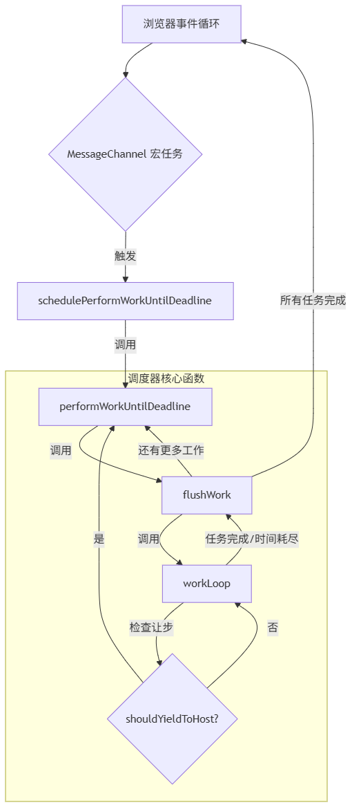
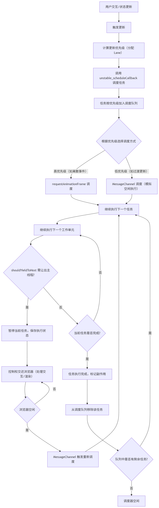

# Lane 优先级模型与时间切片调度

# 1. 引言：并发渲染与优先级问题

在 React 早期版本中，组件的渲染过程是同步且不可中断的。当应用需要渲染大型组件树或处理频繁更新时，JavaScript 主线程会被长时间占用，导致浏览器无法及时响应用户输入（如点击、滚动），最终表现为页面卡顿、交互延迟 —— 这是传统同步渲染模型的核心痛点。

为解决这一问题，React 引入了并发渲染的理念，其核心目标是让渲染过程变得可中断、可恢复、可调度。而实现这一目标的两大支柱，正是 Lane 优先级模型与时间切片调度：

1. Lane 优先级模型：为不同类型的更新任务（如用户交互、数据加载、动画渲染等）赋予明确的优先级层级，让 React 能够识别 “什么任务更紧急”。
2. 时间切片调度：将原本一次性完成的渲染工作拆分为多个 “时间片段”，每次只占用浏览器一帧（约 16ms）中的部分时间执行，剩余时间交还给浏览器处理用户交互，从而避免主线程阻塞。

# 2. Lane 优先级模型

## 2.1 位掩码优先级的数学原理

React 的 Lane 优先级模型巧妙地利用了位掩码（Bitmask）这一计算机科学中的基础概念来表示和管理更新的优先级。

### 2.1.1 位掩码的基本概念

位掩码是一种使用二进制位（bit）来表示一组布尔值或状态的技术。在位掩码中，每一个独立的位都代表一个特定的标志或属性。如果某个位被设置为 1，则表示对应的标志为真；如果为 0，则表示为假。在 Lanes 模型中，每个位代表一个特定的优先级级别或更新类型：

```js
// 总车道数：React 限制 Lane 总数为 31（基于 31 位二进制设计）
export const TotalLanes = 31;

// 无优先级：用于初始化或清除优先级状态
export const NoLanes: Lanes = /*                        */ 0b0000000000000000000000000000000;
export const NoLane: Lane = /*                          */ 0b0000000000000000000000000000000;

// 同步 hydration 优先级：服务端渲染 hydration 阶段的同步更新
export const SyncHydrationLane: Lane = /*               */ 0b0000000000000000000000000000001;
// 同步优先级：最高优先级，用于紧急同步更新（如 flushSync）
export const SyncLane: Lane = /*                        */ 0b0000000000000000000000000000010;
export const SyncLaneIndex: number = 1; // 同步车道索引

// 输入连续 hydration 优先级：hydration 阶段的连续输入事件更新
export const InputContinuousHydrationLane: Lane = /*    */ 0b0000000000000000000000000000100;
// 输入连续优先级：拖拽、滚动等连续用户交互的更新
export const InputContinuousLane: Lane = /*             */ 0b0000000000000000000000000001000;

// 默认 hydration 优先级：hydration 阶段的常规更新
export const DefaultHydrationLane: Lane = /*            */ 0b0000000000000000000000000010000;
// 默认优先级：大多数常规更新（如 setState）
export const DefaultLane: Lane = /*                     */ 0b0000000000000000000000000100000;

// 同步更新组合车道：包含同步、输入连续、默认三种高优更新车道
export const SyncUpdateLanes: Lane =
  SyncLane | InputContinuousLane | DefaultLane;

// 手势优先级：手势操作相关的更新（如点击、滑动手势）
export const GestureLane: Lane = /*                     */ 0b0000000000000000000000001000000;

// 过渡 hydration 优先级：hydration 阶段的过渡更新
const TransitionHydrationLane: Lane = /*                */ 0b0000000000000000000000010000000;
// 过渡优先级组合车道：包含所有过渡子车道
const TransitionLanes: Lanes = /*                       */ 0b0000000001111111111111100000000;
// 过渡子车道1-14：用于非紧急 UI 过渡（如路由跳转、数据加载）
const TransitionLane1: Lane = /*                        */ 0b0000000000000000000000100000000;
const TransitionLane2: Lane = /*                        */ 0b0000000000000000000001000000000;
// ... 更多过渡lanes

// 重试优先级组合车道：包含所有重试子车道
const RetryLanes: Lanes = /*                            */ 0b0000011110000000000000000000000;
// 重试子车道1-4：用于失败任务的重试更新
const RetryLane1: Lane = /*                             */ 0b0000000010000000000000000000000;
const RetryLane2: Lane = /*                             */ 0b0000000100000000000000000000000;
const RetryLane3: Lane = /*                             */ 0b0000001000000000000000000000000;
const RetryLane4: Lane = /*                             */ 0b0000010000000000000000000000000;

export const SomeRetryLane: Lane = RetryLane1; // 示例重试车道

// 选择性 hydration 优先级：服务端渲染中选择性 hydration 更新
export const SelectiveHydrationLane: Lane = /*          */ 0b0000100000000000000000000000000;

// 非空闲优先级组合：包含除空闲、离线等低优车道外的所有优先级
const NonIdleLanes: Lanes = /*                          */ 0b0000111111111111111111111111111;

// 空闲 hydration 优先级：hydration 阶段的空闲更新
export const IdleHydrationLane: Lane = /*               */ 0b0001000000000000000000000000000;
// 空闲优先级：最低优先级，浏览器空闲时执行（如预加载）
export const IdleLane: Lane = /*                        */ 0b0010000000000000000000000000000;

// 离线优先级：离线组件相关的更新
export const OffscreenLane: Lane = /*                   */ 0b0100000000000000000000000000000;
// 延迟优先级：延迟执行的低优更新
export const DeferredLane: Lane = /*                    */ 0b1000000000000000000000000000000;
```

### 2.1.2 位运算的数学特性

位运算是直接对二进制位进行操作的运算，它们在计算机底层执行效率极高,这让 Lanes 模型能够高效地处理优先级操作：

```js
/**
 * 检查集合a中是否包含b的任意一条Lane
 * 原理：按位与运算（&）结果非0 → 存在共有的二进制位（即重叠的Lane）
 */
export function includesSomeLane(a: Lanes | Lane, b: Lanes | Lane): boolean {
  return (a & b) !== NoLanes;
}

/**
 * 检查subset是否是set的子集（subset的所有Lane都包含在set中）
 * 数学性质：若(set & subset) === subset，则subset中所有为1的位在set中均为1
 */
export function isSubsetOfLanes(set: Lanes, subset: Lanes | Lane): boolean {
  return (set & subset) === subset;
}

/**
 * 合并两个Lane集合，保留所有Lane
 * 数学性质：按位或（|）运算会将两侧任意为1的位设为1，满足交换律和结合律
 * 示例：0b101 | 0b011 = 0b111（合并Lane1、Lane3和Lane2）
 */
export function mergeLanes(a: Lanes | Lane, b: Lanes | Lane): Lanes {
  return a | b;
}

/**
 * 求两个Lane集合的交集，仅保留共同的Lane
 * 数学性质：按位与（&）运算仅在两侧均为1的位才设为1，满足交换律和结合律
 * 示例：0b101 & 0b011 = 0b001（仅保留Lane1）
 */
export function intersectLanes(a: Lanes | Lane, b: Lanes | Lane): Lanes {
  return a & b;
}

/**
 * 从set中移除subset包含的所有Lane
 * 数学原理：~b（按位非）会反转b的所有位，再与set进行与运算（&），即可剔除set中属于b的位
 * 示例：0b111 & ~0b010 = 0b101（移除Lane2）
 */
export function removeLanes(set: Lanes, subset: Lanes | Lane): Lanes {
  return set & ~subset;
}

/**
 * 从Lanes集合中提取优先级最高的Lane
 * 数学原理：在二进制补码中，-x = ~x + 1，因此x & -x会保留x最右侧的1（即数值最小的Lane，优先级最高）
 * 示例：0b110 & -0b110 = 0b010（提取最高优先级的Lane2）
 */
export function getHighestPriorityLane(lanes: Lanes): Lane {
  return lanes & -lanes;
}
```

## 2.2 Lane 分配与管理策略

React 的 Lane 优先级模型不仅仅是定义了一系列优先级，更重要的是它建立了一套完善的 Lane 分配与管理策略，确保了不同类型的更新能够获得恰当的优先级，并在调度过程中得到有效处理。

### 2.2.1 静态 Lane 的预定义分配

React 静态 Lane 采用**优先级分组预定义**策略，通过固定位掩码位置实现更新类型与优先级的强绑定。这些静态 Lane 根据其紧急程度和用途进行分组：

1.  **高优先级核心分组**（紧急更新专用）

    - **`SyncLane` (0b0000000000000000000000000000010)**：最高优先级，用于强制同步更新，例如 `flushSync`。
    - **`InputContinuousLane` (0b0000000000000000000000000001000)**：用于连续的用户输入事件，如 `mousemove`、`scroll`、`drag` 等，确保这些交互的流畅性。
    - **`DefaultLane` (0b0000000000000000000000000100000)**：大多数常规更新的默认优先级，例如 `setState`。
    - **`SyncUpdateLanes`**：是 `SyncLane | InputContinuousLane | DefaultLane` 的组合，代表了需要同步或接近同步处理的高优先级更新集合。

2.  **过渡与重试分组**（非紧急任务调度）

    - **`TransitionLanes` (0b0000000001111111111111100000000)**：由 14 个独立的子 Lane (`TransitionLane1` 到 `TransitionLane14`) 组成，用于非紧急的 UI 过渡，如路由跳转、数据加载后的状态更新。这些更新可以被中断和延迟，以避免阻塞用户交互。
    - **`RetryLanes`**：由 4 个独立的子 Lane (`RetryLane1` 到 `RetryLane4`) 组成，用于处理因 Suspense 导致的组件挂起后，数据加载完成时的重试更新。

3.  **低优先级分组**（后台任务专用）
    - **`IdleLane` (0b0010000000000000000000000000000)**：最低优先级，用于在浏览器空闲时执行的任务，例如预加载数据或不重要的后台计算。
    - **`OffscreenLane` (0b0100000000000000000000000000000)**：用于处理屏幕外（Offscreen）组件的更新，这些组件通常不可见，因此其更新可以被延迟。

### 2.2.2 动态 Lane 调整机制

动态 Lane 调整机制是 React Lane 模型的核心，它通过一系列函数在运行时根据上下文动态地分配和管理 Lane。

1.  核心分配函数：

- **作用**：这是 React 内部请求更新 Lane 的主要入口点，它根据当前的 `fiber` 状态和执行上下文来决定分配哪个 Lane。
- **执行流程**：
  - **Legacy 模式**：如果处于 Legacy 模式（非并发模式），则直接返回 `SyncLane`，确保同步更新。
  - **渲染阶段更新**：如果在渲染阶段 (`RenderContext`) 发生更新，React 会尝试复用当前渲染的 Lane，但这通常不被推荐，因为渲染阶段的 `setState` 可能会导致意料之外的行为。
  - **Transition 更新**：如果当前更新是一个 `Transition`（通过 `startTransition` 启动），`requestUpdateLane` 会调用 `requestTransitionLane` 来获取一个动态分配的 `TransitionLane`。
  - **普通事件更新**：对于普通事件更新，它会根据事件优先级（如 `DiscreteEventPriority`, `ContinuousEventPriority`, `DefaultEventPriority`）映射到相应的 Lane。值得注意的是，在 React 的实现中，`EventPriority` 和 `Lane` 是同一种类型（`export opaque type EventPriority = Lane;`），因此 `eventPriorityToLane` 函数实际上直接返回了传入的 `EventPriority` 值，即事件优先级本身就是对应的 Lane。

```js
// 简化版
export function requestUpdateLane(fiber: Fiber): Lane {
  const mode = fiber.mode;
  // Legacy 模式直接返回 SyncLane
  if (!disableLegacyMode && (mode & ConcurrentMode) === NoMode) {
    return (SyncLane: Lane);
  }

  // ... 处理渲染阶段更新的逻辑 ...

  const transition = requestCurrentTransition();
  if (transition !== null) {
    // 如果是 Transition 更新，请求一个 TransitionLane
    const actionScopeLane = peekEntangledActionLane();
    return actionScopeLane !== NoLane
      ? actionScopeLane
      : requestTransitionLane(transition);
  }

  // 根据事件优先级分配 Lane
  return eventPriorityToLane(resolveUpdatePriority());
}
```

关键辅助函数 ：

```javascript
// eventPriorityToLane：事件优先级与 Lane 的映射（直接返回对应优先级）
function eventPriorityToLane(updatePriority: EventPriority): Lane {
  return updatePriority;
}

// getEventPriority：根据事件类型判定事件优先级
export function getEventPriority(domEventName: DOMEventName): EventPriority {
  switch (domEventName) {
    // 离散事件（点击、输入等）：高优
    case "click": "input": "keydown": "mousedown": "touchstart": /* 其他离散事件 */:
      return DiscreteEventPriority;
    // 连续事件（滚动、拖拽等）：中优
    case "scroll": "mousemove": "touchmove": "wheel": /* 其他连续事件 */:
      return ContinuousEventPriority;
    // 消息事件：按调度优先级映射
    case "message":
      switch (getCurrentSchedulerPriorityLevel()) {
        case ImmediateSchedulerPriority: return DiscreteEventPriority;
        case UserBlockingSchedulerPriority: return ContinuousEventPriority;
        default: return DefaultEventPriority;
      }
    // 默认事件：低优
    default:
      return DefaultEventPriority;
  }
}

// resolveUpdatePriority：解析当前更新的最终优先级
export function resolveUpdatePriority(): EventPriority {
  // 优先取当前更新优先级
  const updatePriority = ReactDOMSharedInternals.currentUpdatePriority;
  if (updatePriority !== NoEventPriority) {
    return updatePriority;
  }
  // 无则取当前事件类型对应的优先级
  return window.event ? getEventPriority(window.event.type) : DefaultEventPriority;
}
```

2. 过渡车道循环分配：

- **作用**：专门用于为 `Transition` 更新动态分配一个可用的 `TransitionLane`。
- **避免饥饿逻辑**：`TransitionLanes` 包含 14 个子 Lane。`claimNextTransitionLane` 通过一个内部计数器 `nextTransitionLane` 循环地分配这些子 Lane。这种循环机制确保了即使有多个并发的 `Transition`，每个 `Transition` 都能获得一个独立的 Lane，从而避免某个 `Transition` 长期占用资源导致其他 `Transition` 饥饿。
- **源码关键逻辑**（简化版）：

```js
let nextTransitionLane: Lane = TransitionLane1; // 初始为第一个 TransitionLane

function claimNextTransitionLane(): Lane {
  const lane = nextTransitionLane;
  // 将 nextTransitionLane 左移一位，指向下一个 TransitionLane
  nextTransitionLane <<= 1;
  // 如果超出了 TransitionLanes 的范围，则循环回 TransitionLane1
  if ((nextTransitionLane & TransitionLanes) === NoLanes) {
    nextTransitionLane = TransitionLane1;
  }
  return lane;
}
```

3.  防止饥饿机制：

- **作用**：当低优先级任务等待时间过长时，React 会自动提升其优先级，以防止“饥饿”现象的发生。
- **实现原理**： - React 内部会记录每个 Lane 的过期时间（`expirationTime`）。
  - 在调度循环中，`markStarvedLanesAsExpired` 会检查当前时间是否超过了某个低优先级 Lane 的 `expirationTime`。
  - 如果超过，则将该 Lane 标记为“过期”（Expired），并将其优先级提升，使其能够被调度器优先处理。
  - 这种机制确保了即使是最低优先级的任务，在等待足够长的时间后，也能获得执行的机会，避免了被高优先级任务无限期地推迟。
- **源码关键逻辑**：

```js
export function markStarvedLanesAsExpired(
  root: FiberRoot,
  currentTime: number
): void {
  // 获取根节点上所有待处理的 Lane 集合
  const pendingLanes = root.pendingLanes;
  // 获取根节点上所有已挂起的 Lane 集合
  const suspendedLanes = root.suspendedLanes;
  // 获取根节点上所有已 pinged 的 Lane 集合（pinged 意味着可以重试）
  const pingedLanes = root.pingedLanes;
  // 获取所有 Lane 的过期时间数组
  const expirationTimes = root.expirationTimes;

  // 根据是否启用 RetryLane 过期策略，初始化需要检查的 Lane 集合
  let lanes = enableRetryLaneExpiration
    ? pendingLanes // 如果启用，则检查所有待处理的 Lane
    : pendingLanes & ~RetryLanes; // 如果不启用，则排除 RetryLanes 后再检查

  // 遍历所有需要检查的 Lane
  while (lanes > 0) {
    // 提取当前 Lane 集合中优先级最高的 Lane 的索引
    const index = pickArbitraryLaneIndex(lanes);
    // 根据索引计算出当前 Lane 的位掩码
    const lane = 1 << index;

    // 获取当前 Lane 的过期时间
    const expirationTime = expirationTimes[index];
    // 如果当前 Lane 没有设置过期时间 (NoTimestamp)
    if (expirationTime === NoTimestamp) {
      // 检查该 Lane 是否未被挂起，或者已被 pinged
      if (
        (lane & suspendedLanes) === NoLanes || // 未被挂起
        (lane & pingedLanes) !== NoLanes // 或者已被 pinged
      ) {
        // 如果满足条件，则计算并设置该 Lane 的新的过期时间
        expirationTimes[index] = computeExpirationTime(lane, currentTime);
      }
    } else if (expirationTime <= currentTime) {
      // 如果当前 Lane 的过期时间小于或等于当前时间，说明该 Lane 已过期
      // 将该 Lane 添加到根节点的 expiredLanes 集合中，表示其已饥饿并需要被优先处理
      root.expiredLanes |= lane;
    }

    // 从待检查的 Lane 集合中移除当前已处理的 Lane
    lanes &= ~lane;
  }
}
```

4.  **边缘场景处理**

- **过渡车道耗尽**：尽管 `TransitionLanes` 有 14 个子 Lane，但在极端情况下，如果所有子 Lane 都被长时间占用，React 会有一套降级策略，可能会临时提升某些低优先级 Lane 的优先级，以避免应用完全停滞。
- **优先级降级**：对于长时间未执行的低优先级任务（例如，用户切换到后台标签页后，后台的 `IdleLane` 更新），React 可能会将其优先级进一步降低，甚至暂停，以释放资源给用户当前关注的任务。

## 2.3 Lanes 的合并与选择

### 2.3.1 Lanes 的合并

在 React 的世界里，每一个应用的根节点都维护着一个名为 pendingLanes 的字段。每当有一个新的更新被调度（即 requestUpdateLane 分配了一个 Lane），这个新的 Lane 就会通过**按位或（|）**操作，被合并到 root.pendingLanes 中。

React 通过 childLanes 和 subtreeLanes 机制实现 Lane 的自下而上优先级传播。在协调过程中，当一个父节点完成其子树的协调后，它会根据子节点的 childLanes 和 subtreeLanes 来更新自身的 subtreeLanes。这样，父节点就能“感知”到其子树中存在的最高优先级任务，从而在调度时能够正确地处理。

```javascript
// 简化版
function bubbleProperties(completedWork: Fiber) {
  const didBailout =
    completedWork.alternate !== null &&
    completedWork.alternate.child === completedWork.child;

  let newChildLanes: Lanes = NoLanes;
  let subtreeFlags = NoFlags;

  if (!didBailout) {
    // 遍历当前 Fiber 的所有子节点
    let child = completedWork.child;
    while (child !== null) {
      // 将子节点的 lanes 和 childLanes 合并到 newChildLanes 中
      newChildLanes = mergeLanes(
        newChildLanes,
        mergeLanes(child.lanes, child.childLanes)
      );

      // 聚合子节点的副作用标志
      subtreeFlags |= child.subtreeFlags;
      subtreeFlags |= child.flags;

      child = child.sibling; // 移动到下一个兄弟节点
    }
  }

  // 将聚合后的 newChildLanes 赋值给 completedWork 的 childLanes
  completedWork.childLanes = newChildLanes;
  // 将聚合后的副作用标志赋值给 completedWork 的 subtreeFlags
  completedWork.subtreeFlags = subtreeFlags;
}
```

### 2.3.1 Lanes 的合并

在每次渲染开始前，React 需要决定本次渲染应该处理哪些 `Lane` 的更新。`getNextLanes` 函数负责从 `Root` 节点的所有待处理 `Lane` 中选择最合适的 `Lane` 或 `Lane` 集合。

```javascript
/**
 * 决策当前渲染周期应处理的优先级最高的Lane集合
 * 核心逻辑：从根节点的待处理任务中，基于优先级分级和状态筛选，确定最优处理序列
 *
 * @param root - Fiber根节点，存储所有待处理Lane及相关状态
 * @param wipLanes - 当前正在进行中的任务Lane集合（Work In Progress）
 * @param rootHasPendingCommit - 标识是否存在等待提交到DOM的任务
 * @returns 本次渲染需要处理的Lane集合，作为renderLanes的候选值
 */
export function getNextLanes(
  root: FiberRoot,
  wipLanes: Lanes,
  rootHasPendingCommit: boolean
): Lanes {
  // 获取根节点上所有待处理的Lane（等待调度的更新任务）
  const pendingLanes = root.pendingLanes;
  // 若没有待处理任务，直接返回空Lane集合
  if (pendingLanes === NoLanes) return NoLanes;

  // 存储最终决策出的待处理Lane集合
  let nextLanes: Lanes = NoLanes;
  // 解构根节点中与Lane状态相关的字段：
  // - suspendedLanes：已被挂起的Lane（暂时无法处理）
  // - pingedLanes：被唤醒的Lane（挂起状态已解除，可重新处理）
  // - warmLanes：已预加载的Lane（提前做了部分准备工作）
  const { suspendedLanes, pingedLanes, warmLanes } = root;

  // 第一步：优先处理非Idle级别的高优先级任务
  // （非Idle包括用户交互、动画等需要及时响应的任务，优先级高于后台任务）
  const nonIdlePending = pendingLanes & NonIdleLanes;
  if (nonIdlePending) {
    // 1.1 先处理「未被挂起」的非Idle任务（可直接执行的高优任务）
    const unblockedNonIdle = nonIdlePending & ~suspendedLanes;
    if (unblockedNonIdle) {
      nextLanes = getHighestPriorityLanes(unblockedNonIdle);
    }
    // 1.2 若没有未挂起的，处理「已被唤醒」的非Idle任务（挂起后恢复的高优任务）
    else if (nonIdlePending & pingedLanes) {
      nextLanes = getHighestPriorityLanes(nonIdlePending & pingedLanes);
    }
    // 1.3 若前两者都没有，在允许预渲染且无待提交任务时，预加载未处理的非Idle任务
    // （提前准备，优化后续渲染性能）
    else if (enableSiblingPrerendering && !rootHasPendingCommit) {
      const nonIdleToPrewarm = nonIdlePending & ~warmLanes; // 排除已预加载的
      if (nonIdleToPrewarm)
        nextLanes = getHighestPriorityLanes(nonIdleToPrewarm);
    }
  }
  // 第二步：处理Idle级别的低优先级任务（如后台计算、非紧急更新）
  else {
    // 2.1 先处理「未被挂起」的Idle任务（可直接执行的低优任务）
    const unblockedIdle = pendingLanes & ~suspendedLanes;
    if (unblockedIdle) {
      nextLanes = getHighestPriorityLanes(unblockedIdle);
    }
    // 2.2 若没有未挂起的，处理「已被唤醒」的Idle任务（挂起后恢复的低优任务）
    else if (pingedLanes) {
      nextLanes = getHighestPriorityLanes(pingedLanes);
    }
    // 2.3 若前两者都没有，在允许预渲染且无待提交任务时，预加载未处理的Idle任务
    else if (enableSiblingPrerendering && !rootHasPendingCommit) {
      const idleToPrewarm = pendingLanes & ~warmLanes; // 排除已预加载的
      if (idleToPrewarm) nextLanes = getHighestPriorityLanes(idleToPrewarm);
    }
  }

  // 若未筛选出任何可处理的任务，返回空
  if (!nextLanes) return NoLanes;

  // 第三步：与当前正在处理的任务对比，避免低优任务打断高优任务
  if (
    wipLanes && // 存在正在进行的任务
    wipLanes !== nextLanes && // 新筛选的任务与当前任务不同
    !(wipLanes & suspendedLanes) // 当前任务未被挂起（仍可继续处理）
  ) {
    // 提取两者的最高优先级Lane进行比较
    const highestNextLane = getHighestPriorityLane(nextLanes);
    const highestWipLane = getHighestPriorityLane(wipLanes);

    // 规则1：若新任务优先级不高于当前任务，继续处理当前任务
    // 规则2：若新任务是默认Lane，且当前任务是过渡Lane（可中断），也继续处理当前任务
    if (
      highestNextLane >= highestWipLane ||
      (highestNextLane === DefaultLane && highestWipLane & TransitionLanes)
    ) {
      return wipLanes;
    }
  }

  // 返回最终决策的Lane集合，作为本次渲染的目标
  return nextLanes;
}
```

**工作原理：**

通过优先级分级（先非 Idle 后 Idle）、状态筛选（未挂起 → 已唤醒 → 待预加载）及冲突处理（保留更高优先级任务），最终确定当前渲染的目标 Lane 集合（renderLanes）。核心规则包括优先级最高原则、饥饿原则（低优先级任务久等后提升）及并发模式下对可中断 Lane 的倾斜。

## 2.4 实战案例：Lane 如何协调更新冲突

为了更好地理解 `Lane` 机制在协调更新冲突中的作用，我们来看两个实际案例。

### 案例一：高优先级用户输入中断低优先级后台更新

想象一个场景：用户在一个搜索框中输入文本以过滤一个列表，同时应用正在后台加载更多数据。用户输入是高优先级任务，而后台数据加载是低优先级任务。

```javascript
import React, { useState, useEffect } from "react";

function InteractiveList() {
  const [filterText, setFilterText] = useState("");
  const [data, setData] = useState([]);
  const [isLoading, setIsLoading] = useState(true);

  useEffect(() => {
    // 模拟一个耗时的后台数据加载，这是一个低优先级任务
    const timer = setTimeout(() => {
      setData(["123", "456", "789"]);
      setIsLoading(false);
    }, 2000); // 模拟 2 秒加载时间

    return () => clearTimeout(timer);
  }, []);

  const handleFilterChange = (e) => {
    // 用户输入，这是一个高优先级任务 (DiscreteEventPriority -> SyncLane)
    setFilterText(e.target.value);
  };

  const filteredData = data.filter((item) =>
    item.toLowerCase().includes(filterText.toLowerCase())
  );

  return (
    <div>
      <h2>数字</h2>
      <input
        type="text"
        value={filterText}
        onChange={handleFilterChange}
        placeholder="输入..."
      />
      {isLoading ? (
        <p>加载中...</p>
      ) : (
        <ul>
          {filteredData.map((item) => (
            <li key={item}>{item}</li>
          ))}
        </ul>
      )}
    </div>
  );
}

export default InteractiveList;
```

**Lane 如何协调冲突：**

- **低优先级更新 (`setData`, `setIsLoading`)**: `useEffect` 中的 `setTimeout` 模拟了后台数据加载。`setData` 和 `setIsLoading` 触发的更新通常会被分配到较低优先级的 `Lane` (例如 `DefaultLane`)，因为它们不直接响应用户交互。
- **高优先级更新 (`setFilterText`)**: `handleFilterChange` 响应用户输入事件。`setFilterText` 触发的更新会被分配到高优先级的 `Lane` (例如 `SyncLane` 或 `InputContinuousLane`)。
- **冲突协调**: 如果用户在数据加载过程中（`isLoading` 为 `true`）开始输入过滤文本，React 的 `Lane` 调度机制会发挥作用。高优先级的用户输入更新会中断正在进行的低优先级数据加载更新的渲染。React 会优先处理用户输入，确保输入框的响应是即时的。被中断的数据加载更新不会丢失，它会在高优先级更新完成后，在下一个可用的时间片继续或重新开始。这保证了用户界面的流畅性和响应性。

### 案例二：使用 `startTransition` 优化耗时渲染

考虑一个需要渲染大量数据或执行复杂计算的组件，直接更新可能导致 UI 卡顿。`startTransition` 允许我们将这类非紧急更新标记为“可中断”的低优先级任务。

```javascript
import React, { useState, useTransition } from "react";

// 模拟一个计算量大、渲染耗时的组件
const ComplexChart = React.memo(({ dataPoints, highlightIndex }) => {
  console.log("Rendering ComplexChart with", dataPoints.length, "data points");
  // 模拟大量计算和渲染工作
  const items = [];
  for (let i = 0; i < dataPoints.length; i++) {
    items.push(
      <div
        key={i}
        style={{
          height: dataPoints[i] / 10 + "px",
          backgroundColor: i === highlightIndex ? "red" : "blue",
          width: "2px",
          display: "inline-block",
          margin: "0 1px",
        }}
      ></div>
    );
  }
  return (
    <div
      style={{
        border: "1px solid #ccc",
        height: "100px",
        overflowX: "auto",
        whiteSpace: "nowrap",
      }}
    >
      {items}
    </div>
  );
});

function Dashboard() {
  const [chartData, setChartData] = useState(
    Array.from({ length: 100 }, () => Math.random() * 1000)
  );
  const [highlightedItem, setHighlightedItem] = useState(-1);
  const [isPending, startTransition] = useTransition();

  const generateNewData = () => {
    // 这是一个可能导致 UI 卡顿的更新，使用 startTransition 包裹
    startTransition(() => {
      setChartData(Array.from({ length: 5000 }, () => Math.random() * 1000)); // 大量数据更新
    });
  };

  const handleHighlight = (e) => {
    // 用户交互，高优先级更新
    setHighlightedItem(parseInt(e.target.value, 10));
  };

  return (
    <div>
      <h2>数据仪表盘</h2>
      <button onClick={generateNewData} disabled={isPending}>
        {isPending ? "生成中..." : "生成大量数据图表"}
      </button>
      <input
        type="number"
        min="0"
        max={chartData.length - 1}
        value={highlightedItem}
        onChange={handleHighlight}
        placeholder="高亮索引"
      />
      {isPending && <p>图表正在生成，您可以继续操作...</p>}
      <ComplexChart dataPoints={chartData} highlightIndex={highlightedItem} />
    </div>
  );
}

export default Dashboard;
```

**Lane 如何协调冲突：**

- **`ComplexChart` (耗时渲染)**: `ComplexChart` 组件被设计为渲染大量数据点，模拟一个计算密集型的 UI 任务。`React.memo` 用于避免不必要的重新渲染，但首次渲染大量数据时仍然会耗时。
- **`generateNewData` (`startTransition` 包装)**: `generateNewData` 函数通过 `startTransition` 包裹 `setChartData` 更新。这意味着 `setChartData` 触发的更新会被分配到 `TransitionLane`，这是一个低优先级且可中断的 `Lane`。
- **`handleHighlight` (高优先级)**: `handleHighlight` 响应用户输入，更新 `highlightedItem`。这是一个高优先级更新，通常会被分配到 `SyncLane` 或 `InputContinuousLane`。
- **冲突协调**: 当用户点击“生成大量数据图表”按钮时，`ComplexChart` 的渲染会在 `TransitionLane` 上进行。如果此时用户在“高亮索引”输入框中输入数字，React 会立即中断 `ComplexChart` 的渲染，优先处理用户输入，更新 `highlightedItem` 并重新渲染 `ComplexChart`（如果 `highlightIndex` 改变）。`isPending` 状态可以用来在 `TransitionLane` 任务进行时提供加载反馈，同时允许用户继续与 UI 的其他部分进行交互，而不会感到卡顿。

通过这两个机制，我们明白了 lane 机制的作用，我们接下续介绍时间切片调度，它负责将不同优先级的任务划分到不同的时间切片中执行，确保高优先级任务及时响应，低优先级任务在不阻塞主线程的前提下逐步完成。

# 3. 时间切片调度

## 3.1 时间切片的理论基础

### 3.1.1 浏览器主线程的工作机制

现代浏览器的 JavaScript 引擎为单线程，主线程需统筹处理四类核心任务：用户交互（点击、滚动）、JavaScript 执行、DOM 布局计算、页面绘制。单线程特性导致长任务阻塞问题 —— 若单个 JS 任务执行时间过长，会阻塞后续所有任务，浏览器无法响应交互或渲染，出现页面卡顿、掉帧（帧率低于 60fps）。

浏览器通过事件循环（Event Loop） 协调任务执行，核心是 “任务队列 + 主线程循环处理”，任务分为宏任务与微任务：

1. 宏任务：setTimeout、MessageChannel、requestAnimationFrame、I/O 操作等，执行完后会触发页面重绘；
2. 微任务：Promise.then、MutationObserver 等，优先级高于宏任务，同一宏任务执行完后会清空微任务队列。

```javascript
// 伪代码
// 任务队列初始化
const macroTaskQueue = []; // 宏任务队列
const microTaskQueue = []; // 微任务队列

// 事件循环主流程
function eventLoop() {
  // 1. 执行所有微任务
  while (microTaskQueue.length > 0) {
    const microTask = microTaskQueue.shift();
    execute(microTask);
  }

  // 2. 执行一个宏任务
  if (macroTaskQueue.length > 0) {
    const macroTask = macroTaskQueue.shift();
    execute(macroTask);
  }

  // 3. 循环执行
  requestIdleCallback(eventLoop);
}

// 启动事件循环
eventLoop();
```

当任务队列中存在执行时间超过 16ms 的长任务时（16ms 是 60fps 流畅渲染的单帧极限），会导致：

1. 后续交互任务（如点击）无法及时执行，用户感知 “点击无响应”；
2. 渲染任务被阻塞，页面出现 “卡顿”“掉帧”；

### 3.1.2 时间切片的设计哲学

时间切片调度的核心目标，正是解决长任务阻塞主线程的问题，通过任务拆分与协作式调度，确保主线程不被长时间占用。

时间切片的设计核心是协作式调度—— 不强制中断任务，而是通过 “主动让出控制权” 与浏览器协作，避免主线程阻塞。其核心思想是将长渲染任务拆分为多个 “时间切片”（每个切片执行时间 < 16ms），执行完一个切片后主动交还控制权，让浏览器处理交互、渲染等任务，待浏览器空闲后再恢复执行。

## 3.2 时间切片的实现机制

React 的时间切片调度主要通过其内部的 `Scheduler` 模块实现，该模块利用浏览器提供的异步调度机制，结合任务优先级管理，将渲染工作分解并分时执行。其核心实现机制包括以下几个方面：

### 3.2.1 浏览器帧调度机制与 `MessageChannel`

如前所述，React 调度器与浏览器帧调度紧密结合。在现代浏览器中，通常使用 `requestAnimationFrame` 来同步渲染更新，而对于低优先级的后台任务，React 主要使用 `MessageChannel` 来模拟 `requestIdleCallback` 的行为，实现更精确和可控的调度。

#### 1. `requestIdleCallback` 详解

1. **定义与目的**：`requestIdleCallback` 是浏览器提供的一个 API，它允许开发者在浏览器主线程空闲时执行一个低优先级的任务。它的主要目的是利用浏览器帧渲染后的剩余时间（即“空闲期”），执行一些不紧急但又需要计算的任务，从而避免阻塞主线程，保证页面的流畅性和响应性。

2. **工作原理**：

- 浏览器会在每一帧渲染结束后，检查是否有剩余时间。如果当前帧有空闲时间，并且有通过 `requestIdleCallback` 注册的回调函数，浏览器就会执行这些回调。
- 回调函数会接收一个 `IdleDeadline` 对象作为参数，该对象包含 `timeRemaining()` 方法（返回当前帧剩余的毫秒数）和 `didTimeout` 属性（表示是否因为超时而执行）。
- 开发者可以在回调函数中根据 `timeRemaining()` 的值来决定执行多少工作，并在时间不足时暂停，等待下一次空闲期继续执行。

3. **局限性**：

- **兼容性问题**：并非所有浏览器都完全支持 `requestIdleCallback`，尤其是在一些旧版本浏览器或特定环境下。
- **调度不确定性**：浏览器何时进入空闲期、空闲期有多长，这些都是不确定的。如果主线程一直很忙，`requestIdleCallback` 可能长时间得不到执行，或者执行时间非常短，导致任务被延迟。
- **无法控制优先级**：`requestIdleCallback` 只能处理低优先级任务，无法对任务进行更细粒度的优先级控制。

```javascript
// callback:一个在事件循环空闲时即将被调用的函数的引用。函数会接收到一个名为 IdleDeadline 的参数，这个参数可以获取当前空闲时间以及回调是否在超时时间前已经执行的状态。
requestIdleCallback(callback);
```

#### 2. `MessageChannel` 详解

1. **定义与目的**：`MessageChannel` 是 HTML5 引入的一个 API，用于创建两个端口（`MessagePort`）之间的通信通道。这两个端口可以相互发送消息，并且消息的发送和接收都是异步的，通过事件循环机制进行调度。React 利用 `MessageChannel` 来模拟 `requestIdleCallback` 的行为，作为其在浏览器环境中实现任务调度的核心机制之一。

2. **工作原理**：

- **创建通道**：通过 `new MessageChannel()` 创建一个消息通道实例，它会返回一个包含 `port1` 和 `port2` 两个属性的对象。
- **发送消息**：一个端口（例如 `port2`）可以通过 `postMessage()` 方法向另一个端口（`port1`）发送消息。发送的消息会被放入浏览器的宏任务队列中。
- **接收消息**：另一个端口（`port1`）可以通过监听 `onmessage` 事件来接收消息。当 `port2` 发送的消息被浏览器从宏任务队列中取出并处理时，`port1` 的 `onmessage` 回调函数就会被执行。
- **异步性**：`postMessage` 操作本身是同步的，但 `onmessage` 回调的执行是异步的，它会在当前宏任务执行完毕后，作为下一个宏任务被调度执行。

4. **优点**：

- **广泛兼容性**：`MessageChannel` 在现代浏览器中具有良好的兼容性，比 `requestIdleCallback` 更可靠。
- **可控的异步调度**：通过 `postMessage` 和 `onmessage`，React 可以精确地控制任务何时被放入宏任务队列，并在主线程空闲时（即当前宏任务执行完毕后）执行，从而实现类似 `requestIdleCallback` 的效果，但具有更高的可预测性。
- **避免阻塞**：由于 `onmessage` 回调作为宏任务执行，它不会阻塞当前正在执行的 JavaScript 代码，保证了主线程的响应性。

#### 3. React 调度器如何利用 `MessageChannel`

React 调度器利用 `MessageChannel` 的异步特性，将需要执行的任务拆分成小的、可中断的工作单元。当调度器需要执行一个任务时，它会通过 `MessageChannel` 的 `port2` 发送一个消息。这个消息会进入浏览器的宏任务队列。当浏览器主线程空闲时，它会处理这个宏任务，并触发 `port1` 的 `onmessage` 回调函数，从而执行 React 的调度逻辑（例如 `performWorkUntilDeadline`）。

这种机制使得 React 能够在不阻塞主线程的情况下，实现高效且响应迅速的时间切片调度。它允许 React 在每一帧中执行一部分工作，然后将控制权交还给浏览器，等待下一帧的空闲时间继续执行剩余的工作，从而实现“执行 - 让出 - 恢复”的循环。

```javascript
// 核心调度机制：利用 MessageChannel 模拟 requestIdleCallback
// 在浏览器环境中，当 requestIdleCallback 不可用或为了更精确的控制时，
// React Scheduler 会使用 MessageChannel 来实现任务的异步调度。
// MessageChannel 创建了一个新的消息通道，包含两个端口：port1 和 port2。
// 当 port2 发送消息时，port1 上的 onmessage 事件会在下一个宏任务中被触发。
// 这使得 React 可以在主线程空闲时执行任务，同时避免阻塞主线程。

// 1. 初始化 MessageChannel
// 创建一个 MessageChannel 实例，用于在不同的宏任务之间传递消息。
const channel = new MessageChannel();
// port2 用于发送消息，port1 用于接收消息。
const port = channel.port2;

// 2. 设置消息接收器
// 当 port2 发送消息时，port1 会接收到消息并触发 onmessage 事件。
// React 将 performWorkUntilDeadline 函数绑定到 port1 的 onmessage 事件上。
// 这意味着每当 port2 发送一个消息，performWorkUntilDeadline 就会在下一个宏任务中执行。
channel.port1.onmessage = performWorkUntilDeadline;

// 3. 调度任务函数
// schedulePerformWorkUntilDeadline 是一个用于触发任务调度的函数。
// 它通过 port2.postMessage(null) 发送一个消息。
// 这个消息会被放入浏览器的宏任务队列中，等待主线程空闲时被处理。
// 一旦消息被处理，port1 的 onmessage 事件就会触发 performWorkUntilDeadline 的执行。
let schedulePerformWorkUntilDeadline = () => {
  port.postMessage(null); // 发送消息，将 performWorkUntilDeadline 调度到下一个宏任务
};

// 4. 任务入队辅助函数 (enqueueTaskImpl)
// 在某些情况下，例如在开发模式下或处理特定类型的任务时，
// React 可能会使用一个更通用的 enqueueTaskImpl 函数来将回调函数放入宏任务队列。
// 这个实现同样利用了 MessageChannel 的机制。
enqueueTaskImpl = function (callback: () => void) {
  const taskChannel = new MessageChannel();
  taskChannel.port1.onmessage = callback;
  // 通过 taskChannel.port2 发送一个消息，触发回调函数的执行。
  taskChannel.port2.postMessage(undefined);
};
```

### 3.2.2 调度循环与协作让步具体实现

#### 1. `MessageChannel`：异步调度的触发核心

React 优先用 `MessageChannel` 实现宏任务调度，避免 `setTimeout` 的延迟问题和 `requestIdleCallback` 的兼容性局限，是时间切片的“异步载体”。

1. 初始化通道：创建实例生成 port1（接收端）和 port2（发送端）；
2. 绑定入口：port1.onmessage 绑定 performWorkUntilDeadline，触发消息即执行；
3. 触发调度：schedulePerformWorkUntilDeadline 调用 port2.postMessage(null) 入队宏任务；
4. 空闲执行：主线程空闲时，取出消息触发 performWorkUntilDeadline 处理任务。

#### 2. `performWorkUntilDeadline`：任务执行的控时入口

作为调度循环的“总开关”，`performWorkUntilDeadline` 负责启动任务执行、管理截止时间，并处理任务的重新调度或终止。

**核心职责**：初始化状态并记录 startTime；调用 flushWork 执行任务并获取剩余状态；有剩余任务则重新调度，否则终止循环。

```javascript
const performWorkUntilDeadline = () => {
  if (enableRequestPaint) needsPaint = false; // 重置绘画标记
  if (isMessageLoopRunning) {
    const currentTime = getCurrentTime();
    startTime = currentTime; // 记录本轮执行起始时间

    let hasMoreWork = true;
    try {
      // 执行任务并检查是否有剩余工作
      hasMoreWork = flushWork(currentTime);
    } finally {
      if (hasMoreWork) {
        // 任务未完成，重新调度下一轮执行
        schedulePerformWorkUntilDeadline();
      } else {
        // 任务完成，关闭调度循环
        isMessageLoopRunning = false;
      }
    }
  }
};
```

#### 3. `flushWork`：任务队列的遍历调度器

`flushWork` 是 `performWorkUntilDeadline` 的核心依赖，负责触发任务循环、执行任务，并处理异常边界。

**核心逻辑**：调用 `workLoop` 启动任务处理循环，传入当前时间用于截止判断；

```javascript
function flushWork(initialTime: number) {
  is; // ... 省略部分代码 ...
  try {
    // 启动任务循环，返回是否有剩余任务
    return workLoop(initialTime);
  } finally {
    // ... 省略部分代码 ...
  }
}
```

#### 4. `workLoop`：任务执行的循环核心

`workLoop` 是任务处理的“实际执行者”，在循环中持续处理最高优先级任务，直到满足中断条件。

**循环终止条件**：任务队列为空；任务未过期且需让步。

**核心流程**：推进定时器处理过期任务；取出高优任务执行回调；回调返回新函数则更新任务，否则移除；重复直至中断。

```javascript
function workLoop(initialTime: number) {
  let currentTime = initialTime;
  advanceTimers(currentTime);
  currentTask = peek(taskQueue); // 取出最高优先级任务

  while (currentTask !== null) {
    // 任务未过期且需要让步，中断循环
    if (currentTask.expirationTime > currentTime && shouldYieldToHost()) break;

    const callback = currentTask.callback;
    if (typeof callback === "function") {
      currentTask.callback = null;
      currentPriorityLevel = currentTask.priorityLevel;
      // 执行任务回调，判断是否超时
      const didTimeout = currentTask.expirationTime <= currentTime;
      const continuation = callback(didTimeout);
      currentTime = getCurrentTime();

      if (typeof continuation === "function") {
        // 回调返回新函数，更新任务并保留在队列
        currentTask.callback = continuation;
      } else {
        // 任务完成，从队列移除
        if (currentTask === peek(taskQueue)) pop(taskQueue);
      }
      advanceTimers(currentTime);
    } else {
      // 回调无效，移除任务
      pop(taskQueue);
    }
    currentTask = peek(taskQueue); // 取下一个任务
  }

  // 返回是否有剩余任务
  return currentTask !== null;
}
```

#### 5. `shouldYieldToHost`：协作让步的判断依据

`shouldYieldToHost` 是实现“协作式调度”的关键，决定是否中断当前任务，将控制权交还给浏览器。

- **判断维度**：时间切片耗尽（执行超 5ms 阈值）则让步。

```javascript
const frameInterval = 5; // 时间切片阈值（5ms）

function shouldYieldToHost(): boolean {
  // 如果调度器没有被配置为总是让出主线程，并且 requestPaint 机制是启用 的，并且 当前有显式请求的绘制任务需要完成
  if (!enableAlwaysYieldScheduler && enableRequestPaint && needsPaint)
    return true;

  // 检查时间切片是否耗尽
  const timeElapsed = getCurrentTime() - startTime;
  return timeElapsed >= frameInterval;
}
```

#### 6. 调度循环中核心函数的调用关系图



## 3.3 Lane 与时间切片的协同工作机制

React 的 Lane 优先级模型与时间切片调度机制并非独立运作，而是紧密结合，共同构成了 React 并发渲染的核心。Lane 模型负责**识别和量化**更新任务的紧急程度，而时间切片调度则负责**执行和协调**这些任务，确保高优先级任务及时响应，低优先级任务在不阻塞主线程的前提下逐步完成。

## 3.3.1 任务的优先级分配与入队

当一个更新被触发时，例如通过 `setState` 或 `startTransition`，React 会根据更新的类型和上下文为其分配一个 `Lane`。这个 `Lane` 随后会被映射到 `Scheduler` 内部的 `PriorityLevel`（如 `ImmediatePriority`, `UserBlockingPriority`, `NormalPriority`, `LowPriority`, `IdlePriority`）。

每个任务（`Task`）在创建时都会被赋予一个 `priorityLevel`、`startTime` 和 `expirationTime`。`expirationTime` 是任务的过期时间，它结合了 `startTime` 和 `priorityLevel` 对应的 `timeout` 值。优先级越高的任务，其 `timeout` 值越小，`expirationTime` 也就越早。

这些任务会被添加到 `taskQueue` 中，`taskQueue` 是一个基于最小堆（Min-Heap）实现的数据结构。任务在堆中的排序依据是 `sortIndex`，而 `sortIndex` 通常被设置为 `expirationTime`。这意味着**过期时间越早的任务，在堆中的 `sortIndex` 越小，优先级越高，越会被优先取出**。

```javascript
// Scheduler.js 中的 unstable_scheduleCallback 函数片段
function unstable_scheduleCallback(
  priorityLevel: PriorityLevel,
  callback: Callback,
  options?: { delay: number }
): Task {
  var currentTime = getCurrentTime();
  var startTime;
  // ... 计算 startTime ...

  var timeout;
  switch (priorityLevel) {
    case ImmediatePriority:
      timeout = -1; // 立即过期
      break;
    case UserBlockingPriority:
      timeout = userBlockingPriorityTimeout;
      break;
    // ... 其他优先级对应的 timeout ...
    case NormalPriority:
    default:
      timeout = normalPriorityTimeout;
      break;
  }

  var expirationTime = startTime + timeout; // 计算过期时间

  var newTask: Task = {
    id: taskIdCounter++,
    callback,
    priorityLevel,
    startTime,
    expirationTime,
    sortIndex: -1,
  };

  if (startTime > currentTime) {
    // 延迟任务，sortIndex 为 startTime
    newTask.sortIndex = startTime;
    push(timerQueue, newTask);
    // ... 调度 timerQueue ...
  } else {
    // 非延迟任务，sortIndex 为 expirationTime
    newTask.sortIndex = expirationTime;
    push(taskQueue, newTask); // 任务入队
    // ... 调度 requestHostCallback ...
  }
  return newTask;
}
```

### 3.3.2 `workLoop` 中的优先级调度

`workLoop` 函数是实际执行任务的核心循环。它始终从 `taskQueue` 中获取优先级最高的任务进行处理：

```javascript
// Scheduler.js 中的 workLoop 函数片段
function workLoop(initialTime: number) {
  let currentTime = initialTime;
  advanceTimers(currentTime); // 处理 timerQueue 中的延迟任务，将其移入 taskQueue
  currentTask = peek(taskQueue); // 获取 taskQueue 中优先级最高的任务
  while (currentTask !== null) {
    // ...
    if (!enableAlwaysYieldScheduler) {
      // 如果当前任务未过期，并且 shouldYieldToHost() 返回 true，则让出主线程
      if (currentTask.expirationTime > currentTime && shouldYieldToHost()) {
        break; // 中断当前 workLoop，让出主线程
      }
    }
    // ... 执行当前任务的回调 ...
    const continuationCallback = callback(didUserCallbackTimeout);
    currentTime = getCurrentTime();
    if (typeof continuationCallback === "function") {
      // 如果任务返回了 continuationCallback，说明任务被中断，保存状态
      currentTask.callback = continuationCallback;
      // ...
      advanceTimers(currentTime);
      return true; // 返回 true，表示还有更多工作，需要重新调度
    } else {
      // 任务完成，从队列中移除
      pop(taskQueue);
      // ...
    }
    currentTask = peek(taskQueue); // 再次获取 taskQueue 中优先级最高的任务
    // ...
  }
  // ...
}
```

**当低优先级任务执行了一半，高优先级任务到来时的处理流程：**

1.  **高优先级任务入队**：当一个高优先级任务被调度时，它会被添加到 `taskQueue` 中。由于其 `expirationTime` 更早（`sortIndex` 更小），它会排在当前正在执行的低优先级任务之前。
2.  **`workLoop` 检查让步**：`workLoop` 在每次迭代中都会调用 `shouldYieldToHost()`。
3.  **低优先级任务中断**：如果 `shouldYieldToHost()` 返回 `true`（例如，当前时间切片已用尽），并且当前正在执行的低优先级任务尚未过期，`workLoop` 会通过 `break` 语句中断当前任务的执行。如果该任务是可中断的，其状态（`continuationCallback`）会被保存。
4.  **重新调度与高优先级任务执行**：`workLoop` 返回 `true`，触发 `performWorkUntilDeadline` 的重新调度。在下一个调度周期中，`workLoop` 再次从 `taskQueue` 中 `peek` 任务。此时，由于高优先级任务已经排在队列的最前面，它会被选中并优先执行。
5.  **低优先级任务继续**：当高优先级任务完成后，或者高优先级任务也被中断并让出主线程后，如果之前被中断的低优先级任务仍然是队列中优先级最高的任务，并且其 `expirationTime` 尚未到达，它将有机会从之前中断的地方继续执行。

通过这种机制，React 调度器实现了**协作式多任务处理**：低优先级任务不会被强制抢占，而是通过 `shouldYieldToHost` 的判断，在适当的时机**主动让出主线程**。当主线程被让出后，调度器会重新评估任务队列，确保优先级最高的任务在下一个可用的时间切片中获得执行机会。被中断的低优先级任务会保存其状态，并在未来有空闲时间时继续执行。

### 3.4 scheduler 的全流程


