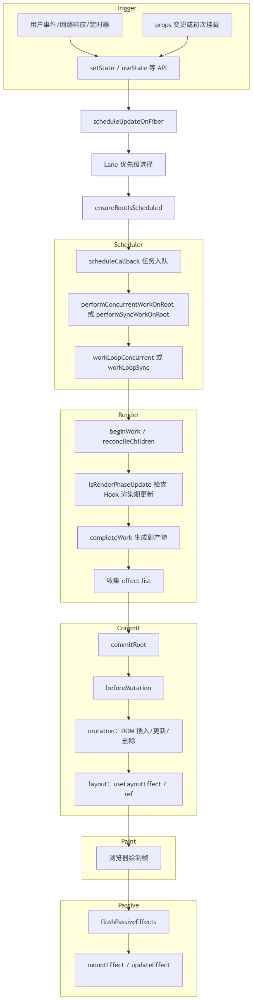

# Commit 阶段的 3 个子阶段与副作用执行全解析

# 一、前言

Commit 阶段是 React 更新流程的最后一环，用于把 Render 阶段计算出的变更与副作用原子化地应用到宿主环境（DOM），确保界面一致性与不出现中间态。

# 二、React 全流程视角下的 Commit 阶段

## 2.1 React 渲染全流程回顾



1. 触发：来自事件、`setState`、`dispatch`、`startTransition`、异步回调等，进入调度。
2. 调度：为更新分配车道（`Lane`），选择下一批工作（`getNextLanes`），安排回调。
3. Render（可中断）：自顶向下构建/复用 Fiber，Diff 得出宿主层变更与副作用列表；不会触碰 DOM。
4. Commit（不可中断）：原子化应用 DOM 变更，执行 layout 类副作用与 ref，保证可见更新的一致性。
5. 绘制（Paint）：浏览器将提交的变更绘制到屏幕。
6. 被动阶段（Passive）：在一个独立宏任务中异步冲洗 `useEffect`（HookPassive）的清理与安装，避免阻塞提交与布局。

## 2.2 Commit 阶段的核心目标

1. 原子应用宿主层变更：在一次不可中断的关键段内完成所有 DOM 插入/删除/属性更新，避免“半提交”导致的视觉撕裂。
2. 正确的副作用时序：`useInsertionEffect` 在变更前、`useLayoutEffect` 清理于变更期/安装于布局期、类组件 `DidMount/DidUpdate` 与 ref 绑定于布局期。
3. 界面一致性与可预期的读写：布局读/写必须发生在稳定的 DOM 状态上，确保测量与同步操作正确。
4. 与调度器的配合：提交期间不让步、不给调度器插入中断，确保一个提交完成后再进入绘制与被动阶段。
5. 产出后续异步工作：将 `useEffect` 的清理与安装延迟到绘制后，尽量降低对交互的阻塞。

```javascript
// 提交阶段的顺序（简化伪代码）
commitBeforeMutationEffects(root, finishedWork, lanes); // 变更前处理，如焦点/过渡
commitMutationEffects(root, finishedWork, lanes); // 应用 DOM 变更
commitLayoutEffects(root, finishedWork, lanes); // ref、类组件、layout effect 安装
// 绘制发生在上述之后；随后进入被动阶段：
flushPassiveEffects(); // useEffect 的清理和安装（异步宏任务）
```

# 三、Commit 阶段源码关键函数解析

## 3.1 入口函数：commitRoot

### 3.1.1 角色定位：

提交阶段的总调度器；将 Render 阶段完成的变更与副作用在宿主环境原子化应用。

### 3.1.2 核心特征：

1. 不可中断：提交路径置位 `CommitContext`，不调用 `shouldYield`。
2. 明确分期：严格依序执行 Before Mutation → Mutation → Layout。
3. 提交后异步：被动副作用（`useEffect`）在一个后续宏任务中冲洗，避免阻塞交互。
4. 关键职责（串联三子阶段并安排 Passive）：

- 冲刷潜在残留的被动效果，确保提交干净。
- 进入提交上下文并短期提升更新优先级到离散事件级别。
- 在 Mutation 结束后切换当前树：`root.current = finishedWork`。
- 调度并在绘制后冲洗被动副作用，设置合适的更新优先级。

### 3.1.3 核心实现逻辑

```javascript
function commitRoot(root, finishedWork, lanes /* ... */) {
  // 先冲刷可能残留的被动效果，确保提交干净
  do {
    flushPendingEffects();
  } while (pendingEffectsStatus !== NO_PENDING_EFFECTS);

  // 设置提交阶段的性能标记与校验
  // ...

  // 安排被动效果（Passive）后续冲洗（必要时）
  if (
    (finishedWork.subtreeFlags & PassiveMask) !== NoFlags ||
    (finishedWork.flags & PassiveMask) !== NoFlags
  ) {
    // 常规：调度一个普通优先级任务执行 flushPassiveEffects
  } else {
    root.callbackNode = null;
    root.callbackPriority = NoLane;
  }

  // Before Mutation 子阶段（提交上下文 + 提升优先级）
  if (hasBeforeMutationEffects) {
    const prev = getCurrentUpdatePriority();
    setCurrentUpdatePriority(DiscreteEventPriority); // 提交路径短期提升为离散优先级
    const prevCtx = executionContext;
    executionContext |= CommitContext; // 进入提交上下文
    try {
      commitBeforeMutationEffects(root, finishedWork, lanes); // DOM 读前置与快照
    } finally {
      executionContext = prevCtx;
      setCurrentUpdatePriority(prev);
    }
  }

  if (!startedViewTransition) {
    flushMutationEffects(); // 执行 DOM 增删改
    flushLayoutEffects(); // 执行 useLayoutEffect、更新 ref 等
    flushSpawnedWork(); // 提交后异步执行 flushPassiveEffects
  }
}
```

### 3.1.4 示例：一次“点击打开弹层”的完整提交与副作用时序

以下示例展示一次离散事件（`click`）触发的更新如何穿越三个子阶段，以及绘制后的被动副作用如何执行与设定优先级。

```javascript
function DialogExample() {
  const [open, setOpen] = useState(false);
  const dialogRef = useRef(null);

  // Layout 阶段执行：此处可安全测量并同步读写 DOM
  useLayoutEffect(() => {
    if (open && dialogRef.current) {
      // 运行于 Layout 子阶段：DOM 已变更且稳定
      const rect = dialogRef.current.getBoundingClientRect(); // 同步测量
      // 例如根据尺寸定位弹层
      dialogRef.current.style.top = `${rect.bottom + 8}px`;
    }
    return () => {
      // 下次提交时，Layout 清理发生在 Mutation 之前（避免脏读）
      // 可在这里撤销同步副作用（如绑定的同步事件等）
    };
  }, [open]);

  // Passive 阶段执行：绘制后再执行，避免阻塞提交/布局
  useEffect(() => {
    if (!open) return;
    // 示例：给窗口添加滚动监听，滚动时关闭弹层
    const onScroll = () => {
      // 注意：此处 setState 的更新优先级由 Passive 阶段设定：
      // priority = lowerEventPriority(DefaultEventPriority, lanesToEventPriority(pendingEffectsLanes))
      // 通常为 Default；如果本次渲染包含 Idle 等更低优先级，效果更新也会更低
      setOpen(false);
    };
    window.addEventListener("scroll", onScroll);
    return () => window.removeEventListener("scroll", onScroll); // Passive 清理
  }, [open]);

  return (
    <div>
      <button
        onClick={() => {
          setOpen(true); // 离散事件入口（click）：触发一次高优先级更新
        }}
      >
        打开弹层
      </button>

      {open && (
        <div ref={dialogRef}>
          弹层内容（Layout 效果会在提交后立刻测量并定位）
        </div>
      )}
    </div>
  );
}
```

时间线解读：

- Before Mutation：读取现有焦点/选择，准备快照与过渡信息；不触碰 DOM。
- Mutation：插入弹层节点、属性写入、可能的宿主层重置；随后 `root.current = finishedWork`。
- Layout：执行 `useLayoutEffect` 清理与安装、类组件 `DidMount/DidUpdate`、`ref` 绑定；支持同步测量。
- Paint：浏览器将变更绘制到屏幕（用户现在看到弹层）。
- Passive：宏任务中冲洗 `useEffect` 清理与安装，此处绑定滚动监听；若滚动触发 `setOpen(false)`，该更新优先级不会高于 `DefaultEventPriority`，并可能更低（比如渲染包含 Idle 车道时）。

## 3.2 子阶段一：Before Mutation

简单说，这个阶段的核心是：在 DOM 发生任何增删改之前，先完成 “读状态” 和 “做准备” 的工作—— 比如记录 DOM 快照、处理焦点，避免后续 DOM 变更破坏这些需要的信息，确保数据和交互的一致性。

### 3.2.1 核心目标与执行时机

1. 核心目标：DOM 变更前，安全读取当前页面状态（如滚动位置、焦点元素、选择的文本），执行前置准备（如快照、焦点处理）。
2. 关键时机：在 Mutation 阶段（实际改 DOM）之前，且整个过程同步执行、不可中断。
3. 为什么要单独分这个阶段：如果先改 DOM 再读状态，拿到的就是变更后的数据，可能导致逻辑错误（比如想记录列表滚动位置，结果 DOM 先更新了，滚动位置变了）。

### 3.2.2 核心实现逻辑

commitBeforeMutationEffects 先初始化提交环境（获取聚焦实例句柄、判断视图过渡场景），通过 commitBeforeMutationEffects_begin 以深度优先方式遍历 Fiber 树，先处理待删除子节点的提交前副作用，有子节点且子树含相关副作用标记则深入遍历，无子节点则记录视图过渡状态并切换到兄弟 / 父节点；遍历过程中通过 commitBeforeMutationEffects_onFiber 处理单个节点逻辑，包括焦点在隐藏 Suspense 边界内的失焦处理、类组件 getSnapshotBeforeUpdate 快照执行、根节点容器清空等，全程在 DOM 变更前完成，为后续 Mutation 阶段做准备，执行完毕后清理环境状态。

```javascript
export function commitBeforeMutationEffects(
  root: FiberRoot,
  firstChild: Fiber,
  committedLanes: Lanes
): void {
  focusedInstanceHandle = prepareForCommit(root.containerInfo);
  shouldFireAfterActiveInstanceBlur = false;

  const isViewTransitionEligible =
    enableViewTransition &&
    includesOnlyViewTransitionEligibleLanes(committedLanes);

  // 初始化副作用遍历指针，指向待处理的第一个 Fiber 节点
  nextEffect = firstChild;
  // 开始执行提交前阶段核心逻辑
  commitBeforeMutationEffects_begin(isViewTransitionEligible);

  focusedInstanceHandle = null;
  resetAppearingViewTransitions();
}

function commitBeforeMutationEffects_begin(isViewTransitionEligible: boolean) {
  // 确定副作用掩码：视图过渡场景用专用掩码，否则用默认提交前掩码
  const subtreeMask = isViewTransitionEligible
    ? BeforeAndAfterMutationTransitionMask
    : BeforeMutationMask;

  // 遍历副作用链表（nextEffect 驱动）
  while (nextEffect !== null) {
    const fiber = nextEffect;

    // 先处理 deletions：父→子
    if (enableCreateEventHandleAPI || isViewTransitionEligible) {
      const deletions = fiber.deletions;
      if (deletions !== null) {
        for (let i = 0; i < deletions.length; i++) {
          commitBeforeMutationEffectsDeletion(
            deletions[i],
            isViewTransitionEligible
          );
        }
      }
    }

    // 隐藏子树优化（Offscreen/Suspense）与视图过渡特殊处理
    if (enableViewTransition && fiber.tag === OffscreenComponent) {
      // 根据隐藏/显现状态跳过或特殊遍历
      commitBeforeMutationEffects_complete(isViewTransitionEligible);
      continue;
    }

    const child = fiber.child;
    // 有子节点且子树含提交前副作用标记：深入子节点遍历（深度优先）
    if ((fiber.subtreeFlags & subtreeMask) !== NoFlags && child !== null) {
      child.return = fiber;
      nextEffect = child;
    } else {
      if (isViewTransitionEligible) {
        // 视图过渡：记录子树内变更前状态
        commitNestedViewTransitions(fiber);
      }
      // 完成当前节点处理，切换到兄弟/父节点
      commitBeforeMutationEffects_complete(isViewTransitionEligible);
    }
  }
}

// 处理单个 Fiber 节点的提交前副作用
function commitBeforeMutationEffects_onFiber(
  finishedWork: Fiber,
  isViewTransitionEligible: boolean
) {
  const current = finishedWork.alternate;
  const flags = finishedWork.flags;

  // 焦点在隐藏边界内的处理
  if (enableCreateEventHandleAPI) {
    if (!shouldFireAfterActiveInstanceBlur && focusedInstanceHandle !== null) {
      if (
        finishedWork.tag === SuspenseComponent &&
        isSuspenseBoundaryBeingHidden(current, finishedWork) &&
        doesFiberContain(finishedWork, focusedInstanceHandle)
      ) {
        shouldFireAfterActiveInstanceBlur = true;
        beforeActiveInstanceBlur(finishedWork); //  // 执行活跃实例失焦前回调
      }
    }
  }

  switch (finishedWork.tag) {
    case ClassComponent: {
      if ((flags & Snapshot) !== NoFlags && current !== null) {
        // 类组件：存在 Snapshot 标记且有旧节点，执行快照逻辑（如 getSnapshotBeforeUpdate）
        commitClassSnapshot(finishedWork, current);
      }
      break;
    }
    case HostRoot: {
      // 根节点：存在 Snapshot 标记，清空容器（DOM 变更前准备）
      if ((flags & Snapshot) !== NoFlags) {
        if (supportsMutation) {
          const root = finishedWork.stateNode;
          clearContainer(root.containerInfo);
        }
      }
      break;
    }
    case FunctionComponent: {
      // useEffectEvent：更新事件实现引用（非 DOM 快照）
      // 省略具体细节
      break;
    }
    default: {
      if ((flags & Snapshot) !== NoFlags) {
        throw new Error("Unexpected Snapshot flag for this fiber tag.");
      }
    }
  }
}
```

## 3.3 子阶段二：Mutation

Mutation 阶段是 React 真正 “动手修改 DOM” 的阶段，核心任务是将 Render 阶段计算出的 DOM 变更（插入、删除、更新）应用到真实 DOM 上，同时完成旧 Ref 解绑、宿主状态清理等关键操作。这一阶段的操作直接影响用户可见的界面，且全程同步执行、不可中断。

### 3.3.1 核心目标与执行时机

1. 核心目标：执行真实 DOM 操作（插入新节点、删除旧节点、更新属性 / 文本），并完成与 DOM 变更相关的前置清理（如旧 Ref 解绑）。
2. 关键时机：在 Before Mutation 阶段（读状态）之后，Layout 阶段（读新 DOM 状态）之前，是 “写 DOM” 的唯一阶段。
3. 为什么重要：这是虚拟 DOM 映射到真实 DOM 的 “最后一步”，所有 Render 阶段的计算结果在此落地，直接决定用户看到的界面。

### 3.3.2 核心实现逻辑

1. 和 Before Mutation 阶段类似，Mutation 阶段也需要确保操作不被打断，因此会先切换到高优先级环境，会调用`commitMutationEffectsOnFiber` 来递归处理 `finishedWork` 树。

```javascript
const prev = getCurrentUpdatePriority();
setCurrentUpdatePriority(DiscreteEventPriority);
const prevCtx = executionContext;
executionContext |= CommitContext;
try {
  commitMutationEffects(root, finishedWork, lanes); // 核心：执行所有 DOM 变更操作
  resetAfterCommit(root.containerInfo); // 宿主层收尾
} finally {
  executionContext = prevCtx;
  setCurrentUpdatePriority(prev);
}

// 关键：DOM 变更完成后，切换当前 Fiber 树（旧树 → 新树）
root.current = finishedWork;
// 标记进入下一阶段（Layout 阶段）
pendingEffectsStatus = PENDING_LAYOUT_PHASE;
```

2. `commitMutationEffectsOnFiber` 是实际执行副作用的核心。它会根据 `fiber.flags` 的不同，执行相应的操作。其基本流程是 “自上而下” 递归，但处理副作用的顺序有所不同。

首先处理 `deletions`，在遍历子节点之前，优先处理当前 Fiber 节点上标记为 `ChildDeletion` 的所有待删除子节点。这确保了在执行其他变更前，旧的 DOM 节点已被移除；然后递归子节点：如果子树中存在 `MutationMask` 标记的变更，则继续向下遍历，对每个子节点调用 `commitMutationEffectsOnFiber`；在递归回到当前 Fiber 后，处理自身的副作用。例如，对于 `HostComponent`，会根据 `flags` 执行 `commitHostUpdate`（更新属性）或 `commitHostPlacement`（插入 DOM 树）。对于函数组件，会在这里触发 `useInsertionEffect` 的销毁和创建回调。

```javascript
function commitMutationEffectsOnFiber(
  finishedWork: Fiber,
  root: FiberRoot,
  lanes: Lanes
) {
  const flags = finishedWork.flags;

  switch (finishedWork.tag) {
    case FunctionComponent:
    case ForwardRef:
    case SimpleMemoComponent: {
      // 递归处理子节点的 Mutation Effects
      recursivelyTraverseMutationEffects(root, finishedWork, lanes);
      // 处理当前节点的 Placement (插入)
      commitReconciliationEffects(finishedWork);

      // 3. 如果有 Update 标记 (通常由 Hook 副作用引起)
      if (flags & Update) {
        // 卸载之前的插入副作用钩子 (useInsertionEffect)
        commitHookEffectListUnmount(
          HookInsertion | HookHasEffect,
          finishedWork,
          finishedWork.return
        );
        // 挂载新的插入副作用钩子 (useInsertionEffect)
        commitHookEffectListMount(HookInsertion | HookHasEffect, finishedWork);
        // 卸载之前的插入副作用钩子 (useLayoutEffect)
        commitHookLayoutUnmountEffects(
          finishedWork,
          finishedWork.return,
          HookLayout | HookHasEffect
        );、
      }
      break;
    }
    case ClassComponent: {
      recursivelyTraverseMutationEffects(root, finishedWork, lanes);
      commitReconciliationEffects(finishedWork);

      if (flags & Ref) {
        // 解绑旧的 ref
        const current = finishedWork.alternate;
        if (current !== null) {
          safelyDetachRef(current, current.return);
        }
      }
      break;
    }
    // DOM 元素
    case HostComponent: {
      recursivelyTraverseMutationEffects(root, finishedWork, lanes);
      commitReconciliationEffects(finishedWork);

      if (flags & Ref) {
        const current = finishedWork.alternate;
        if (current !== null) {
          safelyDetachRef(current, current.return);
        }
      }

      if (flags & Update) {
        const instance = finishedWork.stateNode;
        if (instance != null) {
          // 应用 DOM 属性更新
          const newProps = finishedWork.memoizedProps;
          const oldProps = current !== null ? current.memoizedProps : newProps;
          const type = finishedWork.type;
          const updatePayload = finishedWork.updateQueue;
          finishedWork.updateQueue = null;
          if (updatePayload) {
            // 调用 commitHostUpdate 执行 DOM 更新
            commitHostUpdate(
              instance,
              updatePayload,
              type,
              oldProps,
              newProps,
              finishedWork
            );
          }
        }
      }
      break;
    }
    // ... 其他类型的 Fiber
  }
}

function recursivelyTraverseMutationEffects(root, parentFiber, lanes) {
  // 优先处理删除
  const deletions = parentFiber.deletions;
  if (deletions !== null) {
    for (let i = 0; i < deletions.length; i++) {
      const childToDelete = deletions[i];
      commitDeletionEffects(root, parentFiber, childToDelete);
    }
  }

  // 递归处理子节点
  if (parentFiber.subtreeFlags & MutationMask) {
    let child = parentFiber.child;
    while (child !== null) {
      commitMutationEffectsOnFiber(child, root, lanes);
      child = child.sibling;
    }
  }
}
```

## 3.4 子阶段三：Layout

Layout 阶段是提交过程中 DOM 稳定后、被动副作用执行前的关键环节，核心目标是处理需要依赖完整 DOM 状态的同步操作，同时完成组件生命周期与 ref 的最终绑定。

### 3.4.1 核心目标与执行时机

1. 核心目标：在 DOM 状态稳定后同步处理依赖 DOM 的布局操作、生命周期回调与 ref 绑定。
2. 关键时机：Mutation 阶段（DOM 增删改）之后、被动副作用（如 useEffect）之前。
3. 为什么重要：为需要即时获取 / 操作最新 DOM 状态的场景提供同步执行环境，同时保证相关逻辑的执行时序与 DOM 状态一致性。

### 3.4.2 核心实现逻辑

```javascript
export function commitLayoutEffects(
  finishedWork: Fiber,
  root: FiberRoot,
  committedLanes: Lanes
): void {
  nProgressLanes = committedLanes; // 记录当前处理的优先级车道
  inProgressRoot = root; // 记录当前根节点

  resetComponentEffectTimers(); // 重置组件副作用计时器

  const current = finishedWork.alternate; // 获取旧 Fiber 节点（current 树）
  // 处理当前 Fiber 节点的布局副作用
  commitLayoutEffectOnFiber(root, current, finishedWork, committedLanes);

  inProgressLanes = null;
  inProgressRoot = null;
}

function recursivelyTraverseLayoutEffects(
  root: FiberRoot,
  parentFiber: Fiber,
  lanes: Lanes
) {
  // 若子树存在布局副作用标记，才遍历子节点
  if (parentFiber.subtreeFlags & LayoutMask) {
    let child = parentFiber.child;
    while (child !== null) {
      const current = child.alternate;
      // 处理子节点的布局副作用
      commitLayoutEffectOnFiber(root, current, child, lanes);
      child = child.sibling; // 遍历兄弟节点
    }
  }
}

function commitLayoutEffectOnFiber(
  finishedRoot: FiberRoot,
  current: Fiber | null,
  finishedWork: Fiber,
  committedLanes: Lanes
): void {
  const flags = finishedWork.flags;
  switch (finishedWork.tag) {
    case FunctionComponent:
    case ForwardRef:
    case SimpleMemoComponent: {
      // 先递归处理子树布局副作用
      recursivelyTraverseLayoutEffects(
        finishedRoot,
        finishedWork,
        committedLanes
      );
      // 若节点有更新标记，执行 useLayoutEffect 回调
      if (flags & Update) {
        commitHookLayoutEffects(finishedWork, HookLayout | HookHasEffect);
      }
      break;
    }
    case ClassComponent: {
      // 先递归处理子树
      recursivelyTraverseLayoutEffects(
        finishedRoot,
        finishedWork,
        committedLanes
      );
      if (flags & Update) {
        // 若有更新，调用类组件生命周期（componentDidMount/Update）
        commitClassLayoutLifecycles(finishedWork, current);
      }
      if (flags & Callback) {
        // 处理回调（如 setState 的第二个参数）
        commitClassCallbacks(finishedWork);
      }
      if (flags & Ref) {
        // 绑定 ref
        safelyAttachRef(finishedWork, finishedWork.return);
      }
      break;
    }
    case HostComponent: {
      recursivelyTraverseLayoutEffects(
        finishedRoot,
        finishedWork,
        committedLanes
      );
      if (current === null && flags & Update) {
        // 初次挂载时执行额外逻辑（如输入框聚焦）
        commitHostMount(finishedWork);
      }
      if (flags & Ref) {
        safelyAttachRef(finishedWork, finishedWork.return);
      }
      break;
    }
    case HostRoot: {
      recursivelyTraverseLayoutEffects(
        finishedRoot,
        finishedWork,
        committedLanes
      );
      if (flags & Callback) {
        // 处理根节点回调（如 ReactDOM.render 的回调）
        commitRootCallbacks(finishedWork);
      }
      break;
    }
    // 性能分析节点
    case Profiler: {
      if (flags & Update) {
        recursivelyTraverseLayoutEffects(
          finishedRoot,
          finishedWork,
          committedLanes
        );
        commitProfilerUpdate(
          finishedWork,
          current,
          commitStartTime,
          finishedWork.stateNode.effectDuration
        );
      } else {
        recursivelyTraverseLayoutEffects(
          finishedRoot,
          finishedWork,
          committedLanes
        );
      }
      break;
    }
    case SuspenseComponent: {
      recursivelyTraverseLayoutEffects(
        finishedRoot,
        finishedWork,
        committedLanes
      );
      if (flags & Update) {
        commitSuspenseHydrationCallbacks(finishedRoot, finishedWork);
      }
      // Callback 注册逻辑略
      break;
    }
    case OffscreenComponent: {
      // 隐藏时跳过；重新显现时使用 reappear 递归；否则正常递归
      // 细节见源码的可见性与上下文切换逻辑
      break;
    }
    default: {
      // 其他类型节点默认递归处理子树
      recursivelyTraverseLayoutEffects(
        finishedRoot,
        finishedWork,
        committedLanes
      );
      break;
    }
  }
}
```

## 3.5 被动阶段（Passive Effects）

被动阶段是 Commit 阶段的最后一个子阶段，核心负责执行 useEffect 相关逻辑（清理 + 回调）。其设计核心是不阻塞 DOM 渲染与用户交互，将非紧急副作用延迟到浏览器绘制后异步执行，平衡性能与开发体验。

### 3.5.1 核心目标与执行时机

1. 核心目标：在不阻塞 DOM 渲染与用户交互的前提下，安全执行非紧急异步副作用。
2. 关键时机：本次提交的 Fiber 树（finishedWork）或其子树包含 Passive 副作用标记（flags/subtreeFlags & PassiveMask），即存在需要执行的 useEffect。在 Layout 阶段之后、浏览器绘制（Paint）之后，通过调度一个普通优先级任务执行 `flushPassiveEffects`。

### 3.5.2 核心实现逻辑

先通过 flushPassiveEffects 校验阶段状态、取出提交数据，将渲染车道映射为不高于 Default 的更新优先级并保护原始上下文，再调用 flushPassiveEffectsImpl 做重入保护并进入提交上下文，随后按 “先卸载后挂载” 顺序，通过 commitPassiveUnmountEffects 递归遍历 Fiber 树执行 useEffect 清理函数（含被删除子树的副作用清理、离线组件的断开逻辑），再通过 commitPassiveMountEffects 递归遍历执行 useEffect 回调函数（含视图过渡场景适配、离线 / 根节点等特殊类型 Fiber 的差异化处理），全程同步串行且不阻塞 DOM 渲染与用户交互，执行完毕后恢复原始上下文并释放资源。

```javascript
function flushPassiveEffects(wasDelayedCommit?: boolean): boolean {
  if (pendingEffectsStatus !== PENDING_PASSIVE_PHASE) {
    return false;
  }
  const root = pendingEffectsRoot;
  const remainingLanes = pendingEffectsRemainingLanes;
  pendingEffectsRemainingLanes = NoLanes;

  // 计算被动阶段的更新优先级：不高于Default，避免抢占高优任务
  const renderPriority = lanesToEventPriority(pendingEffectsLanes); // 渲染车道转事件优先级
  const priority = lowerEventPriority(DefaultEventPriority, renderPriority); // 取较低优先级

  const prevTransition = ReactSharedInternals.T;
  const previousPriority = getCurrentUpdatePriority();

  try {
    setCurrentUpdatePriority(priority);
    ReactSharedInternals.T = null;
    return flushPassiveEffectsImpl(wasDelayedCommit); // 执行副作用核心逻辑
  } finally {
    setCurrentUpdatePriority(previousPriority);
    ReactSharedInternals.T = prevTransition;
    releaseRootPooledCache(root, remainingLanes);
  }
}

function flushPassiveEffectsImpl(wasDelayedCommit: void | boolean) {
  const transitions = pendingPassiveTransitions;
  pendingPassiveTransitions = null;

  const root = pendingEffectsRoot;
  const lanes = pendingEffectsLanes;
  pendingEffectsStatus = NO_PENDING_EFFECTS;
  pendingEffectsRoot = (null: any);
  pendingFinishedWork = (null: any);
  pendingEffectsLanes = NoLanes;

  if ((executionContext & (RenderContext | CommitContext)) !== NoContext) {
    throw new Error("Cannot flush passive effects while already rendering.");
  }

  const prevExecutionContext = executionContext;
  executionContext |= CommitContext;

  // 严格执行顺序：先卸载（清理旧副作用），后挂载（执行新回调）
  commitPassiveUnmountEffects(root.current); // 执行useEffect清理函数
  // 执行useEffect回调函数
  commitPassiveMountEffects(
    root,
    root.current,
    lanes,
    transitions,
    pendingEffectsRenderEndTime
  );

  executionContext = prevExecutionContext;
}

// ReactFiberCommitWork.js — 卸载入口与遍历
export function commitPassiveUnmountEffects(finishedWork: Fiber): void {
  resetComponentEffectTimers();
  commitPassiveUnmountOnFiber(finishedWork); // 开始处理单个Fiber节点的卸载逻辑
}

function recursivelyTraversePassiveUnmountEffects(parentFiber: Fiber): void {
  const deletions = parentFiber.deletions; // 待删除的子节点列表
  // 若父节点有子删除标记且存在待删除节点，处理被删除子树的卸载
  if ((parentFiber.flags & ChildDeletion) !== NoFlags && deletions !== null) {
    for (let i = 0; i < deletions.length; i++) {
      const childToDelete = deletions[i]; // 待删除的子节点
      nextEffect = childToDelete; // 标记当前处理的副作用节点
      // 处理被删除子树的被动卸载（深度优先遍历）
      commitPassiveUnmountEffectsInsideOfDeletedTree_begin(
        childToDelete,
        parentFiber
      );
    }
    detachAlternateSiblings(parentFiber); // 分离旧Fiber树的兄弟节点引用，避免内存泄漏
  }
  // 若子树存在被动副作用标记，递归处理所有子节点
  if (parentFiber.subtreeFlags & PassiveMask) {
    let child = parentFiber.child;
    while (child !== null) {
      commitPassiveUnmountOnFiber(child);
      child = child.sibling;
    }
  }
}

function commitPassiveUnmountOnFiber(finishedWork: Fiber): void {
  switch (finishedWork.tag) {
    case FunctionComponent:
    case ForwardRef:
    case SimpleMemoComponent: {
      // 先递归处理子树的卸载副作用
      recursivelyTraversePassiveUnmountEffects(finishedWork);
      if (finishedWork.flags & Passive) {
        // 若节点有被动副作用标记，执行useEffect清理函数
        commitHookPassiveUnmountEffects(
          finishedWork,
          finishedWork.return,
          HookPassive | HookHasEffect
        );
      }
      break;
    }
    // 离线/隐藏组件
    case OffscreenComponent: {
      const instance: OffscreenInstance = finishedWork.stateNode;
      const isHidden = finishedWork.memoizedState !== null;
      if (
        isHidden &&
        instance._visibility & OffscreenPassiveEffectsConnected &&
        (finishedWork.return === null ||
          finishedWork.return.tag !== SuspenseComponent)
      ) {
        // 隐藏子树：断开被动副作用连接
        instance._visibility &= ~OffscreenPassiveEffectsConnected;
        recursivelyTraverseDisconnectPassiveEffects(finishedWork);
      } else {
        recursivelyTraversePassiveUnmountEffects(finishedWork);
      }
      break;
    }
    default: {
      recursivelyTraversePassiveUnmountEffects(finishedWork);
      break;
    }
  }
}

export function commitPassiveMountEffects(
  root: FiberRoot,
  finishedWork: Fiber,
  committedLanes: Lanes,
  committedTransitions: Array<Transition> | null,
  renderEndTime: number
): void {
  resetComponentEffectTimers();
  // 开始处理单个Fiber节点的挂载逻辑
  commitPassiveMountOnFiber(
    root,
    finishedWork,
    committedLanes,
    committedTransitions,
    renderEndTime
  );
}

function recursivelyTraversePassiveMountEffects(
  root: FiberRoot,
  parentFiber: Fiber,
  committedLanes: Lanes,
  committedTransitions: Array<Transition> | null,
  endTime: number
) {
  // 判断是否为视图过渡 eligible 场景（仅包含视图过渡相关车道）
  const isViewTransitionEligible =
    enableViewTransition &&
    includesOnlyViewTransitionEligibleLanes(committedLanes);
  // 确定被动副作用掩码：视图过渡场景用专用掩码，否则用默认被动掩码
  const subtreeMask = isViewTransitionEligible
    ? PassiveTransitionMask
    : PassiveMask;

  // 满足以下条件则遍历子节点：
  // 1. 子树存在对应被动副作用标记；
  // 2. 开启性能追踪且组件有渲染耗时，且子树结构变更（需重新执行副作用）
  if (
    parentFiber.subtreeFlags & subtreeMask ||
    (enableProfilerTimer &&
      enableComponentPerformanceTrack &&
      parentFiber.actualDuration !== 0 &&
      (parentFiber.alternate === null ||
        parentFiber.alternate.child !== parentFiber.child))
  ) {
    let child = parentFiber.child;
    while (child !== null) {
      // 处理单个子节点的被动挂载副作用
      commitPassiveMountOnFiber(
        root,
        child,
        committedLanes,
        committedTransitions,
        enableProfilerTimer && enableComponentPerformanceTrack
          ? child.sibling !== null
            ? ((child.sibling.actualStartTime: any): number)
            : endTime
          : 0
      );
      child = child.sibling;
    }
  } else if (isViewTransitionEligible) {
    restoreNestedViewTransitions(parentFiber);
  }
}

function commitPassiveMountOnFiber(
  finishedRoot: FiberRoot,
  finishedWork: Fiber,
  committedLanes: Lanes,
  committedTransitions: Array<Transition> | null,
  endTime: number
): void {
  const flags = finishedWork.flags;
  switch (finishedWork.tag) {
    case FunctionComponent:
    case ForwardRef:
    case SimpleMemoComponent: {
      // 先递归处理子树的被动挂载副作用
      recursivelyTraversePassiveMountEffects(
        finishedRoot,
        finishedWork,
        committedLanes,
        committedTransitions,
        endTime
      );
      if (flags & Passive) {
        // 安装 useEffect
        commitHookPassiveMountEffects(
          finishedWork,
          HookPassive | HookHasEffect
        );
      }
      break;
    }
    case HostRoot: {
      const prevEffectDuration = pushNestedEffectDurations();
      // 递归处理子树的被动挂载副作用
      recursivelyTraversePassiveMountEffects(
        finishedRoot,
        finishedWork,
        committedLanes,
        committedTransitions,
        endTime
      );
      if (enableProfilerTimer && enableProfilerCommitHooks) {
        finishedRoot.passiveEffectDuration +=
          popNestedEffectDurations(prevEffectDuration);
      }
      break;
    }
    // ... existing code ...
    default: {
      recursivelyTraversePassiveMountEffects(
        finishedRoot,
        finishedWork,
        committedLanes,
        committedTransitions,
        endTime
      );
      break;
    }
  }
}
```

# 四、常见陷阱与最佳实践

- 在 useEffect 中触发更新的优先级与循环风险（无限更新防护）
- 在布局/被动阶段触发 setState 的影响与建议
