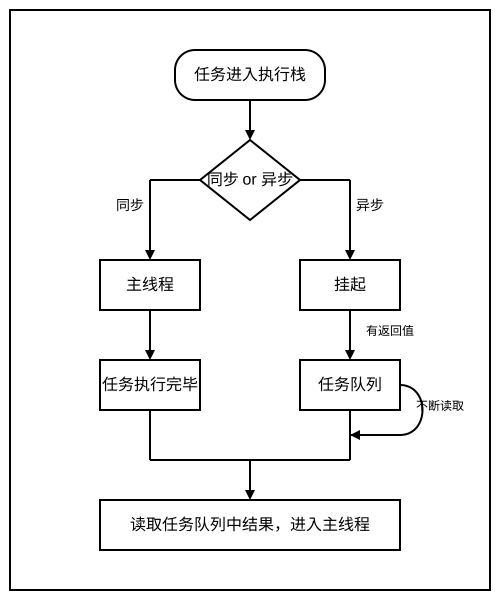

# Effect 执行时机与事件循环交错关系：微任务、宏任务与 passive effect 的调度模型

# 1.引言

在 React 并发渲染架构中，副作用（Effect）的执行时机并非孤立存在，而是与浏览器事件循环的微任务、宏任务队列深度耦合。useEffect 作为最核心的副作用 Hook，其异步执行特性、passive effect 的特殊调度逻辑，一直是开发者理解 React 底层原理的难点。本文将从 React 源码出发，先通过核心源码片段梳理更新调度的关键链路，再逐层拆解 Effect 与事件循环的交错关系，揭示 passive effect 的调度模型。

# 2. 事件循环基础：微任务与宏任务的执行机制

要理解 React Effect 的调度时机，首先要掌握浏览器事件循环（Event Loop）的核心。这是 React 实现异步、非阻塞渲染，并与宿主环境（浏览器）高效交互的底层基础。熟悉事件循环的可以跳过这个章节。

> 之前写过一篇[事件循环的文章](https://github.com/lzj2000/handwriting/blob/main/docs/7.%E4%BA%8B%E4%BB%B6%E5%BE%AA%E7%8E%AF.md)，也可以看一下。

## 2.1 事件循环的运行流程：一次“循环”的生命周期

浏览器的事件循环机制确保了 JavaScript 在单线程模型下依然能高效处理异步操作。其核心可以概括为“一次只做一件事，但会按顺序排队”。一轮具体的事件循环（Tick）可以分解为以下步骤：

1.  **执行同步代码**：从宏任务队列中取出一个最老的任务（例如一个 `script` 标签里的代码），将其放入调用栈（Call Stack）并执行，直到调用栈清空。
2.  **执行所有微任务**：在同步代码执行完毕后，立即检查微任务队列（Microtask Queue）。如果队列不为空，则依次取出所有微任务并执行，直到微任务队列被完全清空。
3.  **（可选）UI 渲染**：在微任务队列清空后，浏览器有一次机会来更新 UI，包括执行重绘（Repaint）和回流（Reflow）。这个步骤不是每轮循环都必然发生，浏览器会根据刷新率、页面性能等因素自行决定。
4.  **进入下一轮循环**：返回第一步，准备从宏任务队列中取出下一个任务。

这个“执行一个宏任务 -> 清空所有微任务 -> 可能的 UI 渲染”的循环，构成了事件循环的核心。



## 2.2 微任务与宏任务的核心差异与示例

微任务和宏任务最关键的区别在于它们的**执行时机**和**优先级**。

1.  **微任务 (Microtask)**:

**特点**：优先级极高，在当前同步任务执行结束后、UI 渲染之前立即执行。如果微任务执行过程中又产生了新的微任务，它们会被添加到队列末尾，并在同一轮事件循环中被“插队”执行，直到队列完全清空。
**常见示例**： - `Promise.then()`、`Promise.catch()`、`Promise.finally()` - `MutationObserver`：用于监听 DOM 树的变化。 - `queueMicrotask()`：一个专门用于手动向微任务队列添加任务的现代 API。 - `process.nextTick()` (Node.js 环境)

2.  **宏任务 (Macrotask)**:

**特点**：优先级较低，被放入宏任务队列中排队等待。每轮事件循环只执行队列中的**一个**宏任务。
**常见示例**： - 整体的 `<script>` 代码块 - `setTimeout()`、`setInterval()` - `MessageChannel`：React Scheduler 用它来模拟 `setImmediate`，以实现无延迟的宏任务调度。 - I/O 操作、网络请求回调 - 用户交互事件（如 `click`、`scroll`）的回调函数

### 代码示例：执行顺序的直观体现

```javascript
console.log("1. 同步代码开始");

setTimeout(() => {
  console.log("5. 宏任务：setTimeout");
}, 0);

Promise.resolve().then(() => {
  console.log("3. 微任务：Promise.then 1");
  Promise.resolve().then(() => {
    console.log("4. 微任务：Promise.then 2");
  });
});

console.log("2. 同步代码结束");

// 预期输出:
// 1. 同步代码开始
// 2. 同步代码结束
// 3. 微任务：Promise.then 1
// 4. 微任务：Promise.then 2
// 5. 宏任务：setTimeout
```

这个例子清晰地展示了：同步代码最先执行，随后所有微任务被清空，最后才轮到下一轮事件循环中的宏任务。

# 3、passive effect 调度模型：useEffect 的异步执行本质

我们已经知道，React 的渲染工作（Render Phase）可以在宏任务中被切分执行，而提交工作（Commit Phase）是同步的。那么，`useEffect` 的回调，也就是 Passive Effect，它到底在哪个阶段执行？

答案是：**在 Commit 阶段之后，通过 Scheduler 调度的一个独立的宏任务中异步执行。**

这正是 `useEffect` “非阻塞”特性的核心。它确保了 Effect 的执行不会推迟浏览器的绘制，从而为用户提供更流畅的体验。

## 3.1 从 Commit 结束到 Passive Effect 调度

整个流程可以分解为以下几个关键步骤：

1.  **Commit 阶段同步执行**：
    当 React 完成 Render 阶段后，会进入 `commitRoot` 函数。在这个阶段，React 会同步执行所有 DOM 操作（增、删、改）和 `useLayoutEffect` 的回调。这个过程是不可中断的，因为它需要保证 DOM 的一致性。

2.  **检查并标记 Passive Effect**：
    在 `commitRoot` 的末尾，React 会检查本次更新中是否存在 Passive Effect。如果 `root.passiveEffects` 标记为 `true`，说明有 `useEffect` 或其销毁函数需要被执行。

3.  **调度 `flushPassiveEffects`**：
    如果存在 Passive Effect，React 并不会立即执行它们。相反，它会调用 `Scheduler_scheduleCallback`，将一个名为 `flushPassiveEffects` 的函数作为一个**低优先级**（`IdleSchedulerPriority`）的新任务交给 Scheduler。

    ```javascript
    // c:\Users\48150\Desktop\新建文件夹 (8)\react-app\src\react\packages\react-reconciler\src\ReactFiberWorkLoop.js (简化)
    function commitRoot(root) {
      // ...
      // 1. 同步执行 DOM Mutations 和 useLayoutEffect
      // ...

      const rootHasPassiveEffects = root.passiveEffects;
      if (rootHasPassiveEffects) {
        // 2. 如果存在 passive effects，将其作为一个新的低优先级任务调度
        const callback = flushPassiveEffects.bind(null, root);
        Scheduler_scheduleCallback(IdleSchedulerPriority, callback);
      }

      // ...
      // 3. 提交阶段结束
    }
    ```

4.  **通过宏任务异步执行**：
    Scheduler 接收到这个新任务后，会像处理其他更新一样，通过 `MessageChannel` 安排一个**新的宏任务**。这意味着 `flushPassiveEffects` 函数的执行将发生在**下一轮或更晚的事件循环**中。

    
    _图：Passive Effect 的调度与执行流程_

## 3.2`flushPassiveEffects` 的工作

当浏览的那个宏任务时，`flushPassiveEffects` 函数才真正被调用。它的工作很简单，分为两步：

1.  **执行销毁函数**：首先，遍器执行到 Scheduler 安排历所有在上一次渲染中注册的 `useEffect`，并执行它们的销毁函数（`cleanup`，即 `useEffect` 返回的那个函数）。
2.  **执行回调函数**：然后，遍历本次渲染中新注册的 `useEffect`，并执行它们的回调函数。

## 3.3 总结：为什么是异步的？

通过这个“提交 -> 调度 -> 异步执行”的模型，React 实现了 `useEffect` 的非阻塞特性：

- **保证渲染不被阻塞**：DOM 更新和页面绘制（发生在当前事件循环的渲染阶段）与 `useEffect` 的执行被完全分离。即使用户在 `useEffect` 中编写了非常耗时的代码，也不会影响页面的首次呈现。
- **获取最新的状态**：由于 `useEffect` 在渲染和提交之后执行，它可以确保访问到最新的 DOM 状态和 React state。

这个设计是 React 并发模式的基石之一，它将副作用的执行从关键的渲染路径中剥离，从而在根本上提升了应用的响应性能。

# 4.从源码中理解一次完整更新代码执行流程

## 4.1 更新产生与入队

当组件中调用 `setState` 时，React 会创建一个更新对象，为其分配一个 `Lane`（优先级车道），并将其入队。关键入口是 `scheduleUpdateOnFiber`，它负责将更新与 Fiber 关联，并确保根（root）被标记为待处理。

```javascript
// c:\Users\48150\Desktop\新建文件夹 (8)\react-app\src\react\packages\react-reconciler\src\ReactFiberWorkLoop.js:848
export function scheduleUpdateOnFiber(
  root: FiberRoot,
  fiber: Fiber,
  lane: Lane
) {
  // ...
  markRootUpdated(root, lane);
  // ...
  ensureRootIsScheduled(root); // 核心调度函数
}
```

`ensureRootIsScheduled` 的核心职责是：判断本次更新的优先级，并决定是以**同步**还是**并发**的方式来安排一次调度。

```javascript
// c:\Users\48150\Desktop\新建文件夹 (8)\react-app\src\react\packages\react-reconciler\src\ReactFiberRootScheduler.js:109
function ensureRootIsScheduled(root: FiberRoot) {
  // ...
  const newCallbackPriority = getHighestPriorityLane(nextLanes);
  // ...
  if (newCallbackPriority === SyncLane) {
    // 同步更新路径
  } else {
    // 并发更新路径
    const schedulerPriorityLevel =
      lanePriorityToSchedulerPriority(newCallbackPriority);
    newCallbackNode = scheduleCallback(
      schedulerPriorityLevel,
      performConcurrentWorkOnRoot.bind(null, root)
    );
  }
  // ...
}
```

- **同步路径** (`SyncLane`): 对于 `flushSync` 或老版 React 中的同步更新，它会调用 `scheduleSyncCallback` 将 `performSyncWorkOnRoot` 函数推入一个同步队列，并安排一个**微任务** (`scheduleMicrotask`) 来冲刷这个队列。这意味着渲染会在当前事件循环的微任务阶段被同步执行，不会等待下一个宏任务。

- **并发路径** (其他 `Lane`): 对于普通更新，它会调用 Scheduler 的 `scheduleCallback` 方法，将 `performConcurrentWorkOnRoot` 函数作为一个任务交给 Scheduler 去处理。

## 4.2 Scheduler 的宏任务调度与 workLoop

当 Reconciler 通过 `scheduleCallback` 请求一次并发调度时，流程进入 Scheduler 模块。

**第一步：创建任务并入队**

`scheduleCallback` 根据 Reconciler 传递的优先级，计算出任务的过期时间 `expirationTime`，然后创建一个 `task` 对象，并将其推入 `taskQueue` 这个最小堆中。

```javascript
// c:\Users\48150\Desktop\新建文件夹 (8)\react-app\src\react\packages\scheduler\src\forks\Scheduler.js:331
function unstable_scheduleCallback(priorityLevel, callback, options) {
  // ... 计算 expirationTime
  var newTask = {
    id: taskIdCounter++,
    callback, // 这里的 callback 就是 performConcurrentWorkOnRoot
    priorityLevel,
    // ...
    expirationTime,
  };

  push(taskQueue, newTask); // 入队（最小堆）

  // 如果当前没有调度在进行，则请求一个宏任务
  if (!isHostCallbackScheduled && !isPerformingWork) {
    isHostCallbackScheduled = true;
    requestHostCallback(flushWork);
  }
  return newTask;
}
```

**第二步：通过 `MessageChannel` 安排宏任务**

`requestHostCallback` 的作用是安排一个**宏任务**来执行 `flushWork` 函数。它优先使用 `MessageChannel`，因为 `MessageChannel` 的回调属于宏任务，且没有 `setTimeout(0)` 的 4ms 延迟限制，可以尽快执行。

```javascript
// c:\Users\48150\Desktop\新建文件夹 (8)\react-app\src\react\packages\scheduler\src\forks\Scheduler.js:532
if (typeof MessageChannel !== "undefined") {
  const channel = new MessageChannel();
  const port = channel.port2;
  channel.port1.onmessage = performWorkUntilDeadline;
  schedulePerformWorkUntilDeadline = () => {
    port.postMessage(null);
  };
}

function requestHostCallback() {
  if (!isMessageLoopRunning) {
    isMessageLoopRunning = true;
    schedulePerformWorkUntilDeadline();
  }
}
```

_注意：`requestHostCallback` 最终会调用 `schedulePerformWorkUntilDeadline`，其 `onmessage` 的处理函数是 `performWorkUntilDeadline`，`performWorkUntilDeadline` 内部会调用 `flushWork`，`flushWork` 内部再调用 `workLoop`。_

**第三步：`workLoop` 执行任务**

当浏览器空闲下来，执行 `MessageChannel` 安排的宏任务时，`workLoop` 函数启动。它的核心逻辑是：

1.  从 `taskQueue`（最小堆）的堆顶 `peek` 一个任务。这个任务是当前所有任务中**最紧急**（`expirationTime` 最小）的。
2.  检查这个任务是否过期，以及当前帧是否还有剩余时间 (`shouldYieldToHost`)。
3.  如果可以执行，就执行任务的 `callback`，这个 `callback` 正是 Reconciler 传来的 `performConcurrentWorkOnRoot`。
4.  执行完毕后，如果任务返回了一个新的函数（表示工作未完成），则将其放回队列。否则，将任务从队列中 `pop` 出。
5.  循环此过程，直到时间切片用完或队列为空。

```javascript
// c:\Users\48150\Desktop\新建文件夹 (8)\react-app\src\react\packages\scheduler\src\forks\Scheduler.js:188
function workLoop(initialTime: number) {
  let currentTime = initialTime;
  currentTask = peek(taskQueue); // 从最小堆顶部取出最高优先级的任务

  while (currentTask !== null) {
    if (currentTask.expirationTime > currentTime && shouldYieldToHost()) {
      // 时间切片用完，让出主线程
      break;
    }
    const callback = currentTask.callback;
    if (typeof callback === "function") {
      // ...
      const continuationCallback = callback(didUserCallbackTimeout); // 执行任务
      // ...
      if (continuationCallback === null) {
        pop(taskQueue); // 任务完成，出队
      }
    }
    // ...
    currentTask = peek(taskQueue); // 取下一个任务
  }
  // ...
}
```

至此，一次并发更新的调度流程完成，`performConcurrentWorkOnRoot` 被成功调用，正式进入了可中断的渲染阶段。

## 4.3 Commit 阶段与 Passive Effect 的重新调度

当渲染阶段（`performConcurrentWorkOnRoot`）成功完成，并且 React 决定将更新提交到屏幕上时，就进入了不可中断的 Commit 阶段。这个阶段的核心函数是 `commitRoot`。

`commitRoot` 负责执行所有真实的 DOM 操作和调用生命周期方法，它分为几个同步执行的子阶段，例如：

- **Mutation Effects**：执行 DOM 的增、删、改。
- **Layout Effects**：同步执行 `useLayoutEffect` 的回调。

在所有这些同步工作都完成后，`commitRoot` 并不会立即执行 `useEffect` 的回调。相反，它会检查是否存在 `Passive` 标记的 effect，如果存在，它会将一个名为 `flushPassiveEffects` 的函数**重新调度**给 Scheduler。

```javascript
// c:\Users\48150\Desktop\新建文件夹 (8)\react-app\src\react\packages\react-reconciler\src\ReactFiberWorkLoop.js (simplified)
function commitRoot(root) {
  // ...
  // 执行 Mutation 和 Layout effects (同步)
  // ...

  const rootHasPassiveEffects = root.passiveEffects;
  if (rootHasPassiveEffects) {
    // 如果存在 passive effects，将其作为一个新的低优先级任务调度
    const callback = flushPassiveEffects.bind(null, root);
    Scheduler_scheduleCallback(IdleSchedulerPriority, callback);
  }

  // ...
  // 提交阶段结束
}

// flushPassiveEffects 的大致实现
function flushPassiveEffects(root) {
  // 1. 调用 commitHookPassiveUnmountEffects (执行 useEffect 的销毁函数)
  // 2. 调用 commitHookPassiveMountEffects (执行 useEffect 的回调函数)
}
```

**核心逻辑闭环：**

1.  **Effect 的异步调度**：`commitRoot` 在同步完成 DOM 更新和 `useLayoutEffect` 后，并没有直接执行 `useEffect`。它调用 `Scheduler_scheduleCallback`，将 `flushPassiveEffects` 包装成一个**空闲优先级**（`IdleSchedulerPriority`）的任务，放回 Scheduler 的任务队列。
2.  **宏任务执行**：Scheduler 会在未来的某个时间点（通常是在浏览器完成当前帧的绘制、主线程进入空闲状态后）的**新宏任务**中，执行这个低优先级的 `flushPassiveEffects` 任务。
3.  **最终回调**：`flushPassiveEffects` 函数内部才会真正去执行 `useEffect` 的销毁和挂载回调。

这种设计确保了 `useEffect` 中的代码（如网络请求、日志记录）不会影响到用户感知的渲染性能。

这个“提交 -> 重新调度 -> 异步执行”的闭环，说明`passive effect`（即 `useEffect`）正是通过与事件循环（宏任务）的交错执行，才实现了其不阻塞浏览器渲染的异步特性。从 `setState` 开始的更新，经过 Reconciler 和 Scheduler 的协同工作，最终在 Commit 阶段通过一次新的调度，完成了 `useEffect` 的异步回调，形成了一个完整的调度模型。

# 5.总结

React 的 Effect 调度模型是其并发渲染架构的核心组成部分，它通过 Lane 优先级模型、Scheduler 时间切片、passive effect 异步调度，实现了与浏览器事件循环的深度协同，解决了传统同步渲染中主线程阻塞、用户体验差的问题。

从底层原理来看，React 以 “用户体验为核心”，通过精细化的任务优先级管理与协作式调度，将更新任务与副作用在事件循环的微任务、宏任务队列中合理编排，既保证了高优先级更新的即时性，又确保了低优先级副作用的非阻塞执行。
