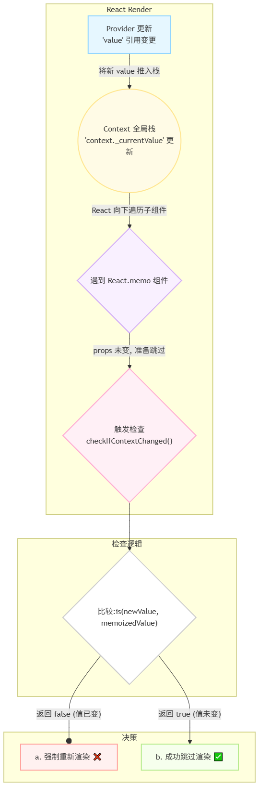

# Context API 的订阅机制与性能优化：React 如何追踪与最小化依赖更新

## 1. 引言：Context API 的双面性

Context API 诞生的核心目标是解决 React 组件树中 “props 钻取” 问题—— 当深层子组件需要使用顶层组件的状态时，无需通过中间组件逐层传递 props。

然而，这种便利性的背后也隐藏着性能上的挑战。默认情况下，任何消费了 Context 的组件都会在 Context 值发生变化时被强制重新渲染，即使它只关心该值的一小部分。这可能导致大规模且不必要的渲染，从而影响应用性能。

## 2. 核心机制：被动的“拉取式”订阅

要理解 Context 的工作原理，我们必须将其视为一个**被动的、在“跳过更新”时进行检查的“拉取式”订阅系统**，而非主动的“发布-订阅”模型。

- **`React.createContext(defaultValue)`**: 创建一个 Context 对象。这个对象本身就像一个“主题”或“事件中心”。

- **`<Context.Provider value={...}>`**: 这是值的**提供者**。当它渲染时，它会将 `value` prop 的值推入一个全局的 Context 栈中，使其成为当前活跃的值。它**不会主动通知**任何组件。

  这个“栈”是 React 用来管理嵌套 `Provider` 值的关键。你可以把它想象成一摞盘子：当遇到一个新的 `Provider` 时，React 会把新值（新盘子）放到最上面；当这个 `Provider` 的渲染结束后，React 会把最上面的值（盘子）拿走，从而恢复上一层 `Provider` 的值。这个“后进先出”的机制确保了无论嵌套多深，组件总能读取到离它最近的 `Provider` 的值。

  这个过程由 `pushProvider` 函数完成，它将旧值保存到栈上，然后更新 Context 对象的当前值。

  ```javascript
  export function pushProvider<T>(
    providerFiber: Fiber,
    context: ReactContext<T>,
    nextValue: T
  ): void {
    if (isPrimaryRenderer) {
      // 将旧值推入栈中
      push(valueCursor, context._currentValue, providerFiber);
      // 更新 context 的当前值
      context._currentValue = nextValue;
    } else {
      push(valueCursor, context._currentValue2, providerFiber);
      context._currentValue2 = nextValue;
    }
  }
  ```

- **`useContext(Context)`**: 这是**订阅者**。当组件调用 `useContext` 时，React 会做两件关键的事：

  1.  **读取值**：从 Context 栈中读取当前的活跃值。
  2.  **记录依赖（订阅）**：将该 Context 和本次读取到的值（作为 `memoizedValue`）记录到当前组件 Fiber 的 `dependencies` 列表中。这一步就是“订阅”，它告诉 React：“这个组件依赖此 Context，并且它上次读取的值是 X”。

  `useContext` 内部调用 `readContext`，最终由 `readContextForConsumer` 完成工作。它读取当前值，然后创建一个依赖项并附加到当前组件 Fiber 的 `dependencies` 链表上。

  ```javascript
  // src/react/packages/react-reconciler/src/ReactFiberNewContext.js

  export function readContext<T>(context: ReactContext<T>): T {
    // ...
    return readContextForConsumer(currentlyRenderingFiber, context);
  }

  function readContextForConsumer<T>(
    consumer: Fiber | null,
    context: ReactContext<T>
  ): T {
    // 读取当前 context 的值
    const value = isPrimaryRenderer
      ? context._currentValue
      : context._currentValue2;

    const contextItem = {
      context: ((context: any): ReactContext<mixed>),
      memoizedValue: value, // 记录读取到的值
      next: null,
    };

    if (lastContextDependency === null) {
      // ... 创建新的依赖列表
      lastContextDependency = contextItem;
      consumer.dependencies = {
        lanes: NoLanes,
        firstContext: contextItem,
      };
    } else {
      // 追加到依赖链表末尾
      lastContextDependency = lastContextDependency.next = contextItem;
    }
    return value;
  }
  ```

#### 内部更新检查流程

Context 的更新通知并非由 `Provider` 主动发起，而是在 `Consumer` 端，当 React 试图优化渲染时被动触发的。

1.  **`Provider` 值变更**：`Provider` 的 `value` prop 获得了一个新的对象引用。`Provider` 重新渲染，并将这个新值推入 Context 栈。

2.  **子组件渲染与检查**：React 向下渲染子组件。

    - **对于普通组件**：由于父节点（或更上层的祖先）在渲染，它们也会默认重新渲染。在渲染过程中，它们调用 `useContext`，自然会读取到 Context 栈中最新的值。
    - **对于希望“跳过更新”的组件**（如被 `React.memo` 包裹且 props 未变的组件）：React 在准备跳过它之前，会执行一道额外的安全检查——调用内部的 `checkIfContextChanged` 函数。

3.  **`checkIfContextChanged` 的工作**：此函数会遍历该组件的 `dependencies` 列表，用 `Object.is` 比较每一个依赖的“旧值” (`memoizedValue`) 和 Context 栈中的“当前值”。

    - 如果发现任何一个值不一致，函数返回 `true`。这个信号会**阻止 React 跳过该组件**，强制其重新渲染。
    - 如果所有值都一致，函数返回 `false`，组件被成功跳过，避免了不必要的渲染。

    源码清晰地展示了这个过程：遍历 `dependencies` 链表，使用 `is` 函数（`Object.is` 的内部实现）比较 `memoizedValue` 和 `_currentValue`。

    ```javascript
    // src/react/packages/react-reconciler/src/ReactFiberNewContext.js

    export function checkIfContextChanged(
      currentDependencies: Dependencies
    ): boolean {
      let dependency = currentDependencies.firstContext;
      while (dependency !== null) {
        const context = dependency.context;
        const newValue = isPrimaryRenderer
          ? context._currentValue
          : context._currentValue2;
        const oldValue = dependency.memoizedValue;
        if (!is(newValue, oldValue)) {
          // 只要有一个 context 的值变了，就返回 true
          return true;
        }
        dependency = dependency.next;
      }
      return false;
    }
    ```



## 3. 性能瓶颈：必要 vs. 不必要的渲染

在优化性能之前，我们需要区分两种渲染：

- **必要的渲染 (Necessary re-render)**：当组件自身的状态变更，或者它直接使用的信息（如 props 或 context 的一部分）发生变化时，它的重新渲染是必要的。例如，当用户在输入框打字时，管理该输入的组件必须渲染。
- **不必要的渲染 (Unnecessary re-render)**：因为架构问题或 React 的渲染机制，一个组件在它依赖的数据完全没有变化的情况下也被重新渲染了。

**Context API 的主要性能瓶颈，就在于它很容易导致不必要的渲染。**

根本原因在于其**检查的粒度太大**。一个组件一旦通过 `useContext` 订阅了某个 Context，它就依赖了**整个 `value` 对象**。只要 `value` 对象的引用发生变化，`checkIfContextChanged` 检查就会失败，从而强制该组件重新渲染——无论组件实际使用的是 `value` 中的哪个属性。

#### 示例：一个典型的不必要渲染场景

假设我们有一个包含用户认证和主题设置的全局 Context：

```javascript
const AppContext = React.createContext();

function AppProvider({ children }) {
  const [user, setUser] = useState(null);
  const [theme, setTheme] = useState("light");

  // 注意：每次 AppProvider 渲染，都会创建一个全新的 value 对象
  const value = { user, theme, setTheme };

  return <AppContext.Provider value={value}>{children}</AppContext.Provider>;
}
```

现在，我们有两个被 `React.memo` 包裹的组件，以尝试优化性能：

1.  `UserProfile` 只显示用户信息。
2.  `ThemeToggler` 只切换主题。

```jsx
const UserProfile = React.memo(function UserProfile() {
  const { user } = useContext(AppContext);
  console.log("UserProfile rendered (unnecessary)");
  return <div>{user ? user.name : "Guest"}</div>;
});

const ThemeToggler = React.memo(function ThemeToggler() {
  const { theme, setTheme } = useContext(AppContext);
  console.log("ThemeToggler rendered (necessary)");
  return (
    <button onClick={() => setTheme((t) => (t === "light" ? "dark" : "light"))}>
      {theme}
    </button>
  );
});
```

**问题在于**：当我们点击 `ThemeToggler` 按钮时，`setTheme` 会触发 `AppProvider` 的重新渲染。

1.  `ThemeToggler` 的渲染是**必要的**，因为它直接使用了 `theme` 和 `setTheme`。
2.  `AppProvider` 重新渲染时，创建了一个**新的 `value` 对象**。
3.  当 React 准备跳过 `UserProfile` 的渲染时，`checkIfContextChanged` 被触发。它比较 `AppContext` 的新旧 `value`，发现引用不同。
4.  因此，React **强制 `UserProfile` 重新渲染**。这次渲染是**不必要的**，因为 `user` 的值根本没有改变。

这就是 Context 导致不必要渲染的典型场景。`React.memo` 在这里失效了，因为它无法阻止由 Context 变更信号触发的强制更新。

## 4. 性能优化策略

为了解决不必要的渲染，我们可以采用以下几种策略，从易到难，层层递进。

### 策略一：使用 `useMemo` 稳定 `value` 对象

这是最基础的优化。我们应该确保 `Provider` 的 `value` 不会在每次渲染时都创建一个新对象。

```javascript
function AppProvider({ children }) {
  const [user, setUser] = useState(null);
  const [theme, setTheme] = useState("light");

  // 只有当 user 或 theme 变化时，value 的引用才会改变
  const value = useMemo(() => ({ user, theme, setTheme }), [user, theme]);

  return <AppContext.Provider value={value}>{children}</AppContext.Provider>;
}
```

**效果**：此举可以防止因 `AppProvider` 的父组件渲染而导致的、不相关的重新渲染。但它仍然没有解决我们上面的核心问题：`UserProfile` 依然会因为 `theme` 的变化而渲染。

### 策略二：拆分 Context

这是解决 Context 性能问题的最有效、最符合 React 理念的方法：**保持 Context 的单一职责**。

不要创建一个包罗万象的“巨石”Context，而应该根据状态的关联性和更新频率，将其拆分为多个更小的、独立的 Context。

```javascript
// 1. 创建独立的 Context
const UserContext = React.createContext();
const ThemeContext = React.createContext();

// 2. 创建独立的 Provider
function UserProvider({ children }) {
  const [user, setUser] = useState(null);
  const value = useMemo(() => ({ user, setUser }), [user]);
  return <UserContext.Provider value={value}>{children}</UserContext.Provider>;
}

function ThemeProvider({ children }) {
  const [theme, setTheme] = useState("light");
  const value = useMemo(() => ({ theme, setTheme }), [theme]);
  return (
    <ThemeContext.Provider value={value}>{children}</ThemeContext.Provider>
  );
}

// 3. 组合 Provider
function AppProviders({ children }) {
  return (
    <UserProvider>
      <ThemeProvider>{children}</ThemeProvider>
    </UserProvider>
  );
}

// 4. 组件按需消费
function UserProfile() {
  const { user } = useContext(UserContext); // 只订阅 UserContext
  console.log("UserProfile rendered");
  return <div>{user ? user.name : "Guest"}</div>;
}

function ThemeToggler() {
  const { theme, setTheme } = useContext(ThemeContext); // 只订阅 ThemeContext
  console.log("ThemeToggler rendered");
  return (
    <button onClick={() => setTheme((t) => (t === "light" ? "dark" : "light"))}>
      {theme}
    </button>
  );
}
```

**效果**：现在，当 `ThemeToggler` 更新 `ThemeContext` 时，只有订阅了 `ThemeContext` 的组件会收到更新信号。`UserProfile` 因为只订阅了 `UserContext`，所以完全不受影响，其不必要的渲染被彻底消除。

### 策略三：组件组合

核心思想是：**将那些不关心 Context 变化的、昂贵的组件作为 `children` prop 传递给一个消费了 Context 的父组件。**

这样，当 Context 变化导致父组件重新渲染时，React 会发现 `children` prop 的引用没有改变（它是在父组件的父组件中定义的），因此会跳过对 `children` 的重新渲染。

让我们看一个正确应用的例子：

```jsx
// AppProvider 包含 theme 和 setTheme
// ThemeToggler 用于改变 theme

// 1. 父组件消费 Context，并接受一个 children prop
function ThemeWrapper({ children }) {
  const { theme } = useContext(AppContext);
  console.log(`ThemeWrapper rendered, theme is: ${theme}`);

  // 这个 div 的背景色会变，但它的 children 不会重新渲染
  return (
    <div
      style={{
        backgroundColor: theme === "light" ? "#fff" : "#333",
        padding: "10px",
      }}
    >
      {children}
    </div>
  );
}

// 2. 昂贵的组件，自身不消费 Context
const ExpensiveTree = React.memo(function ExpensiveTree() {
  console.log("ExpensiveTree rendered (should not happen on theme change)");
  // ... 假设这里有非常复杂的 UI
  return <div>这是一个非常昂贵的组件树，它不应该因为主题变化而重绘。</div>;
});

// 3. 在应用中使用
function App() {
  return (
    <AppProvider>
      <ThemeToggler />
      <hr />
      <ThemeWrapper>
        {/* ExpensiveTree 在 App 中定义，作为 children 传递 */}
        <ExpensiveTree />
      </ThemeWrapper>
    </AppProvider>
  );
}
```

**效果**：当 `theme` 变化时，只有 `ThemeToggler` 和 `ThemeWrapper` 会重新渲染。`ThemeWrapper` 重新渲染是必要的，因为它需要应用新的背景色。但关键在于，它接收的 `children` (`<ExpensiveTree />`) 是在 `App` 组件的作用域中创建的。对于 `ThemeWrapper` 来说，每次渲染时 `props.children` 的引用都是相同的。因此，React 会成功跳过对 `ExpensiveTree` 的渲染，避免了不必要的性能开销。

## 5. 总结

理解 Context API 的订阅机制和性能权衡，是成为一名高效 React 开发者的关键。通过合理地组织 Context 并采用适当的优化策略，我们可以在享受其便利性的同时，构建出高性能、可扩展的应用程序。
